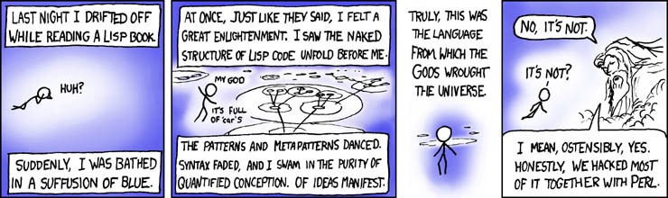
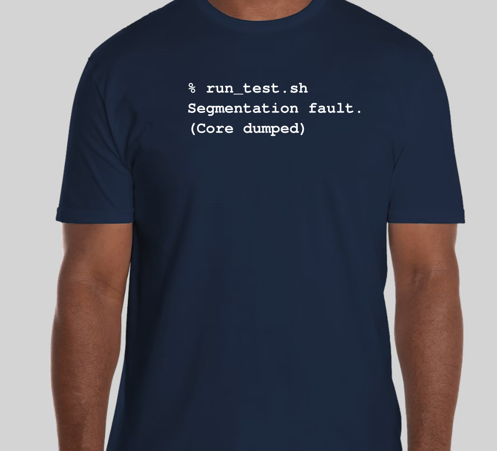
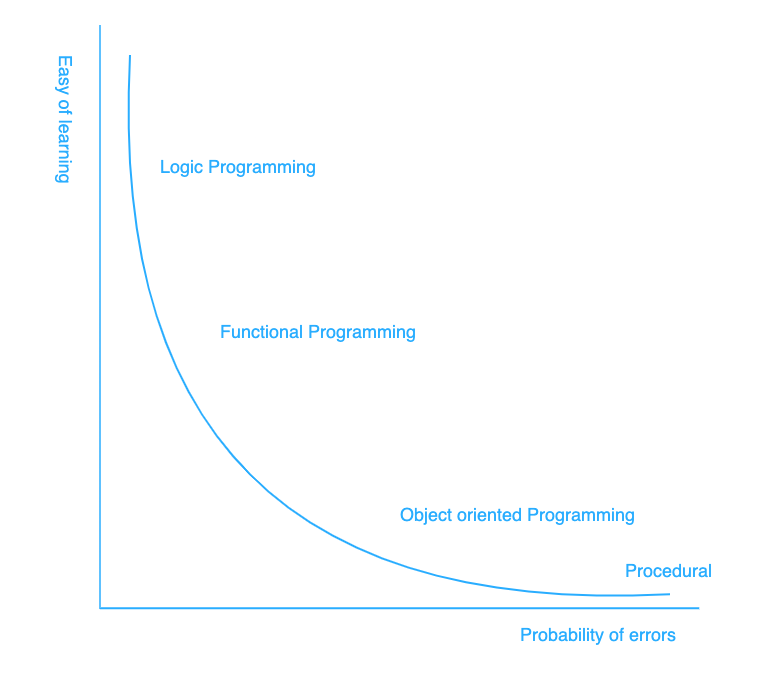
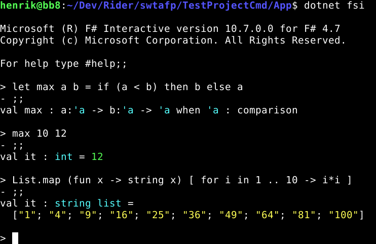
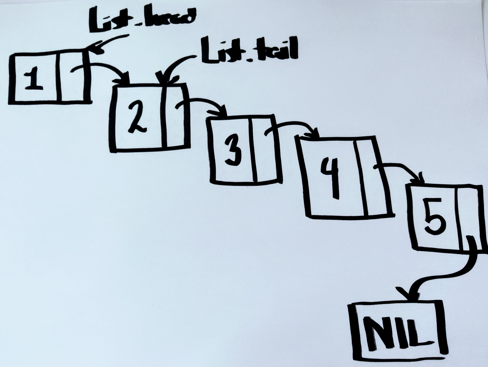

<!-- .slide: data-background="#003d73" -->
## Introduction + F# #



 <!-- .element style="width: 200px; position: fixed; bottom: 50px; left: 50px" -->

----




note:

- master thesis after 3 months
  - running C++ impl af dynamic self adjusting skip list
  - but corrupted memory
- using the next 4 weeks to get the overnight tests running
  - chasing bugs in 2.000 lines of code that mutated data structure all over the place
- Realised
   - not algorithm problem
   - _BUT_ mutation
- This course
  - functional programming - not abstract theory
  - right before you bacherlor
    - so code to fight you. But gives you
    - Immutability, Type safety, composition over complexity
- after course you can
  - write code where compiler catches errors before running it
  - easy to test without boiler plate code


----

## Agenda

* Course Introduction
* What is FP
* Why F\#
* F\#
  * Types
  * Functions
* Lists


---

<!-- .slide: data-background-image="./img/introduction.jpg" -->
## Introduction <!-- .element style="color: white" -->

----

## Qualification description

* <!-- .element: class="fragment" --><b>Apply</b> and <b>explain</b> functional programming as a programming paradigm<br/>
* <!-- .element: class="fragment" --><b>Design</b> and <b>implement</b> solutions building on functional programming<br/>
* <!-- .element: class="fragment" --><b>Explain</b> the Actor model<br/>
* <!-- .element: class="fragment" --><b>Design</b> and <b>implement</b> solutions with the Actor model<br/>
* <!-- .element: class="fragment" --><b>Design</b>, <b>explain</b> and <b>combine</b> functional design patterns when developing applications<br/>

----

### Format

* <!-- .element: class="fragment" -->Lectures:
  * 4 hours per week
  * ~$\frac{1}{2}$ lecturing
  * ~$\frac{1}{2}$ exercises
* <!-- .element: class="fragment" -->Read before, exercises after


----

<!-- .slide: style="font-size:24px" -->

## Schedule Competencies

| Week | Topic | Capability Gained |
|:-----|:------|:------------------|
| 1 | Intro to FP and F# | Think declaratively, not imperatively |
| 2 | Functions, types, lists | Compose small units into larger abstractions |
| 3 | Model/typed-based programming | Invalid states don't compile |
| 4 | Persistent data structures |No dangling pointers or mutation races |
| 5 | Property-based testing |Edge cases found automatically, not by luck |
| 6 | Functors, Applicatives, Monads | Chain computations with explicit error handling |
| 7 | Error handling | Railway-oriented error flows - failures propagate without crashes |
| 8 | Functional Architecture | Business logic at core, side-effects at boundaries |
| 9 | Web | Build backends without shared mutable state |
| 10 | Efficiency | Profile-driven optimization, not premature tuning |
| 11-12 | Actor Model | Concurrency without race conditions |
| 13 | Reactive programming | Event-driven systems with predictable data flow |

----


### Expectations

- &#128187; Prepare **and** do exercises
- &#128587; **Ask** questions and make comments
- &#9200; Handin **on** time for feedback

----

### Your expectations

&#10067; <!-- .element: style="font-size: 160px" -->


----

### Optional handins

Fitness app (but you can choose your own domain)<!-- .element: class="fragment" -->

| Name                 | "Handin" week |
|----------------------|-------:|
| Domain model         | 5      |
| Business logic + test| 7      |
| Error handling       | 9      |
| Frontend             | 12     |
| Notification         | 15     | 
<!-- .element: class="fragment" .element: style="font-size: 26px" -->

* <!-- .element: class="fragment" -->Feedback given <b>if</b>
  * Deadline respected
  * Material is a honest try at solve the problem


----

### Exam

- 20 minutes oral exam<br/><!-- .element: class="fragment" -->
- <!-- .element: class="fragment" -->Draw a random subject (<i>9</i> last semester)<br/>
- <!-- .element: class="fragment" -->Explain theory <b>and</b> show how this can be applied<br/>
- Include code when you see fit<!-- .element: class="fragment" -->
  - exercises/assignments

---

## What is Functional programming

Applying and composing of functions

----

### The Imperative paradim

- Imperative<!-- .element: class="fragment" data-fragment-index="0" -->  
  - Procedural (C)
  - OOP (C++, C#)
* <!-- .element: class="fragment" data-fragment-index="1" -->  <b>in imperative programming</b> one would
  * use statements to modify state
  * focus on how the program should achieve its goal<br/>


----

### The Declarative paradigm

- Declarative <!-- .element: class="fragment" data-fragment-index="0" -->  
  - Functional (F\#)
  - Logic (Prolog)
  - Relational Algebra (SQL)
* <!-- .element: class="fragment" data-fragment-index="1" -->  <b>in declarative programing</b> the focus is on 
  * expressing commands
  * focus on what should be accomplished

----


### Reasoning about functions

Minimize 'side-effects'
- Changing values of variable<br/><!-- .element: class="fragment" data-fragment-index="1" -->
- I/O<br/><!-- .element: class="fragment" data-fragment-index="2" -->
- Throwing exceptions<br/><!-- .element: class="fragment" data-fragment-index="3" -->
- <!-- .element: class="fragment" data-fragment-index="4" --> &#9758; We are going to try minimize and <b>control</b> side-effects<br/>
  - **not** removing them altogheter<!-- .element: class="fragment" data-fragment-index="4" -->  

----

### Tools

- Functions as first class citizen<br/><!-- .element: class="fragment" --> 
- Higher order functions<br/><!-- .element: class="fragment" --> 
- Pure functions<br/><!-- .element: class="fragment" --> 
- Recursion<br/><!-- .element: class="fragment" --> 
- Referential transparency<br/><!-- .element: class="fragment" --> 
- Immutability<br/><!-- .element: class="fragment" --> 

<br/>All to help us make code more readable<!-- .element: class="fragment" --> 

----

### Advantages

- Makes us better OOP developers<br/><!-- .element: class="fragment"  data-fragment-index="1" -->
  - -> give you leverage for your bachelor thesis
- Help us develop more composable code<br/><!-- .element: class="fragment"  data-fragment-index="2" -->
- Makes writing testable code easy<br/><!-- .element: class="fragment"  data-fragment-index="3" -->
- Can help us write 'efficient' code*<br/><!-- .element: class="fragment"  data-fragment-index="4" -->
- Less code -> fewer bugs<br/><!-- .element: class="fragment"  data-fragment-index="5" -->
- Fairly simple and clean syntax<br/><!-- .element: class="fragment"  data-fragment-index="6" -->


\* Efficiency comes from compiler-correctness, not just raw speed <br/><!-- .element: class="fragment"  data-fragment-index="4" -->


----

### Disadvantages

- Learning curve is steap
- A bit like starting from scratch

 <!-- .element: style="width: 500px" -->


note:

not 3 weeks but 3 months.

---

## Why F#

- forces you to think in FP<br/><!-- .element: class="fragment" -->
- strongly typed language<br/><!-- .element: class="fragment" -->
- 'easy' to learn syntax<br/><!-- .element: class="fragment" -->
- has access to .NET standard library<br/><!-- .element: class="fragment" -->
- interoperability with .NET<br/><!-- .element: class="fragment" -->
  - builds to .NET IL<br/>
- OOP possible in F#<br/><!-- .element: class="fragment" -->

Note:

- No higher kinded types
- Fewer OOP features

----

## Usages of F#

* .NET libraries/console applications<br/><!-- .element: class="fragment" -->
* GUI<br/><!-- .element: class="fragment" -->
* Scripting (.fsx files)<br/><!-- .element: class="fragment" -->
* Web<br/><!-- .element: class="fragment" -->
  * backend
  * can be transpiled to JS
* Deployment scripts to Azure<br/><!-- .element: class="fragment" -->

----

## Program files

Creating a project*
- Commandline
- Jetbrains Rider
- Visual Studio

----

## Common pitfals


----

### File order matters

- <!-- .element: class="fragment" data-fragment-index="1" -->Create F# file <code>Library2.fs</code>
```fsharp
// Library2.fs
module Talk =
    let reply replier = printf "Reply from %s" replier
```
<!-- .element: class="fragment" data-fragment-index="1" -->

- <!-- .element: class="fragment" data-fragment-index="2" -->Reference <code>Talk.Reply</code> from existing file
```fsharp
// Library.fs
module Say =
    let hello name =
        printfn "Hello %s" name
        Talk.reply "me"
```
<!-- .element: class="fragment" data-fragment-index="2" -->

swtafp/TestProjectCmd/Library/Library.fs(6,9): error FS0039: The value, namespace, type or module 'Talk' is not defined. Maybe you want one of the following:   tan [swtafp/TestProjectCmd/Library/Library.fsproj] <!-- .element: style="color: red; font-size: 18px" class="fragment" data-fragment-index="3"  -->

----

### 'Old' way of defining programming entrypoint

```fsharp
[<EntryPoint>]
let main argv =
    Say.hello "F#"
    0 // return an integer exit code
```

In newer .NET projects, this is more like C#

----

### Interactive shell

- F# and other functional languages are explorative by nature<br/><!-- .element: class="fragment" -->
- The interactive shell lets you try out code easy<!-- .element: class="fragment" -->
  - REPL (read-eval-print loop)

----

### Interactive example



----

### Modules

- Modules are used to group code
  - types, functions, and variables<br/><!-- .element: class="fragment" data-fragment-index="1" -->
  - keeps related code together<br/><!-- .element: class="fragment" data-fragment-index="1" -->
  - no module declared -> module with the file name exists<br/><!-- .element: class="fragment" data-fragment-index="2" -->
  - two types:<br/><!-- .element: class="fragment" data-fragment-index="3" -->
    - top level<br/><!-- .element: class="fragment" data-fragment-index="3" -->
    - local level (can be nested)<br/><!-- .element: class="fragment" data-fragment-index="3" -->


----

### Namespaces

- Namespace lets you organize F\# programming related elements.
  - Must be top level in a file<br/><!-- .element: class="fragment"  -->
  - All code in that file becomes part of that namespace<br/><!-- .element: class="fragment" -->
  - Only contain types and modules<br/><!-- .element: class="fragment" -->
  - Can be declared implicitly<br/><!-- .element: class="fragment" -->
- Styleguide prefer namespaces in all files<br/><!-- .element: class="fragment" -->
  - because of interopbillity with C#

----

### Signature files (.fsi)

- '`FileName.fsi`'&nbsp;is&nbsp;signature&nbsp;file&nbsp;for&nbsp;'`FileName.fs`'
- Signature file describes<!-- .element: class="fragment" -->
  - Types
  - Namespaces
  - Modules


----

#### .fsi .fs examples

```fsharp
// Module1.fsi
namespace Library1

  module Module1
  val add : int -> int -> int
  val multiply : int -> int -> int
  val greet : string -> string
```


```fsharp
// Module1.fs
namespace Module1

module Program
  let add x y = x + y
  let multiply x y = x * y
  let greet name = sprintf "Hello, %s!" name
```

----

### Scripting files (<code>.fsx</code>)

* As other scripting langauges (bash, powershell)<br/><!-- .element: class="fragment" data-fragment-index="1"  -->
* Is not compiled<br/><!-- .element: class="fragment" data-fragment-index="2" -->
* Execute in terminal:<br/><!-- .element: class="fragment" data-fragment-index="3" -->
```bash
$ dotnet fsi filename.fsx
```
<!-- .element: class="fragment" data-fragment-index="3" -->

---

## F# #


Language intro

----

### Numeric types

- `int`/`int32` - 32 bit integers (1, -10021, 21, 42, ...)
- `float` - 64 bit float (1.0, -10021.0, -0.2, -1.2001, 3.2e2, ...)
- `int64` - 64 bit integer (1L, -10021L, 42L)
- `single` - 32 bit float (1.0f, 3.14159f, 42.2e3, 000)
 

----

### Operators
- <!-- .element: class="fragment" --> +, -, *, /, % on all numeric types
  - Both operands must have same type
  ```fsharp
  // Not
  2 + 3.0
  //  The type 'float' does not match the type 'int'
  ```
- <!-- .element: class="fragment" -->** on <code>floats</code><br/>
- <!-- .element: class="fragment" -->Bitwise on int<br/>
- <!-- .element: class="fragment" -->Conversion with function, named after type
  - `int 3.0 -> 3`

----

### Boolean values

- Type '`bool`' has values `true` and `false`
- Operators `&&`, `||`, and `not`
- Operators that return boolean
  - `=`, `<`, `<=`, `=>`, `>`, `<>`

----

### Conditional

- if-then-else expression<!-- .element: class="fragment" -->
```fsharp
if x > 0 then 1 else 0
```
- Note: the two branches must have same type<!-- .element: class="fragment" -->
  ```fsharp
  // not
  if x > 0 then 1 else 'a'
  // All branches of an 'if' expression must return
  // values implicitly convertible to the type of
  // the first branch, which here is 'int'. This
  // branch returns a value of type 'char'.
  ```

----

### Char

- Type `char` 
- Syntax: `'c', 'a', 'b', '\t', '\n'`, ...

----

### Strings:
- <!-- .element: class="fragment" -->Type <code>string</code><br/>
- <!-- .element: class="fragment" -->Can represent <code>string</code> as <code>char list</code> (more on lists later)<br/>
- <!-- .element: class="fragment" -->Operators: <code>+, [i], [i..j], [i..], [..i]</code><br/>
  * *Deprecated* ~~`.[i]`, `.[i..j]`, `.[i..]`, `.[..i]`~~ 
- <!-- .element: class="fragment" -->Functional vs 'dot' operator
```fsharp
String.length "Hello f#"
"Hello F#".Length
```
- <!-- .element: class="fragment" -->Concat
  - `let result = "Hello" + " World!"`

----

### Evoking Functions

- <!-- .element: class="fragment" -->Syntax without parentheses around arguments
  - `sqrt 10.0`
  - `String.length "Hello F#"`
- <!-- .element: class="fragment" -->Function application bind hardest
  - `sqrt 10.0 + 2.0` => `(sqrt 10.0) + 2.0`

----

### Bindings

- <!-- .element: class="fragment" data-fragment-index="2" -->variables
```fsharp
let phi = 3.14159
// val phi : float = 3.14159
```
<!-- .element: class="fragment" data-fragment-index="2" -->
- <!-- .element: class="fragment" data-fragment-index="3" -->functions 
```fsharp
let identity a = a
// val identity: a: 'a -> 'a
let max x y = if x > y then x else y
// val max : x:'a -> y:'a -> 'a when 'a : comparison
```
<!-- .element: class="fragment" data-fragment-index="3" -->

----

### Lambda

* Lambdas in F# can be defined by the `fun` keyword

```fsharp
fun a b -> a + b
// Or
let fn = fun a b -> a + b
// Or with types
fun (a: int) (b: int) -> a + b
```

----

### Type declaration

- <!-- .element: class="fragment" data-fragment-index="2" -->Not forced to write types to expressions
  - F\# has strong *type inference*
- <!-- .element: class="fragment" data-fragment-index="3"-->Possible to explicit define types
```fsharp
let maxInt (x: int) y = if x > y then x else y
// val maxInt : x:int -> y:int -> int`
// let maxInt (x: int) (y:int) = if x > y then x else y
// let maxInt (x: int) (y:int) : int =
//       if x > y then x else y
```
<!-- .element: class="fragment" data-fragment-index="3" -->

----

### Recursion

- <!-- .element: class="fragment" data-fragment-index="1" -->Factorial definition: 
  - `0! = 1`
  - `n! = n * ((n-1)!)` - for n > 0
- <!-- .element: class="fragment" data-fragment-index="2" -->In F#
   - Keyword '`rec`'
   
```fsharp
let rec factorial n =
  if (n = 0) then 1
  else n * factorial (n-1)
```
<!-- .element: class="fragment" data-fragment-index="2" -->

----

### Pattern Matching

- F# match construct expression<br/><!-- .element: class="fragment" -->
```fsharp
match expr with
  | pattern1 [when condition] -> expr1
  | pattern2 -> expr2
```
- Cases are checked in order, first match is executed<br/><!-- .element: class="fragment" -->
- Compiler will warn if cases are not exhausted<br/><!-- .element: class="fragment" -->


----

### Factorial with match construct

Could redefine factorial with match constructs

```fsharp
let rec factorial n =
  match n with
  | 0 -> 1
  | _ -> n * factorial (n-1)
```

Here `_` is a wildcard that mactches everything

Note:

Keyword `function` is a shorthand for `fun` and a `match` in functions that takes a single argument

```fsharp
let rec factororial = function
  | 0 -> 1
  | _ -> n * factorial (n-1)
```

----

### Pattern matching

```fsharp
type OptionalInt = | Some of int | None 

let optionalInt = Some 1

match optionalInt with 
| Some x -> printfn "Value is %A" x
| None -> printfn "No value" 
```

----

### Pattern matching

```fsharp
type Result =
    | Ok of string
    | Error of string

let result = Error "File not found"

match result with
| Ok result -> printfn "Success with result %A" result
| Error reason -> printfn "Error with reason: %s" reason
```

----

### Simpel type - tuples 

- Tuples<br/><!-- .element: class="fragment" -->
```fsharp
(1,2)
// val it : int * int = (1, 2)
(1, "a")
// val it : int * string = (1, "a")
```
- Access with:<br/><!-- .element: class="fragment" -->
  - functions '`fst`' or '`snd`'
  - **or** pattern matching - with deconstruction

---


## Lists

* List in F# can be arbitrary long but **must** contain elements of same type
  * <!-- .element: class="fragment" -->Give type 'a then a list of 'a's have type<br/> <code>'a list</code><br/>
  * <!-- .element: class="fragment" -->Examples <code>int list</code>, <code>char list</code>, <code>string list</code>, <code>('a -> 'b) list</code>

----

### Construction

- <!-- .element: class="fragment" data-fragment-index="2" -->Building list can be done staticly with the <code>[]</code> list constructor
```fsharp
let l1 = [1; 2; 3; 4; 5]
```
<!-- .element: class="fragment" data-fragment-index="2" -->
- <!-- .element: class="fragment" data-fragment-index="3" -->or dynamicly with the <code>::</code> (<b>cons</b> operator)
```fsharp
let l2 = 1::2::3::4::5::[]
```
<!-- .element: class="fragment" data-fragment-index="3" -->
- <!-- .element: class="fragment" data-fragment-index="4" --><code>::</code> is right-assiciative
```fsharp
let l3 = 1::(2::(3::(4::(5::[]))))
```
<!-- .element: class="fragment" data-fragment-index="4" -->

----

### Visualize a list

 <!-- .element: style="width:700px" -->


----

### Working with lists

There are a number of functions for `list`s, all found in the [List module](https://fsharp.github.io/fsharp-core-docs/reference/fsharp-collections-listmodule.html).

```fsharp
let l1 = ["abc", "def", "ghi"]
List.head l1 // => "abc"
List.isEmpty l1 // => false
List.length l1 // => 3
```

----

### A couple of functions on lists

```fsharp
let l1 = [1;2;3]
let l2 = [4;5;6]

let l1' = 0 :: l1

let l1Plus2 = List.append l1 l2
let l1Plus2' = l1 @ l2
```

We will get back to the List module in next week<!-- .element: class="fragment" -->

----

### Functions on list


- <!-- .element: class="fragment" data-fragment-index="2" -->Defining a sum function for lists
```fsharp
let rec sum l =
    if List.isEmpty l
    then 0
    else List.head l + sum (List.tail l)
```
<!-- .element: class="fragment" data-fragment-index="2" -->
- or with pattern matching <!-- .element: class="fragment" data-fragment-index="3" -->
```fsharp
let rec sum l =
    match l with
    | [] -> 0
    | (x::xs) -> x + sum xs
```
<!-- .element: class="fragment" data-fragment-index="3" -->


----

### Two things about last example

* <!-- .element: class="fragment" data-fragment-index="2" -->Pattern matching
  * decompose <b>any</b> data structures directly in the match expression
* <!-- .element: class="fragment" data-fragment-index="3" -->'<code>function</code>' vs '<code>match x with</code>'
```fsharp
let rec sum = function
  | [] -> 0
  | (x::xs) -> x + sum xs
```
<!-- .element: class="fragment" data-fragment-index="3" -->

---

<!-- .slide: data-background-image="./img/hard.jpg" -->

----

## References

* [Namespaces](https://docs.microsoft.com/en-us/dotnet/fsharp/language-reference/namespaces)
* [Module](https://docs.microsoft.com/en-us/dotnet/fsharp/language-reference/modules)
* [Match](https://docs.microsoft.com/en-us/dotnet/fsharp/language-reference/pattern-matching)
* [List module](https://fsharp.github.io/fsharp-core-docs/reference/fsharp-collections-listmodule.html)
* [Convention](https://docs.microsoft.com/en-us/dotnet/fsharp/style-guide/conventions)