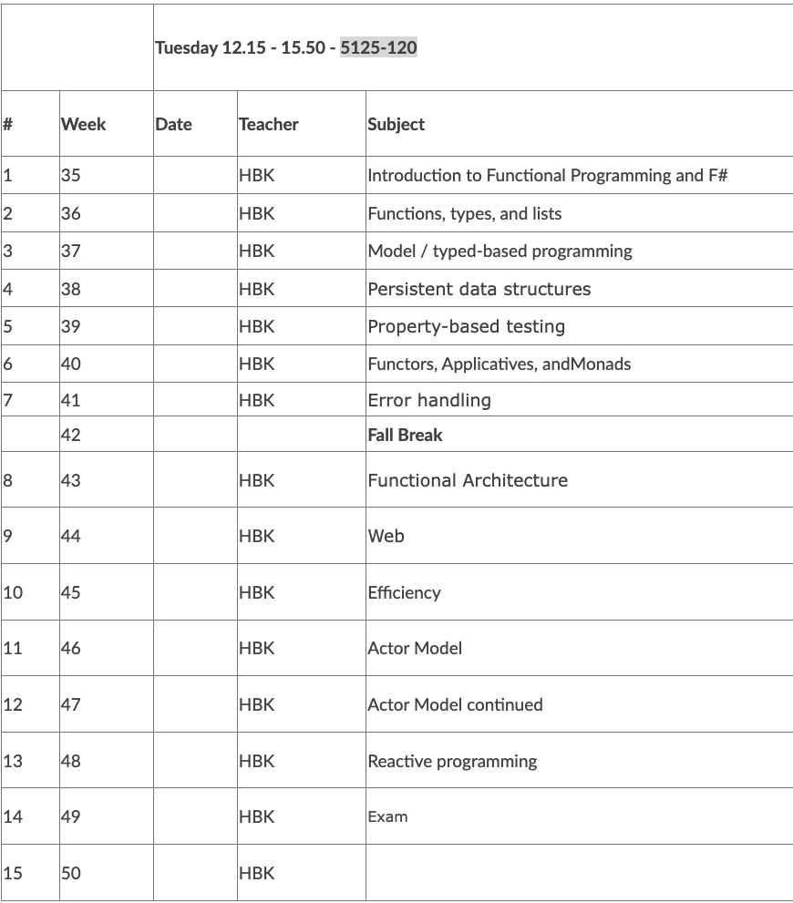

<!-- .slide: data-background="#003d73" -->
## Introduction + F# #

 <!-- .element style="width: 200px; position: fixed; bottom: 50px; left: 50px" -->

----

## Agenda

* Introduction
* What is FP
* Why F\#
* Program files
* F\#
  * Types
  * Functions
* Lists


---

<!-- .slide: data-background-image="./img/introduction.jpg" -->
## Introduction <!-- .element style="color: white" -->

----

## Qualification description

* **Apply** and **explain** functional programing as a programing paradigm
* **Design** and **implement** solutions building on functional programing
* **Explain** the Actor model
* **Design** and **implement** solutions with the Actor model
* **Design**, **explain** and **combine** functional design patterns when developing applications

----

### Format

* Lecture:
  * 4 hours per week
  * `$\frac{1}{2}$` lecturing
  * `$\frac{1}{2}$` exercises
* Homework before, exercises after

----

### Plan



----

### Expectations

- Online:
  - Use your real name
  - Show your face - even though this is early Tuesday morning
- Offline
  - Prepare **and** do exercises
  - Handin assignment on time
  - Check they have the correct content
- **Ask** questions and make comments - this is a new course

----

### Your expectations

* Slides?
* ?

----

### Assignments

6 smaller assignment (you need to handin 4)

| Name     | Release | Handin |
|---------|:-------:|-------:|
| Nokia   | 2       | 4      |
| Queue   | 5       | 6      |
| Tetris 1| 7       | 9      |
| Tetris 2| 9       | 11     |
| Akka    | 11      | 13     |
| Error   | 13      | 15     |


----

### Exam

- Take home exam
  - Equal size to an assignment - and combines 2-3 of these
- plus 30 minutes oral exam
  - Examination contain talks about the theory and how this is applied in the written part - you can draw in your assignments.

---

## What is Functional programing

Applying and composing of functions

----

### Declarative vs Imperative

- Imparative
  - Procedural (e.g. C)
  - OOP (C++, C#)
- Declarative
  - Functional (F\#)
  - Logic (Prolog)
  - ..
  
Traditional imperative would iterate over a list and modify a result, where declarative focus on logic without controlflow.


----

### Side effects


- Changing value of varible
- Printing to console
- Write from file
- Throwing exception

We are going to try minimize side effects and controlflow - **not** removing them altogheter

----

### Other concepts

- First class citizen
- Higher order functions
- Pure functions
- Recursion
- Referential transparency
- Data structures


----

### Why FP

- Helps us developer modular code
- Makes up write testable code
- Helps us write faster code
- Makes us better OOP developers
- Less code -> fewer bugs

----

### Disadvantages

- Learning curve is steap


----

### Personal experience with FP

* Been using FP with OOP since 2012
* Fluent in Scala
* Know some SML
* Been using F# since summer 2020

* a bit like starting from scratch

----

## Why F# #

- forces you to think in a different way
- is build by Microsfot
- has access to .NET standard library
- fully operational on Windows, Linux and Mac via .Net Core 
- strong type system
- can do OO like programing in F#

----

## Usages of F#

* 'Normal programs'
* GUI
* Web backend
* Web frontend (compiled to JS)
* Depoyment to Azure

---

## Program files

Creating a project*
- Commandline
- Jetbrains Rider
- Visual Studio

----

### File order matters

- Create Library2.fs

```fsharp
// Library2.fs
module Talk =
    let reply replier = printf "Reply from %s" replier
```

- Reference Talk.Reply from existing file

```fsharp
// Library.fs
module Say =
    let hello name =
        printfn "Hello %s" name
        Talk.reply "me"
```

swtafp/TestProjectCmd/Library/Library.fs(6,9): error FS0039: The value, namespace, type or module 'Talk' is not defined. Maybe you want one of the following:   tan [swtafp/TestProjectCmd/Library/Library.fsproj] <!-- .element: style="color: red; font-size: 18px" -->

----

### Main entrypoint

```fsharp
[<EntryPoint>]
let main argv =
    Say.hello "F#"
    0 // return an integer exit code
```

----

### Interactive shell

- F\# and other functional languages are explorative by nature
- Interactive lets you try out code easy

----

### Interactive example


----

### Namespaces and Modules


- Namespace lets you organize F\# programming elements into.
  - Must be top level in a file
  - Cannot contain values/function directly
- Modules are used to group values, type and functions
  - Keeps related code etc. together
  - If not modules is declared a module with the same name as the file exists

----

### Signature files (.fsi)

- FileName.fsi is signature file for Filename.fs
- Signature file describes
  - Types
  - Values
  - Members

----

#### .fsi .fs examples

```fsharp
// Module1.fsi

namespace Library1
  module Module1 =
    val function1 : int -> int
    type Type1 =
        new : unit -> Type1
        member method1 : unit -> unit
        member method2 : unit -> unit
```


```fsharp
// Module1.fs
namespace Library1

module Module1 =
    let function1 x = x + 1

    type Type1() =
        member type1.method1() =
            printfn "type1.method1"
        member type1.method2() =
            printfn "type1.method2"
```

---

## F# #


Language intro

----

### Numeric types

- int - 32 bit integers (1, -10021, 21, 42, ...)
- float - 64 bit float (1.0, -10021.0, -0.2, -1.2001, 3.2e2, ...)
- int64 - 64 bit integer (1L, -10021L, 42L)
- single - 32 bit float (1.0f, 3.14159f, 42.2e3, 000)
 

----

### Operators
- `+`, `-`, `*`, `/`, `%` on all numeric types
  - Operands must have same type (Not `2 + 3.0`)
- ** all floats
- Bitwise all int
- Conversion with type name
  - `int 3.0 -> 3`

----

### Boolean values

- Type `bool` has values `true` and `false`
- Operators `&&`, `||`, and `not`
- Operators return boolean
  - `=`, `<`, `<=`, `=>`, `>`, `<>`

----

### Conditional

- if-then-else expresion
- `if x > 0 then 1 else 0`
- Note: the two branches must have same type
  - Not `if x > 0 then 1 else 'a'`

----

### Char

- Type `char` 
- Syntax `'c', 'a', 'b', '\t', '\n'`

----

### Strings:
- Type `string`
- Can represent `string` as `char list` (more on this later)
- Operators `+`, `.[i]`, `.[i..j]`, `.[i..]`, `.[..i]`
- Functional vs 'dot' operator
  - `String.Length "Hello f#"`
  - `"Hello F#".Length`
- Concat like in C#
  - `let result = "Hello" + " World!"`

----

### Functions

- Syntax without parentheses around arguments
  - `sqrt 10.0`
  - `String.Length "Hello F#"`
- Function application bind hardest
  - `sqrt 10.0 + 2.0` => `(sqrt 10.0) + 2.0`

----

### Declaring functions

- `let max x y = if x > y then x else y`
  - Type: `val max : x:'a -> y:'a -> 'a when 'a : comparison`
- Can also declare variables
- `let pi = 3.14159`
  - Type: `val pi : float = 3.14159`

----

### Lambda

* Lambda in F# can be defined by the `fun` keyword

```fsharp
fun a b -> a + b
fun (a: int) (b: int) -> a + b
```

----

### Type declaration

- Note we did not give types to `max` or `pi`
  - F\# has a strong *type inference*
- Can explicit give types
- `let maxInt (x: int) y = if x > y then x else y`
  - Type: `val maxInt : x:int -> y:int -> int`


----

### Recursion

- Examples: factorial: 
  - `0! = 1`
  - `n! = n*(n-1)~!` for `n > 0`
- Keyword `rec`
- In F\#?

```fsharp
let rec factorial n =
  if (n = 0) then 1
  else x * factorial (n-1)
```
<!-- .element: class="fragment" data-fragment-index="1" -->

----

### Pattern Matching

- Pattern matching allows another definition in F\# for factorial
- F\# case construct expresion

```fsharp
match expr with
  | pattern1 -> expr1
  | pattern2 -> expr2
```

- cases are checked in order, first match is executed
- compiler will warn if cases are not exhausted

----

### Factorial with case construct

Could redefine factorial with case constructs

```fsharp
let rec factorial x = match n with
  | 0 -> 1
  | _ -> n * factorial (n-1)
```

Here `_` is a wildcard that mactches everything

----

### Pattern matching

```fsharp
type Option<'a> = | Some of 'a | None 

let optionalInt = Some 1

match optionalInt with 
| Some x -> printfn "Value is %A" x
| None -> printfn "No value" 
```

----

### Pattern matching

```fsharp
type Result<'T,'TError> =
    | Ok of ResultValue:'T
    | Error of ErrorValue:'TError

let result = Error "File not found"

match result with
| Ok result -> printfn "Success with result %A" result
| Error reason -> printfn "Error with reason: %s" reason
```

----

### Types 

- Typles `(1,2)` or `(1, "a")`
  - Type: `val it : int * int = (1, 2)`
  - Type: `val it : int * string = (1, "a")`
    - Access with pattern mathing
    - `fst it` or `snd it`
- Lists `[1; 2; 3; 4]`
  - Type: `int list`

---


## Lists

* List in F# can be arbitrary long but **must** contain elements of same type
  * Give type `a` then a list of `'a`'s have type `'a list`
  * Examples `int list`, `char list`, `String list` `('a -> 'b) list`

----

### Construction

Building list can be done staticly with the `[]` list constructor or

```fsharp
let l1 = [1; 2; 3; 4; 5]
```

with the `::` (prononced cons) operator

```fsharp
let l2 = 1::(2::(3::(4::(5::[]))))
let l3 = 1::2::3::4::5::[]
```
`::` is right-assiciative

----

### Visualize a list

 <!-- .element style="width:700px" -->


----

### Working with lists

There are a number of functions for list, all found in the List module.

```fsharp
let l1 = ["abc", "def", "ghi"]
List.head l1 // => "abc"
List.isEmpty l1 // => false
List.length l1 // => 3
```

----

### A couple of functions on lists

```fsharp
let l1 = [1;2;3]
let l2 = [4;5;6]

let l1' = 0 :: l1

let l1Plus2 = List.append l1 l2
let l1Plus2' = l1 @ l2
```

[List module](https://fsharp.github.io/fsharp-core-docs/reference/fsharp-collections-listmodule.html)

----

### Defining a sum function

```fsharp
let rec sum l =
  if List.isEmpty l
  then 0
  else List.head l + sum (List.tail l)
```

or with pattern matching

```fsharp
let rec sum = function
  | [] -> 0
  | (x::xs) -> x + sum xs
```

----

### two things about last example

* Pattern matching can decompose 'any' data structures in the pattern
* `function` vs `match x with`

---

<!-- .slide: data-background-image="./img/hard.jpg" -->

----

## References

* [List module](https://fsharp.github.io/fsharp-core-docs/reference/fsharp-collections-listmodule.html)