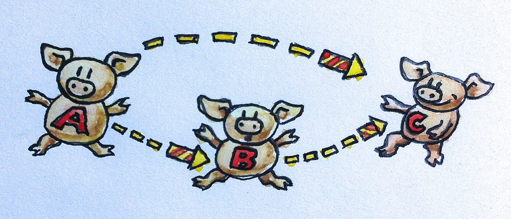

<!-- .slide: data-background="#003d73" -->
# Functions and Types

 <!-- .element style="width: 200px; position: fixed; bottom: 50px; left: 50px" -->

----

## Agenda

* Functions<!-- .element: class="fragment" -->
  * First-class citizen
  * Infix/prefix
* Tuples and Records<br/><!-- .element: class="fragment" -->
* List<!-- .element: class="fragment" -->
  * Polymorphism
  * Higher order Functions
* Monoids<!-- .element: class="fragment" -->

---

# Functions


----

## Type inference

* F# compiler will try to determine type<!-- .element: class="fragment" data-fragment-index="0" -->
  * `let addOne a = a+1`
* If compiler cannot find type it will return error<!-- .element: class="fragment" data-fragment-index="1" -->

```
let concat x = System.String.Concat(x);;

  let concat x = System.String.Concat(x);;
  ---------------^^^^^^^^^^^^^^^^^^^^^^^

<path>: error FS0041: A unique overload for method 'Concat'
could not be determined based on type information prior to
this program point. A type annotation may be needed.

Known type of argument: 'a
```
<!-- .element: class="fragment" data-fragment-index="1" -->

----

### Reading function types

* '->' reads return<!-- .element: class="fragment" -->
```fsharp
let addOne a = a+1
// val addOne: a: int -> int
```
* All functions are curried<!-- .element: class="fragment" -->
```fsharp
let apply f a = f a
// val apply: f: ('a -> 'b) -> a: 'a -> 'b
let multiply a b = a * b
// val multiply: a: int -> b: int -> int
```
* Partial application<!-- .element: class="fragment" -->
```fsharp
let double = multiply 2
// val double: int -> int
```

note:
```fsharp

let applyTwo g a b = g a b
// val applyTwo: g: ('a -> 'b -> 'c) -> a: 'a -> b: 'b -> 'c

```

----

### Specifying types

```fsharp
let multiply a b = a * b
// val multiply: a: int -> b: int -> int
let multiplyFloat (a: float) (b:float) : float = a * b
// val multiplyFloat: a: float -> b: float -> float
```

----

# Inner functions

```fsharp[2-5]
let generateList max =
  let rec generateList i max =
    if (i < max) 
    then i :: (generateList (i+1) max)
    else [max]
  generateList 0 max
```

----

## First-class citizens

* Functions in F# are first class citizen<!-- .element: class="fragment" data-fragment-index="0" -->
  * functions can be input and output from functions<!-- .element: class="fragment" data-fragment-index="0" -->
* First-order functions<!-- .element: class="fragment" data-fragment-index="1" -->
  * *values* as paramters and returns values<!-- .element: class="fragment" data-fragment-index="1" -->
* Higher order functions<!-- .element: class="fragment" data-fragment-index="2" -->
  * *functions* as parameters and/or return functions<!-- .element: class="fragment" data-fragment-index="2" -->

Note:
C#, Java, etc also have functions as first class citizen

----

## Higher order functions

Functions as arguments<!-- .element: class="fragment" data-fragment-index="1" -->

```fsharp
let operate f a = f a
// val operate : f:('a -> 'b) -> a:'a -> 'b

operate (fun a -> a+2) 3
```
<!-- .element: class="fragment" data-fragment-index="1" -->

Returning function<!-- .element: class="fragment" data-fragment-index="2" -->

```fsharp
let plusThree = (+) 3
// val plusThree : (int -> int)

plusThree 5
```
<!-- .element: class="fragment" data-fragment-index="2" -->

----

<!-- .slide: data-visibility="hidden" -->

## Prefix and Infix operators

* Some operators are alwas prefix others can be both
  * Operators begining with `!` and any number of `~` except `!=` are prefix
  * `+`, `-`, `+.`, `-.`, `&`, `&&`, `%`, and `%%` can be both prefix and infix
  * Prefix operators defined by starting with `~`
  * `!`, `*`, `/`, `<`, `=`, `>`, `?`, `@`, `^`, `|`, `.` or a sequence of these can be used as infix

```fsharp
(op) // infix operator of op
(~op) // prefix operator of op
```

----

## Prefix + infix operators

Infix:

```fsharp
let (|+|) a b =
    match (a, b) with
    | (Some(x), Some(y)) -> Some(x+y)
    | _ -> None
Some(2) |+| Some(4) // Some(6)
Some(3) |+| None // None
```

Prefix:

```fsharp
let (~+) a = a+42 // properly a stupid idea :)
+ 3 // 45 
```

----

## Pipe

#### Or 'function appliation operators'

```fsharp
[2;3;4;5;6;6] |> List.filter (fun y -> y < 4)
// val it: int list = [2; 3]
List.filter (fun y -> y < 4) <| [2;3;4;5;6;6]
// val it: int list = [2; 3]
```
<!-- .element: class="fragment" -->

* <!-- .element: class="fragment" -->Operators <code>|></code>, <code>||></code> and <code>|||></code><br/>
* <!-- .element: class="fragment" -->Works as '|' in bash and Powershell


 <!-- .element style="height: 250px;" -->


----

### Function composition

* Operators `>>` and `<<`

```fsharp
let addOne a = a+1
let convertToFloat a = float a
let whatIsThis = addOne >> convertToFloat
let result = whatIsThis 41
```

note:

```fsharp
let inline (>>) f g x = g(f x)
```

* [pipe vs composition](https://stackoverflow.com/a/51640831/802881)

---

# Tuples

```fsharp
let t = ("foo", 42)
// val t : string * int = ("foo", 42)
let t2 = ([12;32], 3, "bar", 'a', t)
```

----

## Functions on tuples

* Predefined functions<!-- .element: class="fragment" data-fragment-index="0" -->
```fsharp
fst ("foo", 42) // returns "foo"
snd ("foo", 42) // return 42
```
<!-- .element: class="fragment" data-fragment-index="0" -->
* Deconstructing&nbsp;&nbsp;&nbsp;&nbsp;&nbsp;&nbsp;&nbsp;&nbsp;&nbsp;&nbsp;&nbsp;&nbsp;&nbsp;&nbsp;&nbsp;&nbsp;&nbsp;&nbsp;&nbsp;&nbsp;&nbsp;&nbsp;&nbsp;&nbsp;&nbsp;&nbsp;&nbsp;&nbsp;&nbsp;&nbsp;&nbsp;&nbsp;&nbsp;&nbsp;&nbsp;&nbsp;&nbsp;&nbsp;&nbsp;&nbsp;&nbsp;&nbsp;&nbsp;<!-- .element: class="fragment" data-fragment-index="1" -->
```fsharp
let (str, num) = t
// or
let (l, num, bar, a, (str', num')) = t2
```
<!-- .element: class="fragment" data-fragment-index="1" -->

----

## Equality

* Requires that equality is defined for components
* Requires the components to be pair wise equal in type

```fsharp
(1, "foo", 'a') = (1, "bar", 'b') // false
(1, ("foo", 'a')) = (1, "foo", 'a')
// error FS0001: Type mismatch. Expecting a
//    int * (string * char)'    
// but given a
//    int * string * char
// The tuples have differing lengths of 2 and 3
```

----

## Ordering

* Requires ordering to defined for components
* Requires components to be pairwise equal in type
* Is compared from left to right

 <!-- .element style="height: 300px; " -->

---

# Records

Defined as<!-- .element: class="fragment" data-fragment-index="0" -->

```fsharp
type Course = { name: string; semester: string;
                students: int list; teacher: int}

```
<!-- .element: class="fragment" data-fragment-index="0" -->
with labels 'name', 'semester', 'students' and 'teacher'<!-- .element: class="fragment" data-fragment-index="0" -->

```fsharp
[ attributes ]
type [accessibility-modifier] typename =
    { [ mutable ] label1 : type1;
      [ mutable ] label2 : type2;
      ... }
    [ member-list ]
```
<!-- .element: class="fragment" data-fragment-index="1" -->

----

### Construction

To create values of Course type

```fsharp
let swafp = {name = "SWAF"; semester = "F23"; 
             students = []; teacher = 31 }
// val swafp : Course = { name = "SWAF"
//      semester = "F23"  students = []
//                        teacher = 31 }
```

**Note**: type is inferred by type system


----

## Equality

* Requires equality to be defined for all components
* Requires types to be equal

```fsharp
type RecordTest = { X: int; Y: int }

let record1 = { X = 1; Y = 2 }
let record2 = { X = 1; Y = 2 }
record1 = record 2
// val it: bool = true
```

----

## Ordering

* Requires ordering to be defined for components
* Requires that types are equal
* Is compared from left to right of definition

----

## Deconstruction

Can use pattern to decompose records

```fsharp
let {name = n; semester = s; students = l; teacher = t } 
                    = swafp
// val t : int = 33
// val s : string = "F21"
// val n : string = "SWAF"
// val l : int list = []
```

---

# List

* From last time<!-- .element: class="fragment" data-fragment-index="0" -->
```fsharp
let alphabet = ['a'; 'b'; 'c'; 'd']
```
<!-- .element: class="fragment" data-fragment-index="0" -->
* Can contain values, records, tuples, functions and lists<!-- .element: class="fragment" data-fragment-index="1" -->

* Lists are finite<!-- .element: class="fragment" data-fragment-index="2" -->
* Single chained linked list<!-- .element: class="fragment" data-fragment-index="3" -->
    * head :: tail<!-- .element: class="fragment" data-fragment-index="3" -->


----

## Pattern matching

```fsharp
let x::xs = alphabet // matches a list
```

**Note**: fails on empty list

```fsharp
> match alphabet with                        
-   | [] -> "empty"                          
-   | x::xs -> "first element " + (string x);;
// val it : string = "first element a"
```
<!-- .element: class="fragment" data-fragment-index="1" -->

----

### Operators

* `@` and `::` is infix operators on lists. 

```fsharp
let l = 'a'::['b']
// val l: char list = ['a'; 'b']
let merged = ['a';'b'] @ ['c';'d']
// val merged : char list = ['a'; 'b'; 'c'; 'd']
```

**Note**: they bind differently

note:

* `List.append` same thing as `@`


----

### Reversing


```fsharp
let rec reverse = function
  | []    -> []
  | x::xs -> reverse xs @ [x]
```

* <!-- .element: class="fragment" -->Not efficient because of the way <code>@<code> works


----

## `List.rev`

* <!-- .element: class="fragment" --><code>List.rev</code> is from List module<br/>
* <!-- .element: class="fragment" --><code>List.rev</code> is an efficient way of reversing a list
  * oppose to the naive implemetation (above)<br/>


Note:

Point - use std - since this is optimized

----

## HoF on Lists

#### as alternative to recursive functions

```fsharp [1-3|5]
let rec sum = function
    | []    -> 0
    | x::xs -> x+(sum xs)

let sum l = List.fold (fun acc elem -> acc+elem) 0 l
```

note:

LINQ: Aggregate

----

### map

* Definition: 
```fsharp
List.map: ('a -> 'b) -> 'a list -> 'b list
```
* <!-- .element: class="fragment" --> Transforms a list of <code>'a</code>'s to a list of <code>'b</code>'s

note:
Equavilant to Select in LINQ

----

### map examples

```fsharp
let list = [1;2;3;4;4;5]

List.map (fun element -> string element) list
// val it : string list = ["1"; "2"; "3"; "4"; "4"; "5"]
```

----

### map (maybe) a better example

```fsharp
let tempSF = [59;61;62;64;63;67;66;67;70;70;64;64;58;64]

let tempSFCelcius = List.map
  (fun fahrenheit -> ((float fahrenheit) - 32.0) * (5.0/9.0))
  tempSF
let tempSFCelciusRounded =
  List.map (fun celcius -> Math.Round(celcius))
  tempSFCelcius
//val it : float list =
//  [15.0; 16.0; 17.0; 18.0; 17.0; 19.0; 19.0; 19.0; 
//   21.0; 21.0; 18.0; 18.0; 14.0; 18.0]
```

----

### map works on many types

* <!-- .element: class="fragment" data-fragment-index="0" -->Generally speaking maps applies a function `f` to wrapped element(s)<!-- .element: class="fragment" data-fragment-index="0" --><br/>
* <!-- .element: class="fragment" data-fragment-index="1" -->Given a function `f: 'a -> 'b`<!-- .element: class="fragment" data-fragment-index="1" -->
    * map applies this to all wrapped elements e.g.
      * `'a list`, `Set<'a>`, `Map<'a>`
      * `'a option`
      * etc.
* <!-- .element: class="fragment" data-fragment-index="2" --> Map is always `$ O(n) $`<!-- .element: class="fragment" data-fragment-index="2" -->

----

### fold

* Definition:<!-- .element: class="fragment" data-fragment-index="0" -->
```
List.fold: ('State -> 'T -> 'State) -> 
                  'State -> 'T list -> 'State
```
<!-- .element: class="fragment" data-fragment-index="0" -->
* Accumulates a list<!-- .element: class="fragment" data-fragment-index="1" -->
  * given an initial value and <!-- .element: class="fragment" data-fragment-index="1" --><br/>
  * a function that takes a list element and an accumulative value.<!-- .element: class="fragment" data-fragment-index="1" --><br/>

* ('State -> 'T -> 'State) - accumulator function<!-- .element: class="fragment" data-fragment-index="2" -->
* 'State an initial value<!-- .element: class="fragment" data-fragment-index="3" -->

----

### fold example

* Counting number of element in list<!-- .element: class="fragment"  data-fragment-index="0" -->

* Initial value? <!-- .element: class="fragment"  data-fragment-index="1" -->

* Function?  <!-- .element: class="fragment"  data-fragment-index="2" -->

```fsharp
let list = [1;2;3;4;4;5]

List.fold (fun acc elem -> acc+1) 0 list
//val it : int = 6
```
<!-- .element: class="fragment"  data-fragment-index="3" -->
* 
Translate to <!-- .element: class="fragment"  data-fragment-index="4" -->

f (f (f (f (f (f (f 0 1) 2) 3) 4) 4) 5)  <!-- .element: class="fragment"  data-fragment-index="4" -->


----

### Another fold example

Insertion sort defined by List.fold

```fsharp
List.fold (fun acc i ->
  let (f, b) = span (fun e -> e < i) acc
  f @ (i :: b)) [] [12;54;2;1;15;6;21;1;5;5;6]
// val it : int list = [1; 1; 2; 5; 5; 6; 6; 12; 15; 21; 54]
```

span is a function that splits input list (see exercises)

Note:
```fsharp
let span p list =
    let rec spanUtil acc l =
        if (not (List.isEmpty l) && (p (List.head l))) then
            spanUtil (acc @ [List.head l]) (List.tail l)
        else
            (acc, l)
    spanUtil [] list
```

----

### fold in general

* Fold like map is defined on many types<!-- .element: class="fragment"  data-fragment-index="1" -->
     * `list`, `Set`, `Map`, `option` etc.
* Fold is tail recursive - stack secure<!-- .element: class="fragment"  data-fragment-index="2" --><br/>
* Fold is specific in the direction it calculates<!-- .element: class="fragment"  data-fragment-index="3" --><br/>
* <!-- .element: class="fragment"  data-fragment-index="4" -->Fold is always $ O(n) $<!-- .element: class="fragment"  data-fragment-index="4" -->

----

### foldBack

Definition

```
foldBack: ('T -> 'State -> 'State) ->
                   'T list -> 'State -> 'State
```

* Accumulate in the opposite order from `fold`
* Order of paramters are different
* FoldBack is always `$ O(n) $`

----

### Differences

```fsharp
List.fold (fun a i -> a - i) 100 [1; 3; 8]
// val it : int = 88

List.foldBack (fun a i -> a - i) [1; 3; 8] 100
// val it : int = -94
```

* fold: (((100 - 1) - 3) - 8) <!-- .element: class="fragment"  data-fragment-index="1" --><br/>
* foldBack: (1 - (3 - (8 - 100))) <!-- .element: class="fragment"  data-fragment-index="1" -->

----

### Zip

Combines two or three lists together

```fsharp
zip: 'a list -> 'b list -> ('a*'b) list
zip3: 'a list -> 'b list -> c' list -> ('a*'b*'c) list
```

```fsharp
List.zip [1;2;3;4] ['2';'4';'6';'8']
val it: (int * char) list = [(1, '2'); (2, '4'); (3, '6'); (4, '8')]

> List.zip [1;2;3;4] [2;4;6;8;2]
System.ArgumentException: The lists had different lengths.
list1 is 1 element shorter than list2 (Parameter 'list1')
Stopped due to error

```


---

## Monoids



----

### Monoid rules

* Associative<!-- .element: class="fragment"  data-fragment-index="1" --><br/>
* Binary operations<!-- .element: class="fragment"  data-fragment-index="2" --><br/>
* Identity element<!-- .element: class="fragment"  data-fragment-index="3" -->

----

### Why Monoids

* Rather simple constructs we see a lot<!-- .element: class="fragment"  data-fragment-index="1" --><br/>
  * We 'add' data together all the time
* Make for simpler programs<!-- .element: class="fragment"  data-fragment-index="2" --><br/>
  * if your types behaves like built-in types

----

### Strings concatenation

* `("a"+"b")+"c" = "a"+("b"+"c")`<!-- .element: class="fragment"  data-fragment-index="1" --><br/>
* `""+"a" = "a"+""`<!-- .element: class="fragment"  data-fragment-index="2" --><br/>

----

### List

* binary operation?<!-- .element: class="fragment"  data-fragment-index="1" --><br/>
* associative?<!-- .element: class="fragment"  data-fragment-index="2" --><br/>
* identity?<!-- .element: class="fragment"  data-fragment-index="3" --><br/>


----

<!-- .slide: data-visibility="hidden" -->
### Free monoid

* We want to combine two numbers<!-- .element: class="fragment"  data-fragment-index="1" --><br/>
  * 3 & 4
  * but have not determined how
* Save these numbers in singleton arrays<!-- .element: class="fragment"  data-fragment-index="2" --><br/>
  * `let three = [3]`
  * `let four = [4]`
* Then we can combine these<!-- .element: class="fragment"  data-fragment-index="3" --><br/>
  * `let combination = [3] @ [4]
  * Haven't lost any information
* later we can 'fold' to combine<!-- .element: class="fragment"  data-fragment-index="4" --><br/>
  * this is a free monoid

---

## References

* [Category therory](https://medium.com/statebox/fun-with-categories-70c64649b8e0 "flying pigs")