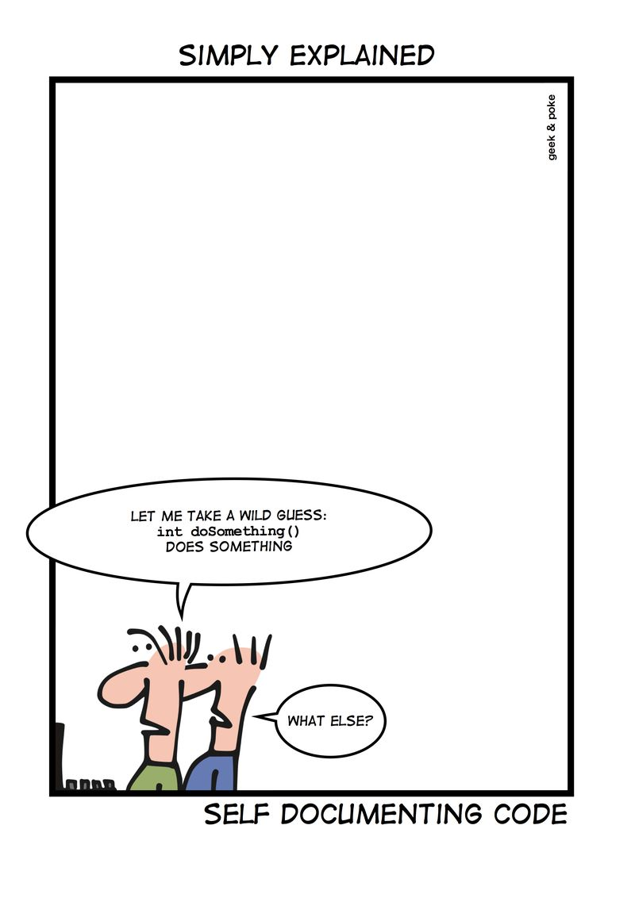
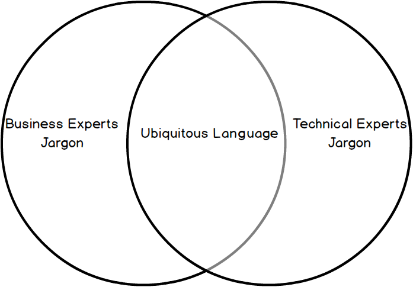
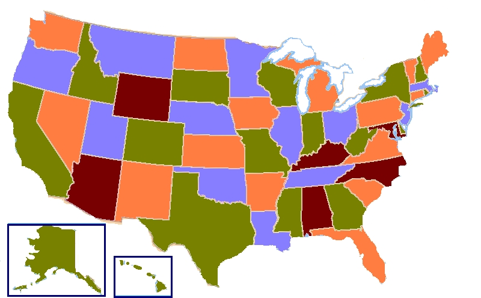
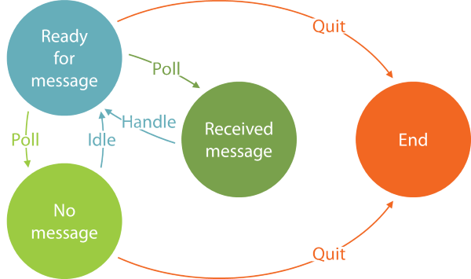

<!-- .slide: data-background="#003d73" -->
# Type / Model based programing

 <!-- .element style="width: 200px; position: fixed; bottom: 50px; left: 50px" -->

----

## Agenda

* Active patterns
* Types
  * Union
  * Sum
  * Enumerations
* Modeling
* Examples


---

### Active patterns

* Hide complex code in type construction

```fsharp
let (|FileExtension|) (s: string) = 
    System.IO.Path.GetExtension s
// val (|FileExtension|) : s: string -> string


let (FileExtension ext) = "Some_file.txt"
// val ext: string = ".txt"
// or
let a = ["asdf.txt"; "afs.ods"] |>   
        List.map (fun (FileExtension s) -> s)
// val a: string list = [".txt"; ".ods"]
```

----

#### Another example

```fsharp
let (|Even|Odd|) (num: int) =
    if (num % 2 = 0) then      
        Even                     
    else Odd
// val (|Even|Odd|) : num: int -> Choice<unit,unit>

match 3 with 
| Even -> printfn "3 is even"
| Odd -> printfn "3 is odd"
// outputs: 3 is odd
```

----

#### Partial active pattern

```fsharp
let (|IsEven|_|) (num: int) =
    if (num % 2 = 0) then
        Some num
    else None
// val (|IsEven|_|) : num: int -> int option
let (|IsOdd|_|) (num: int) =
    if (not (num % 2 = 0)) then
          Some num
    else None
// val (|IsOdd|_|) : num: int -> int option

match 3 with
| IsEven v -> printfn $"{v} is even"
| IsOdd v -> printfn $"{v} is odd"

//  match 3 with
//  ------^
//  warning FS0025: Incomplete pattern matches on this expression
// outputs: 3 is odd
```


---

## Equality

* Equality is structural and not referenctial be default
* Equality works with operators `=` and `<>` 
```fsharp
let eq x y = if (x <> y) then "not equal" else "equal"
//val eq : x:'a -> y:'a -> string when 'a : equality
```
* which means any type with equality

----

## Ordering

* Operators `>`, `>=`, `<=` and `<`
```fsharp
let greater x y = if (x > y) then "greater" else "smaller"
//val greater : x:'a -> y:'a -> string when 'a : comparison
```
* Do not work on functions - for same reasons as equality

----

### Custom Equality

```fsharp
[<CustomEquality; NoComparison>]
type Customer =
    { CustomerId : int; Name : string; Age : int; Town : string }

    interface IEquatable<Customer> with
        member this.Equals other = other.CustomerId.Equals this.CustomerId

    override this.Equals other =
        match other with
        | :? Customer as p -> (this :> IEquatable<_>).Equals p
        | _ -> false
    override this.GetHashCode () = this.CustomerId.GetHashCode()
```

----

### Custom Comparison


```fsharp
[<CustomComparison; CustomEquality>]
type Customer =
    { CustomerId : int; Name : string; Age : int; Town : string }
    interface IComparable with
        member this.CompareTo other =
            match other with
            | :? Customer as p -> (this :> IComparable<_>).CompareTo p
            | _ -> -1

    interface IComparable<Customer> with
        member this.CompareTo other = other.CustomerId.CompareTo this.CustomerId
```

----

## Types

> Data dominates. If you've chosen the right data structures and organized things well, the algorithms will almost always be self-evident. Data structures, not algorithms, are central to programming.
> - Rob Pike in 1989

----

### Abbrev 

* Type alias
```fsharp
type ProductName = string
type ParseProductName = ProductName -> Option<ProductName>
```
* Types are not preserved in .NET Framework MSIL code

----

### Product type

* Tuples

```fsharp
type Birthday = Person * Date
```

----

### Sum

* Discriminated Unions
* uses '`of`'

```fsharp
type Meassurement = Cm | Meter | Kilometer
type IntOrBool =
  | I of Int
  | B of Bool
// type Meassurement' =
//  | Cm
//  | Meter
//  | Kilometer
```

Note: 


----

### Example Sum type 

```fsharp
type Option<'a> =
   | Some of 'a
   | None
let someValue = Some 3
// val someValue: Option<int> = Some 3
```

----

### Enumeration

* Simular to sum type
  * Uses `Equal` and `int` value

```fsharp
type Meassurement = CM = 0 | Meter = 1 | Kilometer = 2
// [<Struct>]
//type Meassurement =
//  | CM = 0
//  | Meter = 1
//  | Kilometer = 2
let cm = Meassurement.CM
```

----

### Records

```fsharp
type StructPoint = 
    { X: float
      Y: float
      Z: float }

let p = { X = 1.0; Y = 2.3; Z = 4.5 }
let p2 = { p with X = 4.0 }
```

----

### Unit of Measure

```fsharp
[<Measure>] type cm
// or
[<Measure>] type ml = cm^3
let length = 3<cm>
let volume = 34<ml>
let v1 = 3.4<ml/cm> 
//val v1: float<ml/cm> = 3.4
```

---

## Examples Quadratic equations

 

----

### Types as tools

* Types can help us understand a domain
* Enforce domain rules
  * make states unrepresentable
* Help us refactor
* Keep and explicit TODO list
* F# makes this **easy**

----

### Understand the Domain 

`$$ ax^2 + bx + c = 0$$`

``` fsharp [1|2|4]
type Equation = float * float * float
type Solution = float * float

type solve = Equation -> Solution
```

Solution:

`$$ x = \frac {-b \pm \sqrt {b^2 - 4ac}}{2a}$$`

----

### Solution

```fsharp [1,7-8]
let solve (a, b, c) = // Equation in
  let d = b*b - 4.0*a*c
  if d < 0.0 || a = 0.0
  then failwith "discrimant is negative or a is zero"
  else 
    let sqrtD = sqrt d
    // Solution out
    ((-b + sqrtD) / (2.0*a), (-b - sqrtD) / (2.0*a))
```

_Left as a exercise to try and capture the possible solutions (2 roots, 1 root, 0 roots)_

---

## Enforce domain rules

`Contact` type for a webapplication

```fsharp
type Contact = {
  FirstName: string
  MiddleName: string
  LastName: string

  EmailAddress: string
  IsEmailVerified: bool
}
```

How can we do better?

----

### Optional

* Use types to express business constraints

```fsharp [3]
type Contact = {
  FirstName: string
  MiddleName: string option
  LastName: string

  EmailAddress: string
  IsEmailVerified: bool
}
```

----

#### Single choice types

* Two strings are not interchangeable
* Create Email type - private constructor

```fsharp
// Email.fsi
module FSharpTest.Email

type T
val create : string -> T option
val value : T -> string
```

```fsharp
// Email.fs
module FSharpTest.Email

type T = EmailAddr of string
let create (s: string) = Some (EmailAddr s)
let value (EmailAddr str) = str
```

----

### Linked fields

* Easier to reuse 

```fsharp [1-5|6-9|11-14]
type NameInfo = {
  FirstName: String50
  MiddleName: string50 option
  LastName: string50
}
type EmailInfo = {
  EmailAddress: EmailAddr
  IsEmailVerified: bool
}

type Contact = {
  name: NameInfo
  email: EmailInfo
}
```

----

### Constraint

- Business logic in types

```fsharp
type EmailInfo = {
  EmailAddress: EmailAddr
  IsEmailVerified: bool
}
```

- Here we want `IsEmailVerified` to change to false, whenever a new email is registered
- Constraint on who can set `IsEmailVerified`

----

### Constraint cont.

```fsharp
type VerifiedEmail = VerifiedEmail of EmailAddr

type VerifyEmailSerice =
  (EmailAddr * Hash) -> VerifiedEmail option

type EmailInfo =
  private
  | Verified of VerifiedEmail
  | UnVerifiedEmail of EmailAddr
```

Could of course also be moved into `fsi` file

----

### Documentation

*  <!-- .element style="height:50vh; background-color:white; float:right;" -->
* All code on the previeus slides are compilable code
* Can argue that most can be read by non-F# programmers
* Document constraints and logic
* Develops a language we can use to talk about the code

<!-- .slide: style="font-size: 38px" -->

----

### Avoid errors

* New requirements: Email or Postal address

```fsharp [3-4]
type Contact = {
  name: NameInfo
  email: EmailInfo option
  postal: PostalInfo option
}
```

- Lets make sure we cannot represent and error state

----

### Make illegal states unrepresentable

```fsharp [2-3|4|8]
type ContactInfo =
  | OnlyEmail of EmailInfo
  | OnlyPostal of PostalInfo
  | BothEmailAndPostal of EmailInfo * PostalInfo

type Contact = {
  name: NameInfo
  contact: ContactInfo
}
```

What about if there should be a secondary contact address?

----

### Domain Driven Design


* "The model and the heart of the design shape each other."
* "The model is the backbone of the language used by all team members."
* "The model is distilled knowledge."

 <!-- .element style="height: 200px;" -->

---

## Examples Cash register


----

### Domain

* Design from bottom and up

```fsharp [1-7|9-12 ]
// Register
type Code = string
type Name = string
[<Measure>] type Money
type Price = int<Money>

type Register = (Code * (Name*Price)) list

// Purchase
type NoPiece = int
type Item = NoPiece * Code
type Purchase = Item list
```

----

### Domain (cont.)

```fsharp [1-4|6-8]
// Bill
type Info = NoPiece * Name * Price
type InfoList = Info list
type Bill = Info list * Price

// Functions
type findArticle = Code -> Register -> (Name*Price)
type makeBill = Register -> Purchase -> Bill
```

note: 

* The more general type actually given by F#

----

## Examples Map Coloring



----

### Domain

```fsharp [1-5|7-8]
type Country = string
type Map = (Country * Country) list

type Color = Country list
type Coloring = Color list

// Goal
type colorMap = Map -> Coloring
```

----

### Functions

```fsharp
type areNeighbours = Country -> Country -> bool
type canBeExtendedBy = Map -> Color -> Country -> bool
type extendColoring = Map -> Coloring -> Country -> Coloring
type countries = Map -> Country list
type colorContries = Map -> Country list -> Coloring
```


Note: 

Methods above comes from the realization:

It should be possible to:
* test wether a color can be extended by a country
* test wether two countries are neighbours
* Extend a color with country.

---

## Examples State machine



----

### Domain

```fsharp [8]
// Auxiliary types
type MessageHandler = unit -> Timed<unit>

// State data
type ReadyData = Timed<TimeSpan list>
type ReceivedMessageData =
        Timed<TimeSpan list * MessageHandler>
type NoMessageData = Timed<TimeSpan list>
```

Note: 

* `MessageHandler` keeps that state clean of the concrete data
* End state don't need any data in this example

```fsharp
open System

type Timed<'a> =
    {
        Started : DateTimeOffset
        Stopped : DateTimeOffset
        Result : 'a 
    }
    member this.Duration = this.Stopped - this.Started

```

----

### States

Representing states of the STM

```fsharp
type PollingConsumer =
  | ReadyState of ReadyData
  | ReceivedMessageState of ReceivedMessageData
  | NoMessageState of NoMessageData
  | EndState
```

 <!-- .element: style="height: 150px; float: right" -->

----

### Transitions

Aiming for a transition function from each state

```fsharp [3-4]
type transitionFromEnd =
          unit -> PollingConsumer
type transitionFromNoMessage =
          NoMessageData -> PollingConsumer
type transitionFromReceived =
          ReceivedMessageData -> PollingConsumer
type transitionFromReady =
          ReadyData -> PollingConsumer
```

 <!-- .element: style="height: 150px; float: right" -->

----

### Implementation

```fsharp
let transitionFromNoMessage (nm : NoMessageData) =
    if shouldIdle nm
    then idle () |> ReadyState
    else EndState
// error FS0039: The value or constructor 'shouldIdle' is not defined.
// error FS0039: The value of constructor 'idle' is not defined.
```

 <!-- .element: style="height: 150px; float: right" -->


----

### Using types as TODO
 
Since this does not compiles - refactoring into

```fsharp
let transitionFromNoMessage shouldIdle idle
                         (nm : NoMessageData) =
    if shouldIdle nm
    then idle () |> ReadyState
    else EndState
// val transitionFromNoMessage :
//   shouldIdle:(NoMessageData -> bool) ->
//     idle:(unit -> ReadyData) -> nm:NoMessageData
//       -> PollingConsumer
```

----

### Still not done

* Model the domain directly in code
* Type system is 'easy' to work with
* Type system helps with refactoring
* Keeps a todo list

---

# References

* Inspirations from: 
 * https://fsharpforfunandprofit.com/ddd/
 * https://blog.ploeh.dk/2015/08/10/type-driven-development/
* Images from:
  * http://geek-and-poke.com/geekandpoke/2013/2/14/self-documenting-code.html

<!-- .slide: style="font-size: 38px" -->