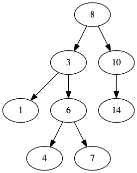
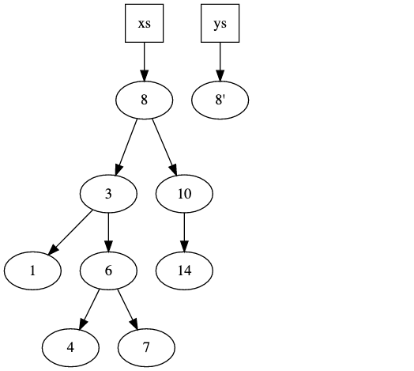
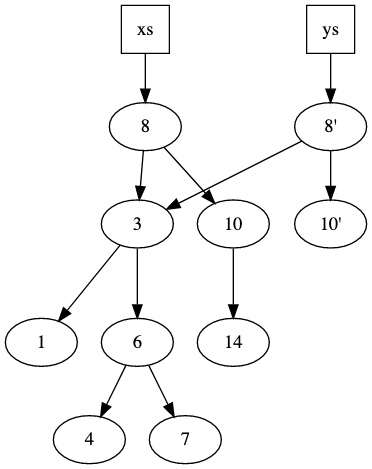
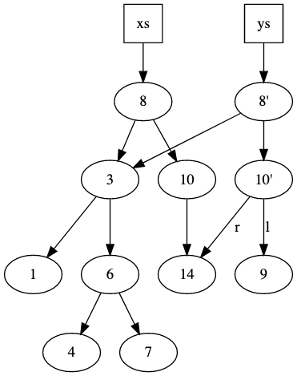

<!-- .slide: data-background="#003d73" -->
# Immutable data structures

 <!-- .element: style="height: 300px; float: right; rigth: -140px; bottom: -230px" -->

 <!-- .element: style="width: 200px; position: absolute; bottom: 50px; left: 50px" -->


----

## Agenda

* What, Why<br/><!-- .element: class="fragment" -->
* How<br/><!-- .element: class="fragment" -->
    * Ex. Binary Search Tree
* Sets<br/><!-- .element: class="fragment" -->
    * set operations
* Maps and Sets<br/><!-- .element: class="fragment" -->
* Sequence in F#<br/><!-- .element: class="fragment" -->

---

## What

* Mutating operations<!-- .element: class="fragment"  data-fragment-index="0" --><br/>
    * should not change structure
    * instead copy
* Can share data between 'versions'<!-- .element: class="fragment"  data-fragment-index="1" --><br/>

----

## Why

* Pros:<!-- .element: class="fragment"  data-fragment-index="0" --><br/>
    * immutablility makes reasoning easier
    * automatically thread safe
    * easier to implement :)
* Cons:<!-- .element: class="fragment"  data-fragment-index="1" --><br/>
    * slower?
    * uses more memory
    * harder to implement :)

---

## Binary search tree

 <!-- .element style="height: 500px;" -->

----

### Type

```fsharp
type BST<'a> =
  | Empty
  | Node of BST<'a> * 'a * BST<'a>
module BST =
    // Code for creating/adding etc.
```

----

##### Invariants
* An element `'a` in a Node 
    * is **greater** than all elements in left sub-tree
    * is **less** than all elements in right sub-tree

Note:
We could also use .fsi files to declare functions

----

### Operations

```fsharp
module BST =
  val empty<'a>    : unit -> BST<'a>
  val insert<'a>   : 'a   -> BST<'a> -> BST<'a>
  val remove<'a>   : 'a   -> BST<'a> -> BST<'a>
  val contains<'a> : 'a   -> BST<'a> -> bool
```

Could be extended with

`map`, `filter`, `fold`, etc.

note:

Insert is also call 'cons' in list-like structures

----

### Implementing `contains x`

```fsharp
let rec contains (x: 'a) (n: BST<'a>) =
    if (n == Empty) then false
    else 
        if (x < n.elem) then contains x n.left
        else if (x > n.elem) then contains x n.right
        else true

```

----

### Implementing `insert`


* Algorithm:   <!-- .element: style="width: 250px; float: right" -->
    1. Use a variation of 'contains' to locate correct place to insert<!-- .element: class="fragment"  data-fragment-index="0" --><br/>
    2. Copy nodes as we move down through the tree<!-- .element: class="fragment"  data-fragment-index="1" --><br/>
* Example<!-- .element: class="fragment"  data-fragment-index="2" --><br/>
    * Inserting 9

----

### Step 1 

 <!-- .element style="height: 500px;" -->

----

### Step 2

 <!-- .element style="height: 500px;" -->

----

### Step 3

 <!-- .element style="height: 500px; float: right" -->

* **Notice:**<!-- .element: class="fragment"  data-fragment-index="0" --><br/>
* Only copy a small part</br>of the tree<!-- .element: class="fragment"  data-fragment-index="0" --><br/>
* How much?<!-- .element: class="fragment"  data-fragment-index="1" --><br/>
* Does it effect run-time</br> for 'insert'?<!-- .element: class="fragment"  data-fragment-index="2" --><br/>


---

## `Set<'a>`

* Invariant: Elements are unique<!-- .element: class="fragment"  data-fragment-index="0" --><br/>
* Finite<!-- .element: class="fragment"  data-fragment-index="1" --><br/>
* Immutable<!-- .element: class="fragment"  data-fragment-index="1" --><br/>
    * All operations returns a new `set`
* Mathmatical set operations available<!-- .element: class="fragment"  data-fragment-index="2" --><br/>
* Only elements where 'ordering' is defined<!-- .element: class="fragment"  data-fragment-index="3" --><br/>
* Internally represented as a 'BBT<'a>'<!-- .element: class="fragment"  data-fragment-index="3" --><br/>

Note:
BBT: balanced binary three
Impl AVL

Red-Black tree: [OKASAKI, C. (1999). Red-black trees in a functional setting. Journal of Functional Programming, 9(4), 471-477. doi:10.1017/S0956796899003494](https://www.cambridge.org/core/journals/journal-of-functional-programming/article/redblack-trees-in-a-functional-setting/62BC5EA75A2C95E3F6EE95AE3DADF0E5)

----

### Set Creations

```
let s1 = set [1;2;3;4;5]

let s2 = Set.ofList [1;2;3;4;5]

let s1' = Set.add 6 s1

let s1'' = Set.remove 3 s1
```

----


### Union + Intersection + Difference

Definition

```fsharp
union:      Set<'a> -> Set<'a> -> Set<'a>
intersect:  Set<'a> -> Set<'a> -> Set<'a>
difference: Set<'a> -> Set<'a> -> Set<'a>
```

----

### Examples

```fsharp
let first = set ["a"; "b"]
let second = set ["c"; "d"]
let third = set ["a"; "d"]

Set.union first second
// val it : Set<string> = set ["a"; "b"; "c"; "d"]
Set.intersect first third
// val it : Set<string> = set ["a"]
Set.difference first third
// val it : Set<string> = set ["b"]
```

----

## Sets in general

* <!-- .element: class="fragment" --> map, filter, `fold`, foldBack are all $ O(n) $<br/>
* <!-- .element: class="fragment" --> complexity of recusion is in worst case $ O(n*log(n)) $<br/>
* <!-- .element: class="fragment" --> Enumarations can be used to simplify and optimize this

---

## `Map<'a, 'b>`

* Invariant: Keys are unique<!-- .element: class="fragment" -->
    * Key / value pair
    * Lookup per key
* Immutable<!-- .element: class="fragment" --><br/>
* Implemented using 'BBT<'a>'<!-- .element: class="fragment" --><br/>
* As Set, Map requires ordering is defined for key type<!-- .element: class="fragment" -->

Note:
BBT: balanced binary three

----

### Map creations

Creation is straightforward

```fsharp
let m1 = Map.empty
// From list
let m2 = Map.ofList [("k1", 1); ("k2", 2); ("k3", 3),
                     ("k3", 4)]
// val m2 : Map<string,int> =
//     map [("k1", 1); ("k2", 2); ("k3", 4)]

let m2' = Map.add "k5" 5 m2

let m2'' = Map.remove "k1" m2
```

----

### Search

```fsharp
find:        'Key -> Map<'Key, 'T> -> 'T
tryFind:     'Key -> Map<'Key, 'T> -> 'T option
containsKey: 'Key -> Map<'Key, 'T> -> bool
exists:      ('Key - 'T -> bool) -> Map<'Key, 'T> -> bool
```

----

### `fold` and `foldBack` on Maps

Uses key/value pair in functions

```fsharp
fold:     ('State -> 'Key -> 'T -> 'State)
                     -> 'State -> Map<'Key, 'T> -> 'State
foldBack: ('Key -> 'T -> 'State -> 'State)
                     -> Map<'Key, 'T> -> 'State -> 'State
```

```fsharp
let m = Map.ofList [("k1", 1); ("k2", 2);
                    ("k3", 4); ("k5", 5)]
Map.fold (fun s k v -> s + v) 0 m
// val it : int = 12
```
<!-- .element: class="fragment" -->

---

## Equality

* = operator is defined for both 'list', 'set' and 'map'<!-- .element: class="fragment"  data-fragment-index="0" --><br/>
* Equal means same elements (structural)<!-- .element: class="fragment"  data-fragment-index="1" --><br/>
    * For `list` order of elements matters

```fsharp
[1;2] = [1;2]
// val it : bool = true

[1;2] = [2;1]
// val it : bool = false

set [1;2] = set [2;1]
// val it : bool = true

set [1;2] = set [3;2]
// val it : bool = false
```
<!-- .element: class="fragment"  data-fragment-index="2" --><br/>

---

<!-- .slide: data-background-image="./img/infinite.jpg" data-background-opacity="0.5" -->
## Sequence


----

### Sequences

* Sequences in F# are lazy<!-- .element: class="fragment"  data-fragment-index="0" --><br/>
* Possibly infinite<!-- .element: class="fragment"  data-fragment-index="1" --><br/>

```fsharp
// Create finite
seq [1;2;3;4;5]
// Create infinite
let nat = Seq.initInfinite (fun i -> i)
// [f 0; f 1; f 2; ...]
```
<!-- .element: class="fragment"  data-fragment-index="2" --><br/>

----

### Accessing

```fsharp
Seq.item 5 nat
// val it: int 5
```

* <!-- .element: class="fragment" --> 'Seq.item 5 nat' evaluates the 5th element
    * not elements '0-4' + '6-...'
* <!-- .element: class="fragment" --><br/> Calling 'Seq.item 5 nat' will evaluate the 5th element again

----

### Caching sequences

```fsharp
// Seq.cache: seq<'a> -> seq<'a>
let cachedNat = Seq.cache nat
```

* <!-- .element: class="fragment"  data-fragment-index="0" --><code>Seq.item 5 cachedNat<code> will evaluate all elements from '0-5'<br/>
* <!-- .element: class="fragment"  data-fragment-index="0" -->Calling again will not evalute elements '0-5' again

---

## References

* Complexity for F# datastructures: https://docs.microsoft.com/en-us/dotnet/fsharp/language-reference/fsharp-collection-types
* [Amortized analysis](https://www.cs.cornell.edu/courses/cs3110/2011sp/Lectures/lec20-amortized/amortized.htm)