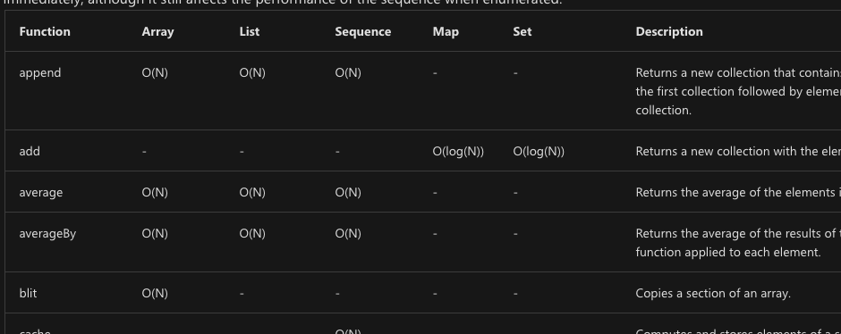
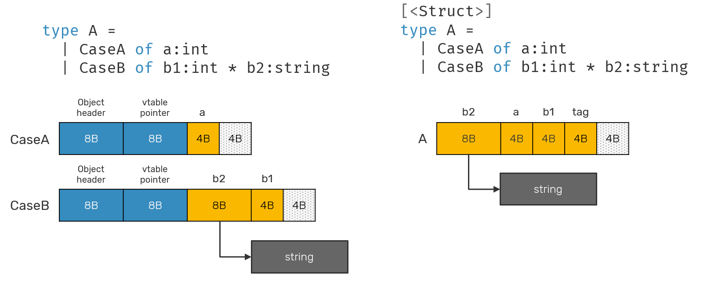
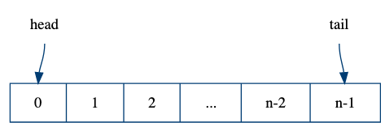

<!-- .slide: data-background="#003d73" -->
## Stack, Heap & Optimization

 <!-- .element style="width: 200px; position: fixed; bottom: 50px; left: 50px" -->

----

### Agenda

* Active Patterns
* Stack/Heap
* Big-O
* Recursion
  * Tail recursion
* Optimization
* Queue's

---

### Active patterns

* Hide complex code in type construction

```fsharp
let (|FileExtension|) (s: string) = 
    System.IO.Path.GetExtension s
// val (|FileExtension|) : s: string -> string


let (FileExtension ext) = "Some_file.txt"
// val ext: string = ".txt"
// or
let a = ["asdf.txt"; "afs.ods"] |>   
        List.map (fun (FileExtension s) -> s)
// val a: string list = [".txt"; ".ods"]
```

----

#### Another example

```fsharp
let (|Even|Odd|) (num: int) =
    if (num % 2 = 0) then      
        Even                     
    else Odd
// val (|Even|Odd|) : num: int -> Choice<unit,unit>

match 3 with 
| Even -> printfn "3 is even"
| Odd -> printfn "3 is odd"
// outputs: 3 is odd
```

----

#### Partial active pattern

```fsharp
let (|IsEven|_|) (num: int) =
    if (num % 2 = 0) then
        Some num
    else None
// val (|IsEven|_|) : num: int -> int option
let (|IsOdd|_|) (num: int) =
    if (not (num % 2 = 0)) then
          Some num
    else None
// val (|IsOdd|_|) : num: int -> int option

match 3 with
| IsEven v -> printfn $"{v} is even"
| IsOdd v -> printfn $"{v} is odd"

//  match 3 with
//  ------^
//  warning FS0025: Incomplete pattern matches on this expression
// outputs: 3 is odd
```

---

## Stack and Heap

* Much like C#, Java, etc.
* Memory is split into Stack and Heap

----

### Stack

* Holds primitive values
    * Some objects
* Reference for objects on Heap
* Stackframes

----

### Stack frame

* Values/objects bound at the same level is kept in a stackframe
* Evaluating local declarations will push a stackframe on top
* When result is found/computed - stackframe wil be popped

----

### Measuring time

* Can be done in FSI with
    * `#time;;`

```fsharp
> #time;;

>pow ("1233456", 56);;
Real: 00:00:00.049, CPU: 00:00:00.037, 
    GC gen0: 1, gen1: 1, gen2: 0
val it : string =
  "1233456123345612334561233456123345612334561233456123345612334561233456123345612334561233456123345612334561233456123345612334
```

---

<!-- .slide: data-visibility="hidden" -->

## Big-O

TODO: Should this be included and what?

---

## Recursion

* We use recursion to do loops
* This can blow the stack
    * recursive call creates a new stack frame

 <!-- .element style="height: 200px;" -->

----

### Example

From week 1:

```fsharp
let rec pow = function
    | (s: string, 1) -> s
    | (s: string, n) -> s + pow (s, n-1)
```

After the recusive call there are still work todo in this function - add '`s`' to result

----

### Tail Recursion

From book:

```fsharp
let rec fact = function
    | (0, m) -> m
    | (n, m) -> fact (n-1, n*m)
```

This is tail recursive - last call is the recursive call

----

### Generalization of 

Looping on a special form:

```fsharp
let rec tr checker cont last value =
    if checker value
    then tr checker cont last (cont value)
    else last value
// val tr : checker:('input -> bool) ->
//          cont:('input -> 'input) ->
//          last:('input -> 'output) ->
//          value:'input -> 'output
```

----

### Implementing factorial by `tr`

```fsharp
let fact' = tr (fun (n,_) -> n<>0L)
               (fun (n,m) -> (n-1L, m*n))
               (fun (_,m) -> m)

// For reference
let rec fact = function
    | (0L, m) -> m
    | (n, m) -> fact (n-1L, n*m)
```

----

### Comparison

```fsharp
> fact' (30,1);;
Real: 00:00:00.000, CPU: 00:00:00.000, 
          GC gen0: 0, gen1: 0, gen2: 0
val it : int = 1409286144

> fact (30,1);;   
Real: 00:00:00.000, CPU: 00:00:00.000,
          GC gen0: 0, gen1: 0, gen2: 0
val it : int = 1409286144
```

----

### Properties of tail recursive functions

* Evaluation<br/> `tr checker cont last (cont value)`<br/> will not build large expressions
    * `cont value`<br/> will be evaluated at each step
* This are $O(n)$ - in the fact example
* The same evironment/stack frame can be reused - So $ O(1)$ space consumption

----

### Using continuations to optimize

* Accumulative parameter (as above) is not always possible
* Continuations is a genenral pattern for making tail-recursion

In general we will transform:

```fsharp
f: 'input -> 'output
// into
f: 'input -> ('input -> 'output) -> 'output
```

----

### Example

```fsharp
let rec bigListC n c =                          
    if n=0 then c []                            
    else bigListC (n-1) (fun res ->
        printfn "execute %d" (n-1)
        c((n-1)::res)
    )

bigListC 3 (fun a -> a)
// val it : int list = [2; 1; 0]
```

----

### Analysis 

* Accumulation is much faster than continuation based
    * Even more visible compared to iterative methods
* Continuations will work in all places 


----

### Example

```fsharp
type BinTree<'a> = | Leaf
                   | Node of BinTree<'a> * 'a * BinTree<'a>

let rec count = function
    | Leaf          -> 0
    | Node(l, n, r) -> count l + 1 + count r
// This is not tail recursive
```

----

### Implementaion with continuations

```fsharp
let rec countC t c =
    match t with
    | Leaf          -> c 0
    | Node(l, n, r) -> 
        let cl = fun vl -> 
            let cr = fun vr -> c(vl+1+vr)
            countC r cr
        countC l cl
// val countC : t:BinTree<'a> -> c:(int -> 'b) -> 'b
```

* So continuations based versions also works with multiple recursion
* **Optimization**: One of the continuations can be replaced with an accumulative version

---

## Optimization



[Collections complexities in F#](https://docs.microsoft.com/en-us/dotnet/fsharp/language-reference/fsharp-collection-types)

----

### Ex. `foldback`

* This should be a continuation-based imp.

```fsharp
// this version doesn't causes stack overflow - it uses a private stack 
[<CompiledName("FoldBack")>]
let foldBack<'T,'State> folder (list:'T list) (state:'State) = 
    let f = OptimizedClosures.FSharpFunc<_,_,_>.Adapt(folder)
    match list with 
    | [] -> state
    | [h] -> f.Invoke(h,state)
    | [h1;h2] -> f.Invoke(h1,f.Invoke(h2,state))
    | [h1;h2;h3] -> f.Invoke(h1,f.Invoke(h2,f.Invoke(h3,state)))
    | [h1;h2;h3;h4] -> f.Invoke(h1,f.Invoke(h2,f.Invoke(h3,f.Invoke(h4,state))))
    | _ -> 
        // It is faster to allocate and iterate an array than to create all those 
        // highly nested stacks.  It also means we won't get stack overflows here. 
        let arr = toArray list
        let arrn = arr.Length
        foldArraySubRight f arr 0 (arrn - 1) state
```

[F# List impl](https://github.com/fsharp/fsharp/blob/master/src/fsharp/FSharp.Core/list.fs)

Note:

```fsharp
let foldArraySubRight (f:OptimizedClosures.FSharpFunc<'T,_,_>) (arr: 'T[]) start fin acc = 
    let mutable state = acc
    for i = fin downto start do
        state <- f.Invoke(arr.[i], state)
    state
```

----

#### Map example

```fsharp
let rec foldBackOpt (f:OptimizedClosures.FSharpFunc<_,_,_,_>) m x = 
        match m with 
        | MapEmpty -> x
        | MapOne(k,v) -> f.Invoke(k,v,x)
        | MapNode(k,v,l,r,_) -> 
            let x = foldBackOpt f r x
            let x = f.Invoke(k,v,x)
            foldBackOpt f l x

    let foldBack f m x = foldBackOpt (OptimizedClosures.FSharpFunc<_,_,_,_>.Adapt(f)) m x
```


----

### Performance

```fsharp
type A = {X: int; Y: int}
// vs
[<Struct>]
type B = {X: int; Y: int}
```

* Type `B` is 16 bytes smaller, not having `8B` Object header + `8B` vTabel
* `B` is passed as values, therefore not always faster

----

### Padding

```fsharp
type A = {X: int; Y: int}
type B = {X: int; Y: int; Y: int}
```

* Here `B` is padded with 4 bytes extra, from the .NET Allocator


----

### Union types




----

### Immutable data structures

Records, unions, Lists etc etc.

* Fewer movings parts
* Thread-safe by default
* % Not nessesary performance optimal.
    * Change to use mutable datastructures within a module/function to gain performance.

----

### Other things to consider

* Hardware, L1, L2, caches
* OS pointer sizes 32/64b
* Inlining functions

F# can be very [performant](https://www.youtube.com/@FastFSharp) - used by stock companies because of this and its safety. But it requires work and knowledge about .Net Il, Hardware and F# of course.

---

### Amortized bounds

* An extension to the Big-O notation from DOA
* Used to analysis average run time
    * Usually used when some operations are fast and other are slow

* C# List is an example, its worst case bounds
    * insert: `$ O(n) $` -- **why?**
    * lookup: `$ O(1) $`
    * delete: `$ O(1) $`

----

### C# List analysis over time

* `$ \rightarrow $` `n` insertions are `$ O(n^2) $` worst case
* You can make the amortized analysis that shows <!-- .element: class="fragment"  data-fragment-index="1" -->
    * `n` insertions are `$ O(2n) $` <!-- .element: class="fragment"  data-fragment-index="1" -->
    * So amortized bounds are `$ O(1) $` for all operations <!-- .element: class="fragment"  data-fragment-index="1" -->
* See references for detailed analysis<!-- .element: class="fragment"  data-fragment-index="1" -->


---

## Queue

 <!-- .element style="width:800px;" -->

----

### Definition and operation

```fsharp [5-10]
module Queue

type Queue<'a> = 'a list * 'a list

val empty:   Queue<'a>
val isEmpty: Queue<'a> -> bool

val cons:    'a -> Queue<'a> -> Queue<'a>
val head:    Queue<'a> -> 'a
val tail:    Queue<'a> -> Queue<'a>
```

* Could be done with a single list <!-- .element: class="fragment" -->

----

### Operation implementations

```fsharp [2,7|3,8|4,9]
let rec head = function
    | ([], []) -> raise (ArgumentException "Empty")
    | ([], r)  -> head (List.rev r, [])
    | (l, _)   -> List.head l 
    
let rec tail = function
    | ([], []) -> raise (ArgumentException "Empty")
    | ([], r)  -> tail (List.rev r, [])
    | (l, r)   -> (List.tail l, r)
```

----


### Using lazy evaluation

* To optimize our queue C. Okasaki proposes to use lazy lists.
    * Almost seq in F#

```fsharp
module LazyQueue

type LazyQueue<'a> = seq<'a> * seq<'a>

val empty:   LazyQueue<'a>
val isEmpty: LazyQueue<'a> -> bool

val cons:    'a -> LazyQueue<'a> -> LazyQueue<'a>
val head:    LazyQueue<'a> -> 'a
val tail:    LazyQueue<'a> -> LazyQueue<'a>
```
<!-- .element: class="fragment" -->

----

### Lazy queue impl (1/2)

So here we utilises that `Seq` is lazy

```fsharp
let l' = Seq.append l r
```

This do not evalute `r` before its needed

----

### Lazy queue impl (2/2)

```fsharp
let l` = Seq.append l (Seq.rev r)
```

1. since append is lazy, we need to do `Seq.rev` incrementally. 
2. so do one step of `Seq.rev` for each step of append   
3. we then need the invariant `Seq.length r <= Seq.length l`

Note:
Seq.rev - will reverse the list in one go

```fsharp
// https://github.com/fsharp/fsharp/blob/577d06b9ec7192a6adafefd09ade0ed10b13897d/src/fsharp/FSharp.Core/seq.fs#L1424
let rev source =
    checkNonNull "source" source
    mkDelayedSeq (fun () ->
        let array = source |> toArray
        Array.Reverse array
        array :> seq<_>)
```

----

### Incremental rotation

```fsharp
let rot (l, r, a) = match Seq.length l
    | 0 -> (Seq.head r) :: a    
    | 1 -> (Seq.head l) :: (rot
                (Seq.tail l, Seq.tail r, Seq.head r :: a))
```

\* Not battle tested code

\*\* Not optimized code

----

### Bounds

* Amortized bounds for all operations are still `$ O(1) $`
* Worst case `$ O(log n) $`

----

### Amortization

* Not useful in `realtime` systems
    * why?

----

### Deque idea




---

## References

* [Writing high performance F# code](https://bartoszsypytkowski.com/writing-high-performance-f-code/)

----

### Other sources

[](https://www.infoq.com/presentations/Lock-free-Algorithms/ "Lock-Free Algorithms For Ultimate Performance")

<video data-autoplay src=""></video>