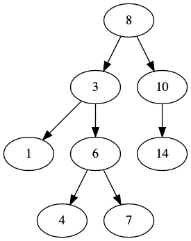
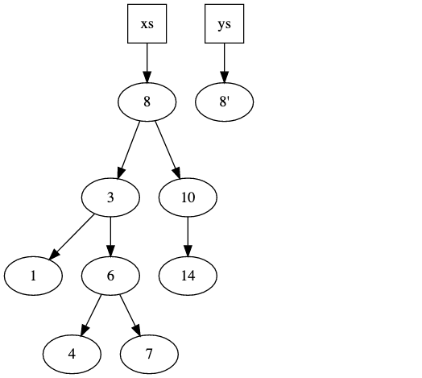
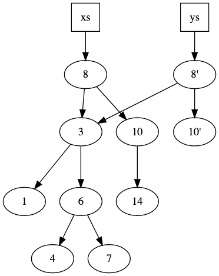
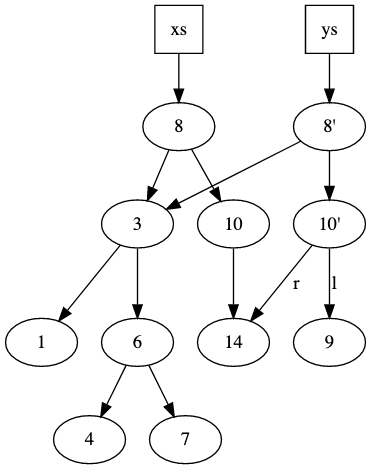

<!-- .slide: data-background="#003d73" -->
# Immutable data structures

 <!-- .element: style="width: 200px; position: fixed; bottom: 50px; left: 50px" -->

----

## Agenda

* What, Why
* How
    * Binary Search Tree (Set / map)
* Sequence in F#
    * Queue
    * Deque

---

## What

* Mutating operations
    * Should not change structure
    * Copy
* Shares data between versions

----

## Why

Pros: 

* Immutable is easier to reason about
* Automatically thread safe
* Easier to implement :)

Cons
* Slower?
* Uses more memory
* Harder to implement :)

---

## Binary search tree

 <!-- .element style="height: 500px;" -->

----

### Type

```fsharp
type BST<'a> =
  | Empty
  | Node of BST<'a> * 'a * BST<'a>
```

plus invariants
* An element `n` in a Node 
    * is always greater than all elements in left sub-tree
    * is always less than all elements in right sub-tree

Note: We could also use .fsi files to declare functions

----

### Operations

```fsharp
type empty<'a>    = unit -> BST<'a>
type insert<'a>   = 'a -> BST<'a> -> BST<'a>
type remove<'a>   = 'a -> BST<'a> -> BST<'a>
type contains<'a> = 'a -> BST<'a> -> bool
```

Could be extended with
* Map
* Filter
* Fold
* etc

----

### Implementing `contains`

* If `Empty` return false
* Else
    * if x < e then `look in left subtree`
    * if x > e then `look in right subtree`
    * else return true

----

### Implementing `insert`

1. Use a variation of `contains` to find correct place to insert
2. Copy nodes as we move down through the tree

E.g.

Inserting 9

----

### Step 1 

 <!-- .element style="height: 500px;" -->

----

### Step 2

 <!-- .element style="height: 500px;" -->

----

### Step 3

 <!-- .element style="height: 500px;" -->


---

<!-- .slide: data-background-image="./img/infinite.jpg" data-background-opacity="0.5" -->
## Sequence


----

### Lazy

* Sequences in F# are lazy
* Possibly infinite

```fsharp
// Create finite
seq [1;2;3;4;5]
// Create infinite
let nat = Seq.initInfinite (fun i -> i)
// [f 0; f 1; f 2; ...]
```

----

### Accessing

```fsharp
Seq.item 5 nat
// val it: int 5
```

* `Seq.item 5 nat` evaluates the 5th element, but not 0-4
* Calling `Seq.item 5 nat` will evaluate the 5 elements again

----

### Cache

```fsharp
// Seq.cache: seq<'a> -> seq<'a>
let cachedNat = Seq.cache nat
```

* Calling `Seq.item 5 cachedNat` will evaluate all elements from 0-5
* Calling again will not evalute elements 0-5 again

---

## Queue

 <!-- .element style="width:800px;" -->


----

### Definition and operation

```fsharp
module Queue

type Queue<'a> = 'a list * 'a list

val empty: Queue<'a>
val isEmpty: Queue<'a> -> bool

val cons: 'a -> Queue<'a> -> Queue<'a>
val head: Queue<'a> -> 'a
val tail: Queue<'a> -> Queue<'a>
```

----

### Operation implementations

* Could be done with a single list

```fsharp
let rec head = function
    | ([], []) -> raise (ArgumentException "Empty")
    | ([], r)  -> head (List.rev r, [])
    | (l, _)   -> List.head l 
    
let rec tail = function
    | ([], []) -> raise (ArgumentException "Empty")
    | ([], r)  -> tail (List.rev r, [])
    | (l, r)   -> (List.tail l, r)
```
<!-- .element: class="fragment" -->

----

### Amortized bounds

* An extension to the Big-O notation from DOA
* Used to analysis avarage run time
    * Usually used when some operations are fast and other are slow

* C# List is an example, its worst case bounds
    * insert: `$ O(n) $`
    * lookup: `$ O(1) $`
    * delete: `$ O(1) $`

----

### C# List analysis over time

* `$ \rightarrow $` `n` insertions is `$ O(n^2) $`
* You can make the amortized analysis that shows <!-- .element: class="fragment"  data-fragment-index="1" -->
    * `n` insertions is `$ O(2n) $` <!-- .element: class="fragment"  data-fragment-index="1" -->
    * So amortized bounds is `$ O(1) $` for all operations <!-- .element: class="fragment"  data-fragment-index="1" -->
* Se references for detailed analysis<!-- .element: class="fragment"  data-fragment-index="1" -->

----

### Using lazy evaluation

To optimize our queue C. Okasaki proposes to use lazy lists (Seq in F#)

```fsharp
module LazyQueue

type LazyQueue<'a> = seq<'a> * seq<'a>

val empty: LazyQueue<'a>
val isEmpty: LazyQueue<'a> -> bool

val cons: 'a -> LazyQueue<'a> -> LazyQueue<'a>
val head: LazyQueue<'a> -> 'a
val tail: LazyQueue<'a> -> LazyQueue<'a>
```
<!-- .element: class="fragment" -->

----

### Lazy queue impl (1/2)

So here we use that `Seq` is lazy

```fsharp
let l' = Seq.append l r
```

This do not evalute `r` before its needed

----

### Lazy queue impl (2/2)

```fsharp
let l` = Seq.append l (Seq.rev r)
```

1. since append is lazy, we need to do `Seq.rev` incrementally. 
2. so do one step of `Seq.rev` for each step of append   
3. we then need the invariant `Seq.length r <= Seq.length l`

----

### Incremental rotation

```fsharp
let rot (l, r, a) = match Seq.length l
    | 0 -> (Seq.head r) :: a    
    | 1 -> (Seq.head l) :: (rot
                (Seq.tail l, Seq.tail r, Seq.head r :: a))
```

\* Not battle tested code

\*\* Not optimized code

----

### Bounds

* Amortized bounds for all operations are still `$ O(1) $`
* Worst case `$ O(log n) $`

----

### Amortization

* Not useful in `realtime` systems
    * why?

----

### Deque idea


---

## References

* [Amortized analysis](https://www.cs.cornell.edu/courses/cs3110/2011sp/Lectures/lec20-amortized/amortized.htm)
