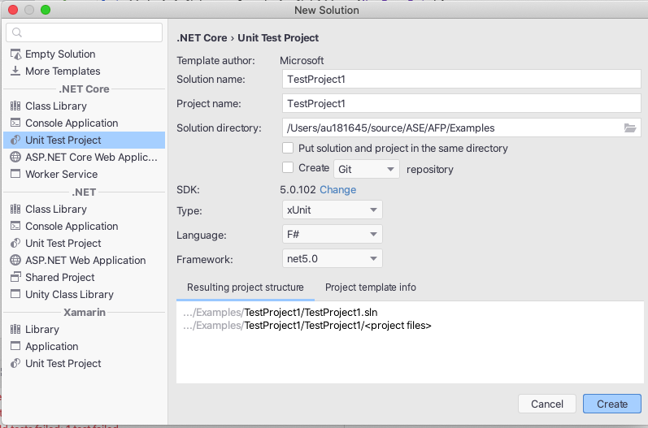
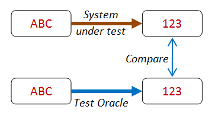

<!-- .slide: data-background="#003d73" -->
## Property based testing

 <!-- .element style="width: 200px; position: fixed; bottom: 50px; left: 50px" -->

----

### Agenda

* Setting up test project
* Property based testing
* FsCheck

---

## Setting up


----

### Creating a Test project


 <!-- .element: style="height: 450px" -->

\* Notice `xUnit` project

----

### Install FsCheck


---

## Function properties


----

### Referential transperency 

* You can replace a function call with the result
    * Caching<br/><!-- .element: class="fragment"  data-fragment-index="0" -->
    * Parallelization<br/><!-- .element: class="fragment"-->
    * Pipelining<!-- .element: class="fragment"  -->

----

### Pure functions

* Functions *rely only on the input* and
    * Deterministic<br/><!-- .element: class="fragment"-->
    * Has no side-effect<br/><!-- .element: class="fragment"-->
    * Works with immutable data structures<br/><!-- .element: class="fragment"-->
    * Simplify reasoning<br/><!-- .element: class="fragment"-->
    * Encourage modularity and compositional<br/><!-- .element: class="fragment"-->

----

### Total Functions

* Defined for all possible inputs<br/><!-- .element: class="fragment"-->
* Should terminate and return a value<!-- .element: class="fragment"-->

```fsharp
let div a b = a / b // total?
```
<!-- .element: class="fragment"-->
```fsharp
let head list = List.head list // total?
```
<!-- .element: class="fragment"-->


---

<!-- .slide: data-background-image="./img/property-based-testing-vs-unit-testing.png" -->

----

* Example [FizzBuzz kata](https://codingdojo.org/kata/FizzBuzz/)
* Problem statement

```nohighlight
Write a program that prints the numbers from 1 to 100.
But for multiples of three print 'Fizz' instead of the
number and for the multiples of five print 'Buzz'.
For numbers which are multiples of both three and five
print 'FizzBuzz'.
```

----

### Example based testing

```fsharp
[<Fact>]
let ``Three should be a Fizz`` () =
    test <@ FizzBuzz.fizzBuzz 3 = "Fizz" @>
 
let ``Five should be a Buzz`` () =
    test <@ FizzBuzz.fizzBuzz 5 = "Buzz" @>
    
let ``Seven should be a number`` () = ...
let ``Nine should be a Fizz`` () = ...
let ``Fifteen should be a FizzBuzz`` () = ...
let ``Twenty-five should be a Buzz`` () = ...
```

Is this enough?<!-- .element: class="fragment" -->

----

### Properly not

```fsharp
let fizzbuzz x =
      match x with
      | 3 -> "Fizz"
      | 5 -> "Buzz"
      | 7 -> "7"
      | 9 -> "Fizz"
      | 15 -> "FizzBuzz"
      | 25 -> "Buzz"
      | _ -> failWith "Not defined"
```

So then what?<!-- .element: class="fragment" -->

----

### Creating a better tests

```fsharp
let expectedList =
      randomList |> List.map (fun i ->
      match i with
      | n when i % 3 = 0 && i % 5 = 0 -> "FizzBuzz"
      | n when i % 3 = 0 -> "Fizz"
      | n when i % 5 = 0 -> "Buzz"
      | _ -> string i)
```

* implementing the algorithm in the test code<!-- .element: class="fragment"-->
    * so not really an option:(

----

### Testing properties instead

So the properties of FizzBuzz is:

1. 1. multiples of both three and five print 'FizzBuzz'<br/><!-- .element: class="fragment"-->
2. 2. multiples of three print 'Fizz'<br/><!-- .element: class="fragment"-->
3. 3. multiples of five print 'Buzz'<br/><!-- .element: class="fragment"-->
4. 4. otherwise prints the numbers<br/><!-- .element: class="fragment"-->

----

### Testing properties

* So we need a way to genrate
    * numbers that are multiply of 3 and 5<br/><!-- .element: class="fragment"-->
    * numbers that are multiply of 3 but not 5<br/><!-- .element: class="fragment"-->
    * numbers that are multiply of 5 but not 3<br/><!-- .element: class="fragment"-->
    * Numbers that are not a multiply of 3 or 5<br/><!-- .element: class="fragment"-->

----

### Custom types

```fsharp
type MultiplyOfOnly3 = MultiplyOfOnly3 of int with
  static member op_Explicit(MultiplyOfOnly3 i) = i

type MultiplyOfOnly3Modifier =
    static member MultiplyOfOnly3() =
        ArbMap.defaults
        |> ArbMap.generate<int32>
        |> Gen.filter (fun i -> i > 0 && i % 3 = 0 && not (i % 5 = 0))
        |> Arb.fromGen

[<Property(Arbitrary = [| typeof<MultiplyOfOnly3Modifier> |])>]
let ```test multiply of three``` (x: MultiplyOfOnly3) =
    test <@ FizzBuzz.fizzBuzz x = "Fizz" @>
```
<!-- .element: class="fragment" -->

----

### Generator

```fsharp
[<Property>]
    let ``test multiply of three`` () =
        let gen = ArbMap.defaults
                    |> ArbMap.generate<int32>
                    |> Gen.filter (fun i -> i % 3 = 0 && not (i % 5 = 0))
                    |> Arb.fromGen
        Prop.forAll gen (fun x ->
            test <@ FizzBuzz.fizzBuzz x = "Fizz" @>
            )
```

---

## FsCheck

 <!-- .element style="height: 100px;" -->

* Works on both F# and C# and there are counterparts in Scala, Js and the original one in Haskel
* Examples are from FsChecks documentation

----

### Testing `int list`

With xUnit a tests looks like this

```fsharp [4|5-6|7]
open FsCheck
open FsCheck.Xunit

[<Property>]
let ``Reverse of reverse of a list is the original list ``
    (xs:list<int>) =
  List.rev(List.rev xs) = xs
```

----

### Output

```nohighlight
Tests.Reverse of reverse of a list is the original list 

Ok, passed 100 tests.
```

----

### For floats

Did you ever test with floats?

```fsharp [2-3]
[<Property>]
let ``Reverse of reverse of a list is the
     original list for float`` (xs:list<float>) =
  List.rev(List.rev xs) = xs
```

Would you?<br/> <!-- .element: class="fragment"   data-fragment-index="1" -->

Output: <!-- .element: class="fragment"   data-fragment-index="2" -->
```nohighlight
Falsifiable, after 6 tests (5 shrinks)
    (StdGen (1484489475, 296855114)):
Original:
[-0.0; -6.681752205; -0.0; nan; 1.797693135e+308; -0.0]
Shrunk:
[nan]
```
<!-- .element: class="fragment" data-fragment-index="2" -->

----

### FsCheck properties 

* Can test universally properties for functions or data structures
* Can not work directly on generic types like `'a`

note:

Generic types not implemented due to the many constraints that can exists for these types.

----

### Conditional Properties

form: `<condition> ==> <property>`

```fsharp
let insertKeepsOrder (x:int) xs = 
    ordered xs ==> ordered (insert x xs)
```

Can give fewer tests - if many inputs are moved. Custom generators could be an altertive

----

### Lazy properties

`lazy` keyword - otherwise F# is eager evaluated

```fsharp [2]
let tooEager a = a <> 0 ==> (1/a = 1/a) // throws exception
let moreLazy a = a <> 0 ==> (lazy (1/a = 1/a))
```

----

### Properties with Exceptions

use: `throws<'e :> exn,'a> Lazy<'a>`

```fsharp
let expectDivideByZero() = 
    Prop.throws<DivideByZeroException,_>
        (lazy (raise <| DivideByZeroException()))
```

----

### More

More to be found here: [Properties](https://fscheck.github.io/FsCheck//Properties.html) 

* Quantified
* Timed
* Distribution


----

### Generating data

* Generate data with `Gen<'a>`
    * we can build our own data generators
* Data shrinkers is defined
    * `'a -> seq<'a>`
    * also customizable

----

### Generator examples

```fsharp
let chooseFromList xs = 
  gen {
        let! i = Gen.choose (0, List.length xs-1) 
        return List.item i xs
      }
```

* Build from the `Gen.choose` function
* Syntax `let!`, `gen { .. }, return` - we will get back to this

note:

From FsCheck:

Generators are built from the function `Gen.choose``, which makes a random choice of a value from an interval, with a uniform distribution.

----

### Control generated data

* Control data with
    * Distribution
    * Test size
* Or use existing combinators like
    * `two g`, `three g`
    * `growingElements`
    * `listOf`, `listOfLength`
    * plus many more


note:

* `two g`: generates two g's
* `growingElements xs`: grows with an element from xs
* `listOf g`: generates a list of t's 

More at https://fscheck.github.io/FsCheck/TestData.html#Useful-Generator-Combinators

----

### Other properties with FsCheck

* Can generate random functions
* Can replay failed tests

```fsharp
Check.One(
    {
        Config.Quick with Replay =
            Some <| Random.StdGen (1145655947,296144285)
    },
    fun x -> abs x >= 0
)
```
\* Avoid changing state of generated objects (if mutable) 


---

<!-- .slide: data-background-image="./img/check.jpeg" -->

## Choosing properties

note:

Photo by Karolina Grabowska from Pexels

----

### Different ways

 <!-- .element: style="height: 300px" -->

note:

Example:

`List.sort xs` -> `List.map (fun x -> x+1)` equal to
`List.map (fun x -> x+1)` -> `List.sort xs`

----

### Negation

 <!-- .element: style="height: 300px" -->

note:

`List.rev(List.rev xs)` equal to `xs`

----

### Non-changing

 <!-- .element: style="height: 300px" -->

note:

`sorted list` equals to `List.sort (sorted list)`

----

### Distinct

 <!-- .element: style="height: 300px" -->

note:

`List.toSet xs` equals `List.toSet (List.toSet xs)`

`x + 0` equals `x + 0 + 0`


----

### Smaller problems

 <!-- .element: style="height: 300px" -->


note:

Mathematical induction proves that we can climb as high as we like on a ladder, by proving that we can climb onto the bottom rung (the basis) and that from each rung we can climb up to the next one (the step).

— Concrete Mathematics, page 3 margins.

`[]` is sorted

`[head]` is sorted

`f :: s :: []` is sorted iff `f <= s`

`f :: s :: rest` is sorted iff `f <= s && (isSorted s::rest)`

----

### Easy Verification

 <!-- .element: style="height: 300px" -->

note:

`string.split str |> string.concat` equals `str`

----

### Test oracle

 <!-- .element: style="height: 300px" -->

---

### vs TDD

* TDD works on specific examples
* PBT on universel properties

----

This means

* PBT provides better description of requirements
* You write fewer test cases
    * but get better security
* PBT forces you to consider what to implement
* PBT forces clean design (as do TDD)

note:

Design:
* Roman literal (negative number is not working)
* 

---

## References

* https://www.the-koi.com/projects/introduction-to-property-based-testing/
* https://fscheck.github.io/FsCheck/
* https://fsharpforfunandprofit.com/posts/property-based-testing-2/