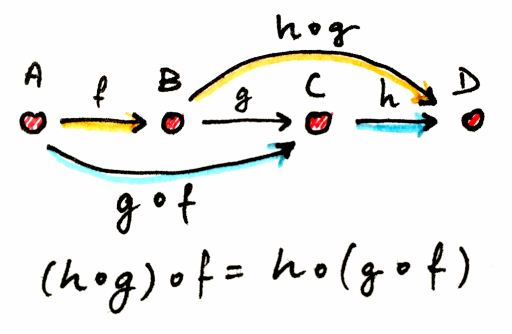

<!-- .slide: data-background="#003d73" -->
## Functors, Monads, and Applicatives

 <!-- .element style="width: 200px; position: fixed; bottom: 50px; left: 50px" -->

----

### Agenda

* Functors (easy peasy)
* Monads
    * variations
* Computation Expressions
    * task / async
* Applicatives
* CE continued

---

### Functors

* A mapping in an elevated worlds between 'types'<!-- .element: class="fragment" -->
    * using 'normal' functions
* They are structure preseving<!-- .element: class="fragment" -->
    * e.g. `List<string> -> List<int>`

note: 

From category theory
    * mapping between categories


----

#### Functor laws - Identity

* applying identity function (`id`) should leave functor unchanged

```fsharp
List.map id [1;2;3;4;5]
// val it : int list = [1; 2; 3; 4; 5]
```
<!-- .element: class="fragment" -->

----

#### Functor laws - composition

* given two functions `f` and `g` you get the same result by
    * mapping over `f` and then `g` as
    * mapping over `f >> g`

```fsharp
let compTrue value =
     let a = value |> map f |> map g
     let b = value |> map (f >> g)
     a = b
```
<!-- .element: class="fragment" -->

----

#### Functor laws - composition

```fsharp [1-3|1,4-5]
let times2 b = 2 * b
[1;2;3;4] |> List.map times2 |> List.map string
// val it : string list = ["2"; "4"; "6"; "8"]
[1;2;3;4] |> List.map (times2 >> string)
// val it : string list = ["2"; "4"; "6"; "8"]
```

----

### Using functors

* Look for a functor whenever you have a type with a generic type argument<br/><!-- .element: class="fragment" -->
* Existing examples:<!-- .element: class="fragment" -->
    * Option<'a>, List<'a>, Set<'a>, Map<'a>, Result<'a>, ...

---

### True use of monads



note:

From: https://medium.com/descript-software/monads-are-useful-part-1-c407e342e117

Function composition

----

## Todays 1st problem

```fsharp [1-10|10]
let add (a: int option) (b: int option) (c: int option) =
    match a with
    | None -> None
    | Some aa -> 
        match b with
        | None -> None
        | Some bb -> 
            match c with
            | None -> None
            | Some cc -> Some(aa + bb + cc)
```

----

<!-- .slide: data-visibility="hidden" -->

### Or like this

```fsharp
let monadicAdd (a: int option)
               (b: int option)
               (c: int option) =
    a |> Option.bind (fun a' ->
        b |> Option.bind (fun b' ->
            c |> Option.bind (fun c' ->
                Some (a' + b' + c') 
                )
            )
        )
```

```fsharp
val bind: ('T -> 'U option) -> 'T option -> 'U option
```
<!-- .element: class="fragment" -->

----

### Monads

* Design pattern which can combine code fragments<br/><!-- .element: class="fragment" data-fragment-index="0" -->
* Apply a function that returns a wrapped value<br/><!-- .element: class="fragment" data-fragment-index="1" -->
    * to a wrapped value
* Monad functions<br/><!-- .element: class="fragment" data-fragment-index="5" -->

```fsharp
val return': a -> m a
// Operator (>>=) also called 'liftM'
val bind: (a -> m b) -> m a -> m b
// Note: 'm' is here the monad type
```
<!-- .element: class="fragment" data-fragment-index="5" -->

----

#### `return'` in detail

```fsharp
```
TODO: 

----

#### Bind in detail

```fsharp
// Option.bind
let bind f = function
    | Some v -> f v
    | None   -> None

bind (fun v -> Some (v+1)) (Some 4)
// val it: int option = Some 5
```

----

### Back to our example

```fsharp
let monadicAdd (a: int option)
               (b: int option)
               (c: int option) =
    a |> Option.bind (fun a' ->
        b |> Option.bind (fun b' ->
            c |> Option.bind (fun c' ->
                Some (a' + b' + c') 
    )))
```

----

#### Monadic laws

```fsharp
let f a = Some (a+1)
let g a = Some (a*10)
let return' a = Some a
// Left identity
bind f (Some 1) = f 1
// Right identity
bind return' (Some 1) = Some 1
// Associative
bind f (bind g (Some 2))
    = bind (fun x -> bind f (g x)) (Some 2)
```

----

#### When to look for monads

* You have a function that performs some side-effect or fails
    * a function taking 'plain' input like `int`, `string` or `Person` and<!-- .element: class="fragment" -->
    * returning `option`, `Promise`, `Result` etc.<!-- .element: class="fragment" -->

---

### Variations

 <!-- .element: style="height: 500px" -->

note:

satisfy Monads laws, but don't collapse/compute, instead build a monadic datastructure

----

### Free monad


Note:
Free monads uses an AST to represent a computation and at the same time keep the computation AST decoupled from the way it is interpreted.

----

### Also

* Comonads<!-- .element: class="fragment" -->
    * Can be seens as a reduction from a computation back down to values
* Additive monads<!-- .element: class="fragment" -->
    * Monad with binary operators 'mplus' and 'mzero'
    * E.g. List with '[]' and '::'

---

### Computation expressions

* Existing computation expressions
    * `async {}`
    * `task {}`
    * `actor {}`
    * `...`
* Creating your own computation expression is possible

```
builder-expr { cexper }
```

----

### Why creating a option CE


```fsharp
let monadicAdd (a: int option)
               (b: int option)
               (c: int option) =
    a |> Option.bind (fun a' ->
        b |> Option.bind (fun b' ->
            c |> Option.bind (fun c' ->
                Some (a' + b' + c')
    )))
```

----

#### CE is a class type

```fsharp
type OptionBuilder() =
    member _.Return(x) =
        Some x
// Staticly somewhere
let option = OptionBuilder()

let create () =
    option {
        return 2
    }
```

----

#### Class types

```fsharp
type OptionBuilder() =
    ...
    member _.Bind(x, f) =
        Option.bind f x // Monadic bind

// Staticly somewhere
let option = OptionBuilder()

let useBind (intOption: int option): int option =
    option {
        let! x = intOption
        return x+1
    }
let useBind' (intOption: int option): int option = 
    Option.bind (fun x -> Some(x+1)) intOption
```

Note: 
```fsharp
type OptionBuilder() =
    member _.Return(x) =
        Some x
    member _.Bind(x, f) =
        Option.bind f x // Monadic bind
```

----

#### Returning directly from CE

```fsharp
type OptionBuilder() =
    ...
    member _.ReturnFrom(x) = x

let add (a: int option) =
    option {
        return! a
    }
let addWithoutReturnFrom (a: int option) = 
    option {
        let! a' = a
        return a'
    }
```

Note:

```fsharp
type OptionBuilder() =
    member _.Return(x) =
        Some x
    member _.ReturnFrom(x) = x
    member _.Bind(x, f) =
        Option.bind f x

let option = OptionBuilder()
```

----

### Why creating a option CE

```fsharp
let addThreeOptions (a: int option)
                    (b: int option)
                    (c: int option) =
    option {
        let! a' = a
        let! b' = b
        let! c' = c
        return a' + b' + c'        
    }
```

----

TODO: Move?? to after applicatatives?

#### Keywords in CE

```fsharp
expr { let! ... }    // bind
expr { and! ... }    // applicatives
expr { do! ... }     // call CE without return
expr { yield ... }   // return value from CE
expr { yield! ... }  // flatening
expr { return ... }  // return'
expr { return! ... } // wraps value in CE type
expr { match! ... }  // inline CE
````

note: 

Details can be found on: https://learn.microsoft.com/en-us/dotnet/fsharp/language-reference/computation-expressions

---

### Async programming in F#

* <!-- .element: class="fragment" -->`task {}` is used to consume `Task<T>` from C# otherwise<br/>
* <!-- .element: class="fragment" -->use `async {}`
    * `async` are specifications of work, `task` are representation of work

----

### `async` examples

```fsharp
let printTotalFileBytesUsingAsync (path: string) =
    async {
        let! bytes = File.ReadAllBytesAsync(path)
                     |> Async.AwaitTask
        let fileName = Path.GetFileName(path)
        printfn $"File {fileName} has %d{bytes.Length} bytes"
        filename
    }

[<EntryPoint>]
let main argv =
    let result = printTotalFileBytesUsingAsync "path-to-file.txt"
                 |> Async.RunSynchronously
    printfn $"{result}"
    0
```

note:
printTotalFileBytesUsingAsync: string -> Async<unit>

Async computation is first started when `Async.RunSynchronously` is executed


----

### Control execution

* `Async.Parallel`
* `Async.Sequential`
* ...

---

### Applicatives

* Mapping of objects in an elevated world<br/><!-- .element: class="fragment" -->
    * using elevated functions with same type


```fsharp
// Defined by these to functions
val pure: 'a -> F 'a
val apply: F ('a -> 'b) -> F 'a -> F 'b 
// Operator: (<*>), also called lift
// Note here 'F' is the applicative type
```
<!-- .element: class="fragment" -->

```fsharp
// E.g
val pureList: a -> a list
val applyToList: (a -> b) list -> a list -> b list
```
<!-- .element: class="fragment" -->


Note:
`<*>` is also called `liftA2` and sometimes `apply` :)

----

#### Examples

```fsharp [1-5|6-12|14-17]
module List =
    // val apply : fs:('a -> 'b) list -> l:'a list -> 'b list
    let apply fs l = 
        fs |> List.collect (fun f ->
                l |> List.map f)
let odds = [1;3;5;7;9]
let evens = [2;4;6;8;0]
let all = 
    (List.apply
        (List.apply [fun odd even -> (odd, even)]
                     odds)
            evens)

type allFaces = []
type allSuits = []
let fullDeck = [fun f s -> { Face = f; Suit = s }]
                    <*> allFaces <*> allSuits
```

Note:

```fsharp
module Option =
    let apply = function
        | (Some f, Some x) -> Some <| f x
        | _                -> None
```


----

#### Applicative laws

```fsharp
// Identity:
pure id <*> v = v
// Composition:
u <*> v <*> w = u <*> (v <*> w)
// Homomorphism:
pure f <*> v = pure (f v)
// Interchange:
u <*> pure y = pure (fun a -> a y) <*> u
```

Note:

```fsharp
List.map string [1;2;3;4] = apply [string] [1;2;3;4]

// Interchange in F#
`[add1] <*> [1] = [fun a -> a 1] <*> [add1]`
// We can change the parameters and apply - this forces us to create a function (lambda) expression which takes a functions and apply - for the types to be correct.
```

----

#### Using applicatives

* Apply a list of functions to some argument(s)<br/><!-- .element: class="fragment" -->
* When having a function taking multiple arguments<!-- .element: class="fragment" -->
    * but having the arguments wrapped in something like `Result`, `Option`, ...

----

#### Applicative and Functors

Every `applicative` is a `functor`, since `map` can be defined by using `pure` and `<*>`

```fsharp
//map f x = pure f <*> x
map f x = apply (pure f) x
```
<!-- .element: class="fragment" data-fragment-index="2" -->

 <!-- .element: style="height:300px" class="fragment" data-fragment-index="1" -->

---

### Using Applicatives in our example

```fsharp [1-6|8-16]
module Option =
    let apply fOpt xOpt = 
        match (fOpt, xOpt) with
        | (Some f, Some x) -> f x |> Some
        | _                -> None
    let (<*>) = Option.apply

let applicativeAdd (a: int option)
                   (b: int option)
                   (c: int option) =
    let add3 x y z = x + y + z
    (Some add3) <*> a <*> b <*> c
    //Option.apply 
    //   (Option.apply 
    //        ((Option.apply (Some add3) a) b) c)
````

----

#### Parallel computations

```fsharp
type OptionBuilder() =
    ...
    member _.MergeSources (x,y) =
        Option.zip x y
    member _.BindReturn (x,f) =
        Option.map f x
let option = OptionBuilder()
let addThreeOptions a b c =
    option {
        let! a' = a
        and! b' = b
        and! c' = c
        return a' + b' + c'        
    }
```

Note: 
```fsharp
module Option =
    let apply fOpt xOpt = 
        match (fOpt, xOpt) with
        | (Some f, Some x) -> Some <| f x
        | _                -> None
    let (<*>) = apply
    let zip a b =
        let toTuple x y = (x, y)
        Some toTuple <*> a <*> b

type OptionBuilder() =
    member _.Return(x) =
        Some x
    member _.ReturnFrom(x) = x
    member _.Bind(x, f) =
        Option.bind f x
    member _.MergeSources(x,y) =
        Option.zip x y
    member _.BindReturn(x,f) =
        Option.map f x
```


---

### References

* [Computation expressions](https://docs.microsoft.com/en-us/dotnet/fsharp/language-reference/computation-expressions)
* [Computation expression explained](https://www.youtube.com/watch?v=pC4ZIeOmgB0)
* [Mark Seeman about category theory](https://blog.ploeh.dk/2018/03/19/functors-applicatives-and-friends/)

---

```fsharp

let divide a b: Result<int, string> =
    match b with
    | 0 -> Error "Divide by zero is stupid"
    | _ -> Success (a / b)


let plusOne result = 
    match result with
    | Error why -> Error why
    | Success result -> Success (result + 1)

let plusOne' result =
    Result.bind (fun s -> s+1) result

let addToResultsTogether result1 result2 =
    result1 |> Result.bind (fun res1 ->
        result2 |> Result.bind (fun res2 -> 
            Success (res1+res2)
        )
    )
// if Result.ce existed
let addToResultsTogether result1 result2 =
    result {
        let! res1 = result1
        let! res2 = result2
        return res1+res2
    }

match divide 1 0 |> plusOne' with
| Success result -> printfn $"{result}"
| Error why -> printfn $"This failed: {why}"

```