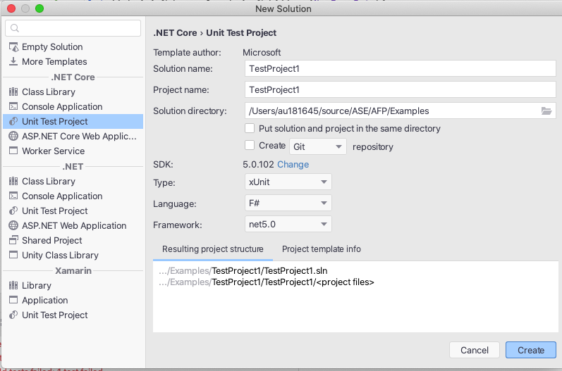
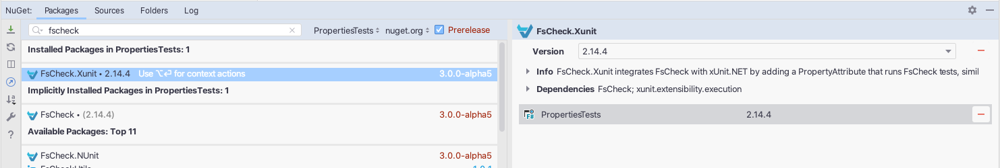

<!-- .slide: data-background="#003d73" -->
## Property based testing

 <!-- .element style="width: 200px; position: fixed; bottom: 50px; left: 50px" -->

----

### Agenda

* Setting up test project
* Property based testing
* FsCheck

---

## Setting up


----

### Creating a Test project

* Notice xUnit project




----

### Install FsCheck



---

## Property based testing

* Example [FizzBuzz kata](https://codingdojo.org/kata/FizzBuzz/)
* Problem statement

```nohighlight
Write a program that prints the numbers from 1 to 100.
But for multiples of three print 'Fizz' instead of the
number and for the multiples of five print 'Buzz'.
For numbers which are multiples of both three and five
print 'FizzBuzz'.
```

----

### Covering with test cases

```fsharp
let ``Three should be a Fizz`` () =
    test <@ FizzBuzz.fizzBuzz 3 = "Fizz" @>
 
let ``Five should be a Buzz`` () =
    test <@ FizzBuzz.fizzBuzz 5 = "Buzz" @>
    
let ``Seven should be a number`` () = ...
let ``Nine should be a Fizz`` () = ...
let ``Fifteen should be a FizzBuzz`` () = ...
let ``Twenty-five should be a Buzz`` () = ...
```

Is this enough?<!-- .element: class="fragment" -->

----

### Properly not

```fsharp
let fizzbuzz x =
      match x with
      | 3 -> "Fizz"
      | 5 -> "Buzz"
      | 7 -> "7"
      | 9 -> "Fizz"
      | 15 -> "FizzBuzz"
      | 25 -> "Buzz"
      | _ -> failWith "Not defined"
```

So then what?<!-- .element: class="fragment" -->

----

### Creating a better tests

```fsharp
let expectedList =
      randomList |> List.map (fun i ->
      match i with
      | n when i % 3 = 0 && i % 5 = 0 -> "FizzBuzz"
      | n when i % 3 = 0 -> "Fizz"
      | n when i % 5 = 0 -> "Buzz"
      | _ -> string i)
```

Here we end with implementing the algorithm in the test code, so that do not work :(

----

### Testing properties instead

So the properties of FizzBuzz is:

* multiples of both three and five print 'FizzBuzz'
* multiples of three print 'Fizz'
* multiples of five print 'Buzz'
* prints the numbers

----

### Testing properties

We then need

* A way to genrate
    * numbers that are multiply of 3 and 5
    * numbers that are multiply of 3 but not 5
    * numbers that are multiply of 5 but not 3
    * Numbers that are not a multiply of 3 and 5

```fsharp
let ```test multiply of three``` (x: MultiplyOfOnly3) =
    test <@ FizzBuzz.fizzBuzz x = "Fizz" @>
```

---

## FsCheck

 <!-- .element style="height: 100px;" -->

* Works on both F# and C# and there are counterparts in Scala, Js and the original one in Haskel
* Examples are from FsChecks documentation

----

### Testing `int list`

In Xunit a tests looks like this

```fsharp [4|5-6|7]
open FsCheck
open FsCheck.Xunit

[<Property>]
let ``Reverse of reverse of a list is the original list ``
    (xs:list<int>) =
  List.rev(List.rev xs) = xs
```

Output: 
```nohighlight
Tests.Reverse of reverse of a list is the original list 

Ok, passed 100 tests.
```

----

### For floats

Did you ever test with floats?

```fsharp [2-3]
[<Property>]
let ``Reverse of reverse of a list is the
     original list for float`` (xs:list<float>) =
  List.rev(List.rev xs) = xs
```

Would you? <!-- .element: class="fragment"   data-fragment-index="1" -->

Output: <!-- .element: class="fragment"   data-fragment-index="2" -->
```nohighlight
Falsifiable, after 6 tests (5 shrinks)
    (StdGen (1484489475, 296855114)):
Original:
[-0.0; -6.681752205; -0.0; nan; 1.797693135e+308; -0.0]
Shrunk:
[nan]
```
<!-- .element: class="fragment" data-fragment-index="2" -->

----

### Properties

* FsCheck can test universally properties for functions or data structures
* Can't work directly on generic types like `'a`

----

### Ways to used Properties

* Conditional Properties
    * form `<condition> ===> <property>`
* Lazy properties
    * `lazy` keyword - otherwise F# is eager evaluated
* Exceptions
    * use `throws<'e :> exn,'a> Lazy<'a>`
* More to be found [Properties](https://fscheck.github.io/FsCheck//Properties.html)
    *Quantified, Timed

----

# Examples

```fsharp
// conditional
let insertKeepsOrder (x:int) xs = 
    ordered xs ==> ordered (insert x xs)

// Lazy
let tooEager a = a <> 0 ==> (1/a = 1/a) // throws ex
let moreLazy a = a <> 0 ==> (lazy (1/a = 1/a))

// Exception
let expectDivideByZero() = 
    Prop.throws<DivideByZeroException,_>
        (lazy (raise <| DivideByZeroException()))

```

----

### Generating data

* Test data in FsCheck is generated by `Gen<'a>`
    * We can build our own data generators
* Like wise we can build our own data shrinkers
    * `'a -> seq<'a>`

```fsharp
let chooseFromList xs = 
  gen { let! i = Gen.choose (0, List.length xs-1) 
        return List.item i xs }
```

----

### Control data

* Control data with
    * Distribution
    * Test size
* Or use some of the combinators like
    * `two g`, `three g`
    * `growingElements`
    * `listOf`, `listOfLength`
    * plus many more


----

### Other properties with FsCheck

* Can check objects' internal state through methods
* Can generate random functions
* Can replay failed tests

```fsharp
Check.One({ Config.Quick with Replay =
     Some <| Random.StdGen (1145655947,296144285) },
         fun x -> abs x >= 0)
```


---

## References

* https://fscheck.github.io/FsCheck/