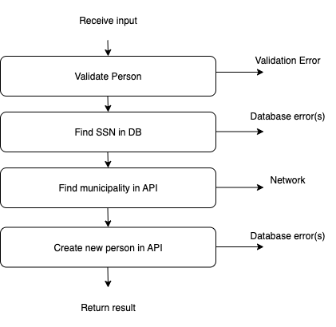

<!-- .slide: data-background="#003d73" -->
## Functional error handling 

 <!-- .element style="width: 200px; position: fixed; bottom: 50px; left: 50px" -->

----

### Agenda

* Problem<br/><!-- .element: class="fragment" -->
* Result / Either monad<br/><!-- .element: class="fragment" -->
* Monadic error handling<br/><!-- .element: class="fragment" -->
  * Composition
  * Conversion
  * Exceptions && Parallel validation

---

### Problem

* A 'normal' program consists of
  1. Input validation<br/><!-- .element: class="fragment" -->
  2. Reading data from db/api<br/><!-- .element: class="fragment" -->
  3. Complete functions in business logic<br/><!-- .element: class="fragment" -->
  4. Updatting data in db<br/><!-- .element: class="fragment" -->
  5. Accessing network<br/><!-- .element: class="fragment" -->
  6. Showing results<br/><!-- .element: class="fragment" -->
* <br/><div><b>Note</b>: here is I\O - we solve that next time</div><!-- .element: class="fragment" -->

----

#### Not thinking about errors

```fsharp
let useCase (json:string) =
  let person = validatePerson json
  let ssn = db.readSSN person
  let bornIn = api.findMunicipality ssn
  let newData = createNewPerson bornIn
  db.updateMunicipality newData
```

All functions are on the form
<!-- .element: class="fragment" data-fragment-index="1" -->

```fsharp
'input -> 'output
```
<!-- .element: class="fragment" data-fragment-index="1" -->

Note:

```fsharp
type person = {ssn: string; bornIn: string option}
let validatePerson (json: string) =
  {ssn = "1234"; bornIn = None}

let createNewPerson bornIn =
  {ssn = "1234"; bornIn = Some bornIn}

module db =
  let readSSN person = person.ssn
  let updateMunicipality person = "Success"

module api =
  let findMunicipality ssn =
    "Aarhus"
```

----

#### More F#'ish

```fsharp
let useCase =
  validatePerson 
  >> db.readSSN
  >> api.findMunicipality
  >> createNewPerson 
  >> db.updateMunicipality
```

<div><b>Note</b> could have used a pipeline</div><!-- .element: class="fragment">


----

<!-- .slide: data-background-image="./img/error.jpg" -->


----

#### But what about the actual errors



----

#### two problems

* Functions fail in different ways<!-- .element: class="fragment" data-fragment-index="0" -->
  * IOError, DBError,  ValidationError, VerificationError, AuthenticationError, ...<br/><br/>
* How to compose code that fails with functional functions?
<!-- .element: class="fragment" data-fragment-index="1" -->

```fsharp
type PersonOrError = Person of p | ValidationError of string
// E.g
let validatePerson (json: string): PersonOrError =
```
<!-- .element: class="fragment" data-fragment-index="2" -->

----

#### Proposal

Compose functions into a single use-case function like:


----

#### Changing our code to handle errors

```fsharp [|2,4,6,8-9|3,5,7,10-13]
let useCase (json:string) =
  let person = validatePerson json
  if person != null then
    let ssn = db.readSSN person
    if (ssn != null) then
      let bornIn = api.findMunicipality ssn
      if string.IsNullOrEmpty bornIn then
        let newData = createNewPerson bornIn
        db.updateMunicipality newData
      else "Municipality not found"
    else "Person not found"
  else
    "Validation error"
```


----

#### Syntactic sugar 

```fsharp [14-19|1-12 ]
let dostuffwithPerson person =
  let ssnOpt = db.readSSN person
  match ssnOpt with
  | Some ssn ->
    let bornIn = api.findMunicipality ssn
    match bordnInOpt with
    | Some bornIn ->
      let newData = createNewPerson person bornIn
      let result = db.updateMunicipality newData
      "Success"
    | None -> "Municipality not found"
  | None -> "Person not found"

let useCase json: ReturnType =
  let person = validatePerson json
  match person with
  | Person p -> doStuffWithPerson person
  | ValidationError s -> s


```

Note: Could have chosen to return `Result` from our functions instead of Options - same problem

----

#### Return Types

Creating a single type for a use-case

```fsharp
type ReturnType =
  | Success
  | DBError
  | IOError
  | VerificationError
  /// ...
```

Drawbacks:
* <!-- .element: class="fragment" -->hard to 'match' on<br/>
* will consist of 'all' error types in our application<br/><!-- .element: class="fragment" -->
* <!-- .element: class="fragment" -->hard to navigate in


---

### F# `Option` and `Result`

```fsharp
type Option<'T> =
  | Some of 'T
  | None
type Result<'T,'TError> =
  | Ok of ResultValue:'T
  | Error of ErrorValue:'TError
```

* Both are monads<!-- .element: class="fragment" -->

Note:

In many other languages Result is called an `Either`

----

#### Extending this to our general case

```fsharp [1-6|8-13]
type Success = Sucess
type Errors =
  | DBError
  | IOError
  | VerificationError
  /// ...

// single error
let ourUseCase input: Result<Success, Errors> =
    failwith ""
// multiple errors
let ourUseCase2 input: Result<Success, Errors list> =
    failwith ""
```

----

#### Monad to the Rescue

<iframe src="https://giphy.com/embed/l0Hlxvd5L0Qrn4JP2" width="480" height="270" frameBorder="0" class="giphy-embed" allowFullScreen></iframe><p><a href="https://giphy.com/gifs/southparkgifs-l0Hlxvd5L0Qrn4JP2">via GIPHY</a></p>


----

# Monads - repcap

* Consists of:  
  * <!-- .element: class="fragment" --><code>return</code> - wraps a data type in monadic type<br/>
  * <!-- .element: class="fragment" --><code>bind</code> - transform the encapsulated value<br/>
  * + monadic laws<!-- .element: class="fragment" -->

```fsharp
val return: 'A -> M<'A>
val bind: ('A -> M<'B>) -> M<'A> -> M<'B>
```
<!-- .element: class="fragment" -->


----

#### Return and Bind

```fsharp [1-4|6-12]
// Return
type Bricks = {desc: string; numBricks: int}
let ok = Ok {desc = "A Castle"; numBricks = 2133}
let error = Error "Lego crashed"

// Bind
let result input: Result<int, string> =
   Result.bind (fun (lego: Bricks) -> Ok lego.numBricks)
               input
// Result.bind ('T -> Result<'U, 'TError>) 
//        -> Result<'T, 'TError>
//        -> Result<'U, 'TError>
```

note:

```fsharp
let a: Result<string, 'a> = Ok "asdf"
match a with
| Ok value -> value + "ASdf"
| Error error -> throw error

if Result.IsOk a then
  Result.getOk a
else 
  Result.getError a
```


----

### Example with `Result`

```fsharp [3-6|8]
type person = {email: string; name: string}
let validatePerson (input: string*string) =
  if invalidEmail (fst input) then
    Error "Email not valid"
  elif invalidName (snd input) then
    Error "Name not valid"
  else
    Ok {email = fst input; name = snd input }
```

note:

```fsharp
let invalidEmail (str: string) =
  not (str.Contains("@"))
let invalidName (str: string) =
  not (str.Contains(" "))
```

---

### Composing with monads <!-- .element style="color:white" -->

<!-- .slide: data-background-image="./img/compose.jpg" -->

----

#### 

```fsharp [2,10]
type person = {email: string; name: string}
let validatePerson input: Result<Person, string> =
  if validEmail (fst input) then
    Error "Email not valid"
  elif validName (snd input) then
    Error "Name not valid"
  else
    Ok {email = fst input; name = snd input }

let readSSN (person: Person): Result<Person, string> = 
  failwith ""
```

So how to compose these functions?

----

#### Input -> Output

* We have a bunch a functions on the form<!-- .element: class="fragment" -->
  * `'T -> Monad<'U>`
* Could be one of these<!-- .element: class="fragment" -->
  * `Option<'T>`
  * `Result<'T, 'TError>`

----

#### Creating an adapter

* <!-- .element: class="fragment" -->To compose two functions like
  * `'A -> Result<'B, 'E>`
  * `'B -> Result<'C, 'E>`
* <!-- .element: class="fragment" -->Monadic bind is excactly an adapter

```fsharp
let bind func = // being explicit about currying
  fun input ->
    match input with
    | Ok value -> func value
    | Error e  -> Error e

let convertedValidatePerson = bind validatePerson
// val: convertedValidatePerson: Result<'A, 'E> -> Result<'B, 'E>
```
<!-- .element: class="fragment" -->

Note:

This takes a function as input, a function that with a single input and retuning a Result (`'A -> Result<'B, 'E>`)

And a value of the type `'Result<'A, 'E>`

Then it either return
* If input is an error, just output the error.
* If there is a value, then apply the given function

----

#### Altertive implementation

```fsharp
let bind2 func input =
  match input with
      | Ok value -> func value
      | Error e  -> Error e

let bind3 func = function
  | Ok value -> func value
  | Error e  -> Error e
```

**Note**: Both functions doing exactly the same as the above one. 


----

#### Now we can compose

```fsharp
let validated2 input = ...
// val validated2: 'B -> Result<'C, 'Error>

let combinedValidation =
  let validated2' = bind validated2
  // val validated2': Result<B, 'Error> -> Result<'C, 'Error>
  let validated3' = bind validated3

  validated1 >> validated2' >> validated3'
```

Note:

```fsharp
  let bind func =
    fun input ->
      match input with
      | Ok value -> func value
      | Error e  -> Error e

  let validated1 str =
    if (str = "ok") then
      Ok str
    else
      Error "Error 1"
    
  let validated2 (str:string) =
    if (str.ToUpper() = "OK") then
      Ok (str.ToUpper())
    else
      Error "Error 2"

  let validated3 (str: string) =
    if (str.Contains("O")) then
      Ok "Contains 'o'"
    else
      Error "Error 3"
  // I know this does not make so much sense.
```

----

#### The same with `>>=` operator

```fsharp
let (>>=) twoTrackInput switchFunction = 
    bind switchFunction twoTrackInput
//     twoTrackInput: Result<'a,'b> ->
//    switchFunction: ('a -> Result<'c,'b>) -> Result<'c,'b>
let validate x =
  x
  |>  validated1
  >>= validated2
  >>= validated3
```

Data vs function oriented method - but same result.

----

### `SwitchComposition`

```fsharp
// Implemented with binds in slide notes
let (>=>) aFun bFun x =
 match aFun x with
 | Ok y    -> bFun y
 | Error e -> Error e

// Usage
let combinedValidation =
  validated1
  >=> validated2 // 'Just' hide bind
  >=> validated3
```

Note:

`>=>` implemented with bind

```fsharp
let (>=>) aFun bFun =
  aFun >> (bind bFun)
```

----

#### Comparison

* <div class="fragment" data-fragment-index="1"><b>Bind</b> - Converts a 'switch function' into what <a href="http://www.fsharpforfunandprofit.com">the blog</a> calls a 'two-track function'<br/>
  Used when combining single function
* <div class="fragment" data-fragment-index="2"><b>SwitchComposition</b> - Converts two 'switch functions' into a single new 'switch function'<br/>
  Chaining a number of functions together

---

#### Composing with simple functions 

```fsharp
let cannotFail input = input

// Convert 'A -> 'A into 'A -> Result<'A, 'TError>

let switch f input =
  f input |> Ok
```

----

#### Functions with side effects

* E.g. save output, logging

```fsharp [2-5|1,11]
let log msg: unit = printfn "-- %O" msg

let tee fn x =
  fn x
  x

let combinedValidation =
  validated1
  >=> validated2
  >=> validated3
  >=> switch (tee log)
```


----

### Exceptions

* Integrating with code that throws exceptions

```fsharp[3-7|1,13]
let doStuff input = invalidArg "input" "always wrong"

let tryCatch fn input =
  try
    fn input |> Ok
  with
    | ex -> Error ex.Message

let combinedValidation =
  validated1
  >=> validated2
  >=> validated3
  >=> tryCatch (tee doStuff)
```


Note:

```fsharp
let doStuff (input: string) = 
  if input.ToUpper() = "OK"
  then (printfn "fine")
  else invalidArg "input" "was all wrong"
```

----

### Parallel validation

Think monoids :) combining pairwise

```fsharp [1-2|3|6|4-5]
let plus combineOks combineErrors switch1 switch2 x = 
    match (switch1 x),(switch2 x) with
    | Ok s1, Ok s2       -> Ok (combineOks s1 s2)
    | Error f1, Ok _     -> Error f1
    | Ok _ , Error f2    -> Error f2
    | Error f1, Error f2 -> Error (combineErrors f1 f2)
```


---

### References

* Some images from: [https://fsharpforfunandprofit.com/](https://fsharpforfunandprofit.com/)
