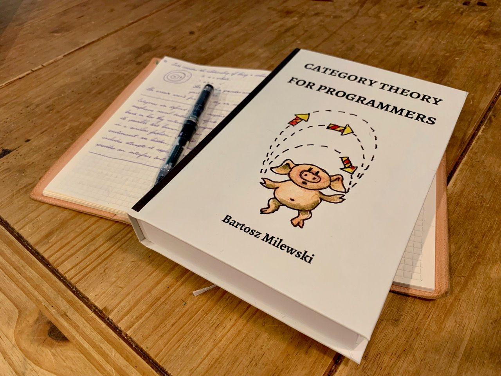

<!-- .slide: data-background="#003d73" -->
## Algebraic data types

 <!-- .element style="width: 200px; position: fixed; bottom: 50px; left: 50px" -->

----

### Agenda

* Flaws
    * Fold / FoldBack
* Iteration vs recursion
* Algebraic type sizes
    * Translation

---

## Flaws

```fsharp
type Boxes =
    | Item of float
    | Box  of Boxes

let price boxes = 
    let fItem r = r
    let fBox b = b+1.0
    cataBoxes fItem fBox boxes
```


Note:

```fsharp
let rec cataBoxes fItem fBox boxes = 
    let recursive = cataBoxes fItem fBox
    match boxes with
    | Item x  -> fItem x
    | Box b  -> fBox (recursive b)
```

----

### Creating large structures

```fsharp
let createNestedBoxes n =
    let rec createNestedBoxesRec content = function
        | 0 -> content
        | n -> createNestedBoxesRec (Box content) (n-1)

    createNestedBoxesRec (Item 1.0) n
```

```fsharp
createNestedBoxes 10000 |> price
// val it : float = 10001.0

createNestedBoxes 100000 |> price
// val it : float = 100001.0

createNestedBoxes 1000000 |> price
// Stack overflow.
// Repeat 174533 times:
```
<!-- .element: class="fragment" -->

----

### Tail recursion

Remeber how we solve this?

```fsharp [1-3|5-7]
let rec priceAcc costSoFar = function
    | Item i -> costSoFar + i
    | Box b -> priceAcc (costSoFar+1.0) b

createNestedBoxes 1000000000 |> priceAcc 0.0
// Real: 00:02:27.801, CPU: 00:02:19.659, GC gen0: 3834, gen1: 1318, gen2: 6
// val it : float = 1000000001.0
```
<!-- .element: class="fragment" -->


---

## Fold

So with this above implementation

```fsharp
let rec priceAcc costSoFar = function
    | Item i -> costSoFar + i
    | Box b -> priceAcc (costSoFar+1.0) b
```

we are back with pattern macthing

----

### Rewrite our pattern catamorphism

```fsharp
let rec foldBoxes fItem fBox acc boxes = 
    let recursive = foldBoxes fItem fBox
    match boxes with
    | Item x  -> fItem acc x
    | Box b  ->
        let newAcc = fBox acc
        recursive newAcc b
// val foldBoxes :
//  fItem:('a -> float -> 'b) ->
//  fBox:('a -> 'a) ->
//  acc:'a -> boxes:Boxes -> 'b
```

----

# Comparison

Notice changes in method signature

```fsharp
val foldBoxes :
 fItem:('a -> float -> 'b) ->
 fBox:('a -> 'a) ->
 acc:'a -> boxes:Boxes -> 'b
// vs
val cataBoxes : 
  fItem:(float -> 'a) ->
  fBox:('a -> 'a) ->
  boxes:Boxes -> 'a
```

----

### Price with fold

```fsharp [1-4|6-8]
let priceWithFold boxes = 
    let fItem costSoFar r = costSoFar + r
    let fBox costSoFar = costSoFar + 1.0
    foldBoxes fItem fBox 0.0 boxes

createNestedBoxes 100000000 |> priceWithFold
// Real: 00:00:13.667, CPU: 00:00:14.414, GC gen0: 896, gen1: 135, gen2: 4
// val it : float = 100000001.0
```

----

### Problems

```fsharp [4|9|12-13]
type Boxes =
    | Item of float
    | Box  of Boxes
    | Wrapped of Boxes

let descriptionWithFold boxes =
    let fItem description r = sprintf "An item %O %s" r description
    let fBox description = sprintf "%s in a box" description
    let fWrapped description = sprintf "%s wrapped in paper" description
    foldBoxes fItem fBox fWrapped "" boxes

descriptionWithFold (Wrapped (Box (Item 1.0)))
// "An item 1  wrapped in paper in a box"
```

Note:

```fsharp
let rec foldBoxes fItem fBox fWrapped acc boxes = 
    let recursive = foldBoxes fItem fBox fWrapped
    match boxes with
    | Item x    -> fItem acc x
    | Box b     ->
        let newAcc = fBox acc
        recursive newAcc b
    | Wrapped b ->
        let newAcc = fWrapped acc
        recursive newAcc b
```


----

### Precalculate

Can we avoid pre-calculation and still keep stack safety?

Continuations <!-- .element: class="fragment" -->

---

## FoldBack

So the above implementaton with accumulators 

```fsharp
let descriptionWithAccumulators boxes =
    let fItem descriptionGen r = 
        descriptionGen (sprintf "An item %O" r)
    let fBox descriptionGen = fun text ->
        let newText =  sprintf "%s in a box" text
        descriptionGen newText
    let fWrapped descriptionGen = fun text ->
        let newText = sprintf "%s wrapped in paper" text
        descriptionGen newText
    foldBoxes fItem fBox fWrapped (fun t -> t) boxes

descriptionWithAccumulators (Wrapped (Box (Item 1.0)))
// val it : string = "An item 1 in a box wrapped in paper"
```

Note:

In the recursive cases - we are given a descriptionGenerator and must create a new generator.

----

### Generalizing

```fsharp
let rec foldBackBoxes fItem fBox fWrapped gen boxes = 
    let recursive = foldBackBoxes fItem fBox fWrapped
    match boxes with
    | Item x    -> gen (fItem x)
    | Box b     -> 
        let newGen i =
            let newAcc = fBox i
            gen newAcc
        recursive newGen b
    | Wrapped b ->
        let newGen i =
            let newAcc = fWrapped i
            gen newAcc
        recursive newGen b
// val foldBackBoxes :
//    fItem:(float -> 'a) ->
//    fBox:('a -> 'a) ->
//    fWrapped:('a -> 'a) ->
//    gen:('a -> 'b) -> boxes:Boxes -> 'b
```

----

### Generalizing 2

```fsharp
let descriptionWithFoldBack boxes =
    let fItem r = sprintf "An item %O" r
    let fBox text = sprintf "%s in a box" text
    let fWrapped text = sprintf "%s wrapped in paper" text

    foldBackBoxes fItem fBox fWrapped (fun t -> t) boxes

descriptionWithFoldBack (Wrapped (Box (Item 1.0)))
// val it : string = "An item 1 in a box wrapped in paper"
```

----

### Like `List.fold` and `List.foldBack`

* Like in the list the signatures for both fWrapped is the same
    * `('a -> 'a)`
* they behave completely different, so we should properly change signatures for easier usage.
* Also note - this is slower because of the chain of nested functions

----

### Fold/FoldBack generally

1. Create a function paramter to handle each case
2. Add a accumulator paramter
3. For non-recursive cases pass the accumulator and all case data to the function paramter

```fsharp
| Item x    -> gen (fItem x)
```


----

### Fold/FoldBack gennerally cont.
4. For recursive cases
    ```fsharp
    | Box b     -> 
    ```
    1. pass the handler the accumulator plus all data associated with the case -> a new accumlator value
    ```fsharp
        let newGen i =
            let newAcc = fBox i
            gen newAcc
    ```
    2. then call recursively on the nested value with the new accumulator
    ```fsharp
        recursive newGen b
    ```

---

## Iterations vs recursion

So we have 3 implementatins

* cata (recursive bottom-up)
* fold (iterative top-down)
* foldBack (iterative bottom-up)

Note:

* cata is recursive and start accumulatinng from the bottom
* fold is tail recursive so is translated into a loop when f# compiles
* foldback is also tail recursive but accumulate from the bottom.


----

### When to use

* cata version 
    * safely when nesting is 'small'
    * generalization of fold into ADT
* fold version otherwise
* foldback
    * if you need the inner accumulator

----

### Optimizing

[List.foldback](https://github.com/fsharp/fsharp/blob/master/src/fsharp/FSharp.Core/list.fs#L269) is highly optmized for speed.

* Pattern match on small lists otherwise iterate over an array
* So in real-life if you need speed
    * convert to an iteration if possible

Note:

```fsharp
let foldArraySubRight (f:OptimizedClosures.FSharpFunc<'T,_,_>) (arr: 'T[]) start fin acc = 
            let mutable state = acc
            for i = fin downto start do
                state <- f.Invoke(arr.[i], state)
            state

        // this version doesn't causes stack overflow - it uses a private stack 
        [<CompiledName("FoldBack")>]
        let foldBack<'T,'State> folder (list:'T list) (state:'State) = 
            let f = OptimizedClosures.FSharpFunc<_,_,_>.Adapt(folder)
            match list with 
            | [] -> state
            | [h] -> f.Invoke(h,state)
            | [h1;h2] -> f.Invoke(h1,f.Invoke(h2,state))
            | [h1;h2;h3] -> f.Invoke(h1,f.Invoke(h2,f.Invoke(h3,state)))
            | [h1;h2;h3;h4] -> f.Invoke(h1,f.Invoke(h2,f.Invoke(h3,f.Invoke(h4,state))))
            | _ -> 
                // It is faster to allocate and iterate an array than to create all those 
                // highly nested stacks.  It also means we won't get stack overflows here. 
                let arr = toArray list
                let arrn = arr.Length
                foldArraySubRight f arr 0 (arrn - 1) state
```


---

## Algebraic data types sizes

<!-- .element style="width:700px" -->


----

### Product types size

```fsharp
type RGB = | Red | Green | Blue
type Alpha = | Transp | NonTrans
type Colour { rbg: RGB; alpha: Alpha }
```

Product of sizes of components: 

`size(record) = size(a)*size(b)`


----

### Sum / union type size

```fsharp
type Colour = 
    | rgb of RBB
    | Transparant
```

Sum of sizes of components:

`size(sum) = size(a)+size(b)`

----

### Generic types type size
 
```fsharp
type Option<'a> = 
    | Some of 'a
    | None
````

`size(Option<'a>) = sum('a) + 1`

----

### Recursive data structures type size

```fsharp
type List<'a> =
    | Nil
    | Cons of head:'a * tail:List<'a>
```

`size(List<'a>) = 1 + (size('a)*size(List<'a>))`

----

### Functions size

```fsharp
type RgbAlphaColour = 
    RGB * Alpha -> Colour
```

`size(function) = size(input)^size(output)`

----

## Translation

Sizes can help us design, take these two types

```fsharp
type Alpha = | Transp | NonTrans
type AlphaR = { Alpha: bool}
```

both have size 2, so we can translate between them without loosing data.

This is an [Isomorphism](https://en.wikipedia.org/wiki/Isomorphism)

----

### Lossy translation

```fsharp
type Int = int
type String = string
```

Here we can translate from `Int -> String` but not from `String -> Int`

```
"1" -> 1
...
"a" -> invalid
"b" -> 
```

Note:
size(Some<int>) --- size(int) + 1

size(Int32.TryParse) ---- size(int) + 2

----

### Domain design

Given to different way of modeling the same problem

```fsharp
type UserInfo = {name: string} // + other usefull stuff
type SessionId = SessionId of int
type WebSiteUser = 
    | RegisteredUser of SessionId * UserInfo
    | GuestUser of SessionId
```

```fsharp
type WebSiteUserInfo =
    | RegisteredUser of UserInfo
    | GuestUser
type WebSiteUser = {
    sessionId: SessionId
    info: WebSiteUserInfo
}
```

Which is better?

----

Both can be equally good - the represent the same data

* type of User over SessionId - choose first
* using SessionId often -> choose second
* or choose both and create a method than translate


----

### Category theory

This just touched on the subject Category Theory. 

[Category Theory for Programmers: The Preface ](https://bartoszmilewski.com/2014/10/28/category-theory-for-programmers-the-preface/)


---

## References

[Introducing Folds](https://fsharpforfunandprofit.com/posts/recursive-types-and-folds-2/)

[Algebraic type sizes and domain modelling](https://fsharpforfunandprofit.com/posts/type-size-and-design/)