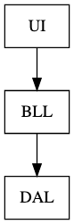
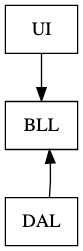
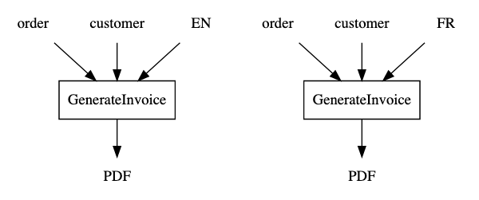
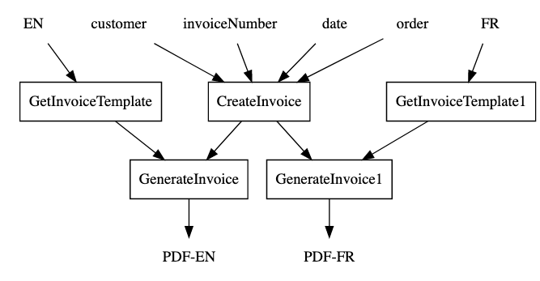
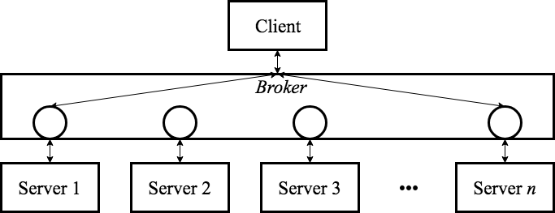
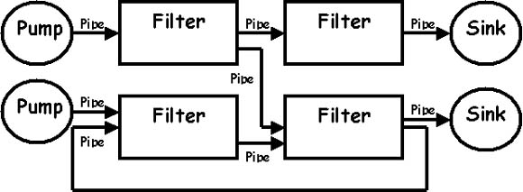

<!-- .slide: data-background="#003d73" -->
## Functional Architecture

 <!-- .element style="width: 200px; position: fixed; bottom: 50px; left: 50px" -->

----


### Agenda

* Problem
* Ports & Adapters
* Abstraction
* Other

---

### Problem




Note:

Breaks DIP - BLL depends on details in DAL

----

#### Small change

So to adhere to DIP



----

#### Why keep BLL pure

* Creating a **PDF** invoice, requires
    * Products
    * Prices before and after taxes
    * Customer information
    * Date
    * Invoice number

----

#### OO way of implementing the above

```csharp
public void GenerateInvoice(Order order, Customer customer)
{
    // ...
}
```

* Testing
    * requires us to compare files
    * But what about date and invoice number?

Note:

* Invoice number is generated (or gotten from a DB)
* Date is 'read'

----

#### Handling internalization

```csharp
public void GenerateInvoice(Order order,
                            Customer customer,
                            Language lang) {}
```

Call `GenerateInvoice` twice on for each language - what problems does this introduce?



----

#### Problems

So each call to `GeneateInvoice` increments invoice number :(

----

#### Solution



---

#### Hexagonal architecture

also known as Ports and Adapters

") <!-- .element style="height:400px" -->

By Alistair Cockburn 

----

## Ports & Adapters

* Components<!-- .element: class="fragment" -->
    * loosely coupled and interchangeable
    * e.g. database, ui, business logic, etc. etc.
* Ports<!-- .element: class="fragment" -->
    * 'interface' that components can access other components through
* Adapters<!-- .element: class="fragment" -->
    * glue between components and ports

Note: Not only for FP - but very used especially in FP so e.g. F# and Haskell

----

<!-- TODO: New example -->

### A Restaurant example

```fsharp
module Capacity

type Error = CapacityExceeded
type Reservation = {Quantity: int}

let check capacity getReservedSeats reservation =
    let reservedSeats = getReservedSeats reservation
    if (capacity < reservation.Quantity + reservedSeats)
    then Result.Error CapacityExceeded
    else Result.Ok reservation
// val check :
//  capacity:int ->
//  getReservedSeats:(Reservation -> int) ->
//  reservation:Reservation -> Result<Reservation,Error>
```

----

### Controller / Use case

* Restaurant check if reservation can be accepted


```fsharp
let connStr = "..."
let reserveTable = 
    Validate.reservation
    >> bind (Capacity.check 10 (getReservedSeatsFromDb connStr))
    >> map (saveReservation connStr) // same as below
  //>> map (fun res -> (saveReservation connStr) res)
```

----

### Inject `getReservedSeats`

```fsharp
let getReservedSeatsFromDb (connStr: string)
                           (reservations: Reservation): int = 
    // TODO: load reserved seats from database

let getReservedSeats = getReservedSeatsFromDb connStr
// val getReservedSeats : (Reservation -> int)
```

* <!-- .element: class="fragment" --> So 'getReservedSeats' are inpure - but that do not show in the signature.

----

### Partial application

* <!-- .element: class="fragment" --> Our pure function 'check', will be inpure in production

* But why do 'check' need getReservedSeats at all?  <!-- .element: class="fragment" -->

----

### Rewrite

```fsharp
let check capacity reservedSeats reservation =
    if (capacity < reservation.Quantity + reservedSeats)
    then Result.Error CapacityExceeded
    else Result.Ok reservation
```

----

### Calling check

So now calling '`check`' is a bit more tedious

```fsharp
let connStr = ".."
let reserveTable =
  Validate.reservation
    >> map  (getReservedSeatsFromDb connStr r, r)
    >> bind (fun (i, r) -> Capacity.check 10 i r)
    >> map  (saveReservation connStr)
```

Note:

`>>` function composition

```
let (>>) f g x = g (f x)

let add1 x = 1+x
let times2 x = x*2

let add1Times2 = (>>) add1 times2
let add1Times2' = add1 >> times2
```

----

### Reuse logic

* What is business logic?<br/><!-- .element: class="fragment" -->
* What is application logic?<br/><!-- .element: class="fragment" -->
* Does 'reserveTable' belong in the BLL?<br/><!-- .element: class="fragment" --> 

----

### The function `reserveTable`

1. could application logic<br/><!-- .element: class="fragment" --> 
1. thereby not something you would necessary reuse<br/><!-- .element: class="fragment" --> 
1. because:<br/><!-- .element: class="fragment" --> 
    * handle reservation validation in the same manner?
    * handle input/output different

----

### Take-aways

1. Read data (impure)<br/><!-- .element: class="fragment" -->
1. Hand data to BLL (pure)<br/><!-- .element: class="fragment" -->
1. Save data (impure)<br/><!-- .element: class="fragment" -->
1. Return/show data (impure)<br/><!-- .element: class="fragment" -->

---

## Abstractions

* Pure functions
* Impure functions

----

### Calling functions

1. Pure functions **may** call other pure functions
2. Impure functions **may** call other impure functions
3. Impure functions **may** call other pure functions
4. ___Pure functions **may not** call other impure functions___

----

### ??

Is my function `a()` pure or not?

----

### Ports and Adapters
##### or hexagonal architecture

* One way of avoiding DAL contaminating BLL<br/><!-- .element: class="fragment" --> 
* Alternative to layered architecture<br/><!-- .element: class="fragment" --> 
* Each component is connected through a number of ports<br/><!-- .element: class="fragment" --> 
* <!-- .element: class="fragment" --> Not always the correct solution

----

### Onion architecture

 <!-- .element style="height: 260px" -->

* Onion architecture was inspired by Hexogonal architecture<br/><!-- .element: class="fragment" -->
* Layered architecture<!-- .element: class="fragment" --> 
    * where inner circles have no knowledge of outer circle


----

### Onion Arch. pro/cons

* \- e.g. database is accessible from UI<br/><!-- .element: class="fragment" -->
    * they are in same layer - not a good idea though.
* \+ fewer artifacts then ports and adapters<br/><!-- .element: class="fragment" -->

---

### Broker architecture



Looks like microservices, right?

----

### Pipe and filter
##### or reactive programming



note:

We will take a closer look at this later

---

## References

* [Conditional composition of functions](https://blog.ploeh.dk/2016/07/04/conditional-composition-of-functions/)