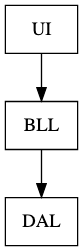
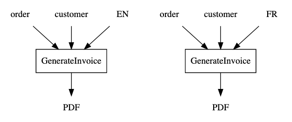
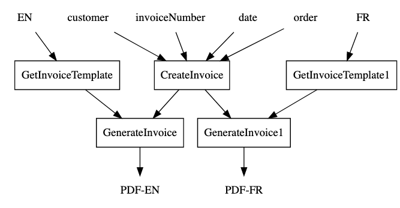
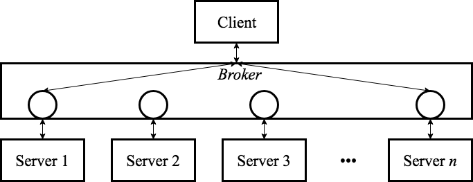
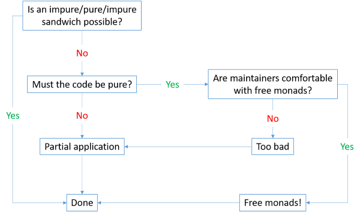

<!-- .slide: data-background="#003d73" -->
## Functional Architecture

 <!-- .element style="width: 200px; position: fixed; bottom: 50px; left: 50px" -->

----

### Agenda

* Problem
* IO
* Ports & Adapters
* Abstraction
* Other

---

### Problem




Note:

Breaks DIP - BLL depends on details in DAL

----

#### Small change

So to adhere to DIP


----

#### Why keep BLL pure

* Creating a PDF invoice, requires
    * Products
    * Prices before and after taxes
    * Custumer information
    * Date
    * Invoice number

----

#### OOP way of doing this

```csharp
public void GenerateInvoice(Order order, Customer customer)
{
    // ...
}
```

* Testing
    * requires us to compare files
    * But what about date and invoice number?

----

#### Handling internalization

```csharp
public void GenerateInvoice(Order order,
             Customer customer, Language lang) {}
```

Call `GenerateInvoice` twice on for each language - what problems does this introduce?



----

#### Problems

So each call to `GeneateInvoice` increments invoice number :(

----

#### Solution




---

## IO

* IO is from Haskell
* Used to force inpure code away from pure code
* Baked in to type system

----

### Monad

So IO would be all the places we have side-effects aka. Infrastructure

* IO is a monad.
* Another example on a monads is F# Option type
* Monads can be combined with `bind`

**Note**: We will come back to monads.

----

#### Return and Bind

Two important methods `return` and `bind`

```fsharp
val return: 'a -> m<'a>
val bind: m<'a> -> (a -> m<'b>) -> m<'b>
```

----

#### F# Option type

```fsharp
let o = Some 3 // creation
let n = None   // creation 
let f = fun a -> Some (a+3)

o |> Option.bind f // ...
n |> Option.bind f // ...
```

---

#### Hexagonal architecture

also known as Ports and Adapters

") <!-- .element style="height:400px" -->

By Alistair Cockburn 

----

## Ports & Adapters

* Components - loosely coupled and interchangeable
    * E.g. database, ui, business logic, etc etc
* Ports
    * 'Holes' that components can access other components through
* Adapters
    * Adapters are glue between components and ports

Note: Not only for FP - but very used especially in FP so e.g. F# and Haskell

----

### A Resturant example

* Resturant check if reservation can be accepted

TODO: Rename impl!


```fsharp
let connStr = "..."
let impl = 
    Validate.reservation
    >> bind (Capacity.check 10 (getReservedSeatsFromDb connStr))
    >> map (saveReservation connStr)
  //>> map (fun res -> (saveReservation connStr) res)
```

----

### Closer look at `Capacity.Check`

```fsharp
type Error = CapacityExceeded
type Reservation = {Quantity: int}

let check capacity getReservedSeats reservation =
    let reservedSeats = getReservedSeats reservation
    if (capacity < reservation.Quantity + reservedSeats)
    then Result.Error CapacityExceeded
    else Result.Ok reservation
// val check :
//  capacity:int ->
//  getReservedSeats:(Reservation -> int) ->
//  reservation:Reservation -> Result<Reservation,Error>
```

----

### Inject `getReservedSeats`

```fsharp
let getReservedSeatsFromDb (connStr: DbContext)
                           (reservations: Reservation): int = 
    failwith "Not implemented"

let getReservedSeats = getReservedSeatsFromDb context
// val getReservedSeats : (Reservation -> int)
```

So `getReservedSeats` are inpure - but that do not show in the signature.

----

### 'Problem'

* Our pure function check, will be inpure in production

* But why do checkCapacity need getReservedSeats at all?  

----

### Rewrite

```fsharp
let check capacity reservedSeats reservation =
    if (capacity < reservation.Quantity + reservedSeats)
    then Result.Error CapacityExceeded
    else Result.Ok reservation
```

----

### Calling check

So now calling check is a bit more involved

```fsharp
let connStr = ".."
let impl =
  Validate.reservation
    >> map  (fun r -> (getReservedSeatsFromDb connStr r, r))
    >> bind (fun (i, r) -> check 10 i r)
    >> map  (saveReservation connStr)
  //>> map (fun r -> saveReservation connStr r)
```

Note:

`>>` function composition

```
let (>>) f g x = g (f x)

let add1 x = 1+x
let times2 x = x*2

let add1Times2 = (>>) add1 times2
let add1Times2' = add1 >> times2
```

----

### Reuse logic

* What is business logic?
* What is application logic?

* One could argue that the function `impl` should belong in the business logic?

----

The function `Impl`
* could also argue that this function is part of the controller
* Thereby not something you would reuse in another application
* because:
    * Would you always need to handle resevation validation?
    * Handle input/output different

----

### Generalization

1. Read data from impure sources
2. Hand data to BLL
3. Use returned data to perform side-effects

---


## Abstractions

* Pure functions
* Impure functions

----

### Calling functions

1. Pure functions **may** call other pure functions
2. Impure functions **may** call other impure functions
3. Impure functions **may** call other pure functions
4. ~~Pure functions **may not** call other impure functions~~

----

### ??

Is my function `a` pure or not?

----

### Hexagonal architecture

* To avoid BLL to contaminate e.g. UI
* Alternative to layered architecture
* Each component is connection via a number of ports
* Onion architecture was inspired by Hexogonal architecture

* **Note**: Not always the correct solution

----

### Onion architecture

 <!-- .element style="height: 300px" -->

* Layered architecture
    * where inner circles have no knowledge of outer circle


----

### Onion pro/cons

* \- e.g. database is accessible from UI, since they are in same layer - not a good idea though.
* \+ fewer artifacts then ports and adapters

---


----

### Broker architecture



Looks like microservices, right?

----

### Pipe and filter


----

### Free monad



Note:
Free monads uses an AST to represent a computation and at the same time keep the computation AST decoupled from the way it is interpreted.

---

## References

* [Conditional composition of functions](https://blog.ploeh.dk/2016/07/04/conditional-composition-of-functions/)