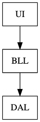
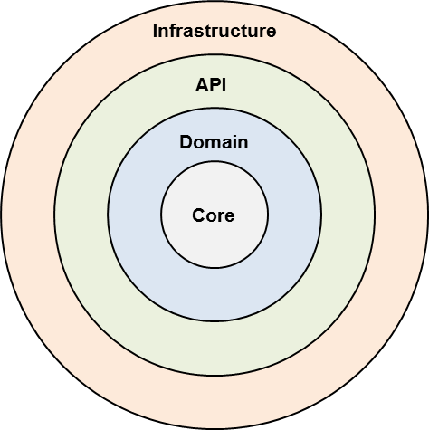

<!-- .slide: data-background="#003d73" -->
## Functional Architecture

 <!-- .element style="width: 200px; position: fixed; bottom: 50px; left: 50px" -->

----

### Agenda

* Problem
* IO
* Ports & Adapters
* Abstraction
* Other

---

## Problem




Note:

Breaks DIP - BLL depends on details in DAL

----

### Small change

So to adhere to DIP


----

### Onion architecture



Where inner circles have no knowledge of outer circle


---

## IO

* IO is from Haskell
* Used to force inpure code away from pure code
* Baked in to type system

----

### Monad

So IO would be all the places we have side-effects aka. Infrastructure

* IO is a monad.
* Another example on a monads is F# Option type
* Monads can be combined with `bind`

**Note**: We will come back to monads.

----

### Option is a monad

```fsharp
let o = Some 3
let n = None
let f = fun a -> Some (a+3)

o |> Option.bind f // ...
n |> Option.bind f // ...
```

----

TODO: Anything else?

---

## Ports & Adapters

* Ports
    * 'Holes' that components can access other components through
* Adapters
    * Adapters are glue between components and ports
    *

TODO: What should introduce this

----

### An example

```fsharp
type Error = CapacityExceeded
type Reservation = {Quantity: int}

let check capacity getReservedSeats reservation =
    let reservedSeats = getReservedSeats reservation
    if (capacity < reservation.Quantity + reservedSeats)
    then Result.Error CapacityExceeded
    else Result.Ok reservation
// val check :
//  capacity:int ->
//    getReservedSeats:(Reservation -> int) ->
//      reservation:Reservation -> Result<Reservation,Error>
```

----

### Inject `getReservedSeats

```fsharp
let getReservedSeatsFromDb (connStr: DbContext)
                           (reservations: Reservation): int = 
    failwith "Not implemented"

let getReservedSeats = getReservedSeatsFromDb "..."         
// val getReservedSeats : (Reservation -> int)
```

Here `getReservedSeats` are inpure - but that do not show in the signature.

----

### 'Problem'

* Our inpure function check function, will be inpure in production

But why do checkCapacity need then getReservedSeats at all? <!-- .element: class="fragment" -->

----

### Rewrite

```fsharp
let check capacity reservedSeats reservation =
    if (capacity < reservation.Quantity + reservedSeats)
    then Result.Error CapacityExceeded
    else Result.Ok reservation
```

----

### Calling check

So now calling check is a bit more involved

```fsharp
let connStr = ".."
let do =
    Validate.reservation
        >> map (fun r ->
            getReservedSeatsFromDb connStr r, r)
        >> bind (fun (i, r) -> check 10 i r)
        >> map (saveReservation connStr)
```

Note:

`>>` function composition

```
let (>>) f g x = g (f x)

let add1 x = 1+x
let times2 x = x*2

let add1Times2 = (>>) add1 times2
let add1Times2' = add1 >> times2
```

----

### Reuse logic

* What is business logic?
* What is application logic?

One could argue that the function `do` should belong in the business logic?

TODO: need an answer here

----

### Generalization

1. Read data from impure sources
2. Hand data to BLL
3. Use returned data to perform side-effects

---


## Abstractions

* Pure functions
* Impure functions

----

### Calling functions

1. Pure functions **may** call other pure functions
2. Impure functions **may** call other impure functions
3. Impure functions **may** call other pure functions
4. ~~Pure functions **may not** call other impure functions~~

----

### ??

Is my function `a` pure or not?

----

### Hexagonal architecture

") <!-- .element style="height:400px" -->

By Alistair Cockburn 

----

### Hexagonal architecture

* To avoid BL to contaminate e.g. UI
* Alternative to layered architecture
* Each component is connection via a number of ports
* Onion architecture was inspired by Hexogonal architecture

----

### Ports and adapters

* Basicly the same as Hexagonal architecture
* **Note**: Not always the correct solution


---

## Other

TODO: something fun

----

### Broker architecture


Looks like microservices, right?

----

### Pipe and filter


----

### Free monad


Note:
Free monads uses an AST to represent a computation and at the same time keep the computation AST decoupled from the way it is interpreted.

---

## References

* [Conditional composition of functions](https://blog.ploeh.dk/2016/07/04/conditional-composition-of-functions/)