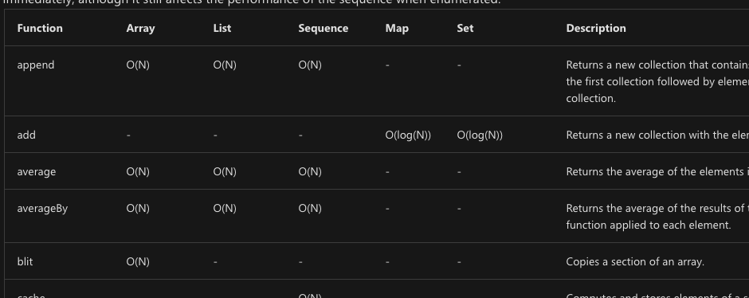

<!-- .slide: data-background="#003d73" -->
## Memory, Optimization and Queues

 <!-- .element style="width: 200px; position: fixed; bottom: 50px; left: 50px" -->

----

### Agenda

* Stack/Heap
* Recursion
  * Tail recursion
* Optimization

---

## Stack and Heap

* Much like C#, Java, etc.<!-- .element: class="fragment" -->
* Memory is split into Stack and Heap<!-- .element: class="fragment" -->

----

### Stack

* Stackframes<br/><!-- .element: class="fragment" -->
    * Holds primitive values<br/><!-- .element: class="fragment" -->
        * Some objects
    * Reference for objects on Heap<br/><!-- .element: class="fragment" -->


----

### Stack frame

* Values/objects bound at the same level is kept in a stackframe<br/><!-- .element: class="fragment" -->
* Evaluating local declarations will push a stackframe on top<br/><!-- .element: class="fragment" -->
* When result is found/computed - stackframe wil be popped<br/><!-- .element: class="fragment" -->

---

<!-- .slide: data-visibility="hidden" -->

## Big-O

TODO: Should this be included and what?

---

## Recursion

* We use recursion to do loops<br/><!-- .element: class="fragment" data-fragment-index="0" -->
    * simplicity
    * where no HoF works
* This can blow the stack, because<br/><!-- .element: class="fragment" data-fragment-index="1" -->
    * recursive call creates a new stack frame

 <!-- .element style="height: 200px;" class="fragment" data-fragment-index="1" -->

----

### Example

```fsharp
let rec pow = function
    | (s: string, 1) -> s
    | (s: string, n) -> s + pow (s, n-1)
```

* After the recusive call there are still computations in this function<!-- .element: class="fragment" -->
    * add '`s`' to result - so new stackframe will be created

----

### Tail Recursion

```fsharp
let pow' (input: string * int) =
    let rec powInner acc = function
        | (s: string, 1) -> acc+s
        | (s: string, n) -> powInner (acc + s) (s, n-1)
    powInner "" input
```

This is tail recursive - last expression is recursive call<!-- .element: class="fragment" -->

note: 

```fsharp
let pow' (input: string * int) =
    let rec powInner acc (x: string * int) =
        match x with
        | (s: string, 1) -> acc+s
        | (s: string, n) -> powInner (acc + s) (s, n-1)
    powInner "" input
```

----

#### Accumulative value

```fsharp
let rec fact n =
    match n with
    | 0L | 1L -> 1L
    | _ -> n * fact(n-1L)
    
// Same as
let rec fact' = function
    | 0L | 1L -> 1L
    | n -> n * fact' (n-1L)
```
<!-- .element: class="fragment" data-fragment-index="0" -->

```fsharp
let fact'' n =
    let rec factInner = function
        | (0L, m) -> m
        | (n, m) -> factInner (n-1L, n*m)
    factInner (n, 1)
```
<!-- .element: class="fragment" data-fragment-index="1" -->

----

### Generalization

```fsharp
let fact'' n =
    let rec factInner = function
        | (0L, m) (* base condition *) -> m // last operation
        | (n, m) -> factInner (n-1L, n*m)   // continue operation
    factInner (n, 1)
```


Looping on a special form:<!-- .element: class="fragment" data-fragment-index="1" -->

```fsharp
let rec tr checker cont last value =
    if checker value
    then tr checker cont last (cont value)
    else last value
// val tr : checker:('input -> bool) ->
//          cont:('input -> 'input) ->
//          last:('input -> 'output) ->
//          value:'input -> 'output
```
<!-- .element: class="fragment" data-fragment-index="1" -->

----

### Implementing factorial by `tr`

```fsharp
let fact' = tr (fun (n,_) -> n<>0L)       // checker
               (fun (n,m) -> (n-1L, m*n)) // cont
               (fun (_,m) -> m)           // last

// For reference
let rec fact = function
    | (0L, m) -> m
    | (n, m) -> fact (n-1L, n*m)
```

----

### Comparison

```fsharp
> fact' (30,1);;
Real: 00:00:00.000, CPU: 00:00:00.000, 
          GC gen0: 0, gen1: 0, gen2: 0
val it : int = 1409286144

> fact (30,1);;   
Real: 00:00:00.000, CPU: 00:00:00.000,
          GC gen0: 0, gen1: 0, gen2: 0
val it : int = 1409286144
```

----

### Properties of tail recursive functions

* Evaluation<!-- .element: class="fragment" -->
    * `tr checker cont last (cont value)` will not build large expressions
    * `cont value`<br/> will be evaluated at each step
* <!-- .element: class="fragment" -->This are $O(n)$ - in the fact example<br/>
* <!-- .element: class="fragment" -->The same evironment/stack frame can be reused
    * $O(1)$ stack space consumption

----

### Using continuations to optimize

* Accumulative parameter (above) is not always possible<br/><!-- .element: class="fragment" data-fragment-index="1" -->
* Continuations is a genenral pattern for making tail-recursion<!-- .element: class="fragment" data-fragment-index="2" -->

In general we will transform:<!-- .element: class="fragment" data-fragment-index="3" -->

```fsharp
f: 'input -> 'output
// into
f: 'input -> ('input -> 'output) -> 'output
```
<!-- .element: class="fragment" data-fragment-index="3" -->

----

### Example

Populate list in opposite direction
```fsharp
let rec bigList = function
    | 0 -> []
    | n -> (n-1) :: (bigList (n-1))
// val it : int list = [2; 1; 0]
```
<!-- .element: class="fragment" data-fragment-index="0" -->

```fsharp
let rec bigListC c = function
    | 0 -> c []
    | n -> bigListC (fun res -> printfn "execute %d" (n-1)
                                c ((n-1)::res)
                    ) (n-1)

bigListC (fun a -> a) 3

```
<!-- .element: class="fragment" data-fragment-index="1" -->

----

### Analysis 

* Accumulation is much faster than continuation based<br/><!-- .element: class="fragment" -->
    * Even more visible compared to iterative methods
* Continuations will work in all places <!-- .element: class="fragment" -->


----

### Example

```fsharp
type BinTree<'a> = | Leaf
                   | Node of BinTree<'a> * 'a * BinTree<'a>

let rec count = function
    | Leaf          -> 0
    | Node(l, n, r) -> (count l) + 1 + (count r)
```

Is this tail recursive?

----

### Implementaion with continuations

```fsharp [9|6-7|5-8]
let rec countC t c =
    match t with
    | Leaf          -> c 0
    | Node(l, n, r) -> 
        let cl = fun vl -> 
            let cr = fun vr -> c(vl+1+vr)
            countC r cr
        countC l cl
// val countC : t:BinTree<'a> -> c:(int -> 'b) -> 'b
```

* So continuations based versions also works with multiple recursion<br/><!-- .element: class="fragment" -->
* <!-- .element: class="fragment" --> Optimization: One of the continuations can be replaced with an accumulative version

---

## Optimization



[Collections complexities in F#](https://docs.microsoft.com/en-us/dotnet/fsharp/language-reference/fsharp-collection-types)

----

### Ex. `foldback`

* This should be a continuation-based imp.

```fsharp
// this version doesn't causes stack overflow - it uses a private stack 
[<CompiledName("FoldBack")>]
let foldBack<'T,'State> folder (list:'T list) (state:'State) = 
    let f = OptimizedClosures.FSharpFunc<_,_,_>.Adapt(folder)
    match list with 
    | [] -> state
    | [h] -> f.Invoke(h,state)
    | [h1;h2] -> f.Invoke(h1,f.Invoke(h2,state))
    | [h1;h2;h3] -> f.Invoke(h1,f.Invoke(h2,f.Invoke(h3,state)))
    | [h1;h2;h3;h4] -> f.Invoke(h1,f.Invoke(h2,f.Invoke(h3,f.Invoke(h4,state))))
    | _ -> 
        // It is faster to allocate and iterate an array than to create all those 
        // highly nested stacks.  It also means we won't get stack overflows here. 
        let arr = toArray list
        let arrn = arr.Length
        foldArraySubRight f arr 0 (arrn - 1) state
```

[F# List impl](https://github.com/fsharp/fsharp/blob/master/src/fsharp/FSharp.Core/list.fs)

Note:

```fsharp
let foldArraySubRight (f:OptimizedClosures.FSharpFunc<'T,_,_>) (arr: 'T[]) start fin acc = 
    let mutable state = acc
    for i = fin downto start do
        state <- f.Invoke(arr.[i], state)
    state
```

----

#### Map example

```fsharp
let rec foldBackOpt (f: OptimizedClosures.FSharpFunc<_, _, _, _>) (m: MapTree<'Key, 'Value>) x =
        if isEmpty m then
            x
        else if m.Height = 1 then
            f.Invoke(m.Key, m.Value, x)
        else
            let mn = asNode m
            let x = foldBackOpt f mn.Right x
            let x = f.Invoke(mn.Key, mn.Value, x)
            foldBackOpt f mn.Left x

let foldBack f m x =
    foldBackOpt (OptimizedClosures.FSharpFunc<_, _, _, _>.Adapt f) m x
```

----

### Measuring time

* Can be done in FSI with
    * `#time;;`

```fsharp
> #time;;

>pow ("1233456", 56);;
Real: 00:00:00.049, CPU: 00:00:00.037, 
    GC gen0: 1, gen1: 1, gen2: 0
val it : string =
  "1233456123345612334561233456123345612334561233456123345612334561233456123345612334561233456123345612334561233456123345612334
```

----

### Benchmarking

There is a nice NuGET package [https://github.com/dotnet/BenchmarkDotNet](BenchmarkDotNet)


```csharp
[SimpleJob(RuntimeMoniker.Net472, baseline: true)]
[SimpleJob(RuntimeMoniker.NetCoreApp30)]
[SimpleJob(RuntimeMoniker.NativeAot70)]
[SimpleJob(RuntimeMoniker.Mono)]
[RPlotExporter]
public class Md5VsSha256
{
    ...
    [Params(1000, 10000)]
    public int N;

    [GlobalSetup]
    public void Setup() {
        data = new byte[N];
        new Random(42).NextBytes(data);
    }

    [Benchmark]
    public byte[] Sha256() => sha256.ComputeHash(data);

    [Benchmark]
    public byte[] Md5() => md5.ComputeHash(data);
}
```


---

## References

* [Writing high performance F# code](https://bartoszsypytkowski.com/writing-high-performance-f-code/)

----

### Other sources

[](https://www.infoq.com/presentations/Lock-free-Algorithms/ "Lock-Free Algorithms For Ultimate Performance")

<video data-autoplay src=""></video>