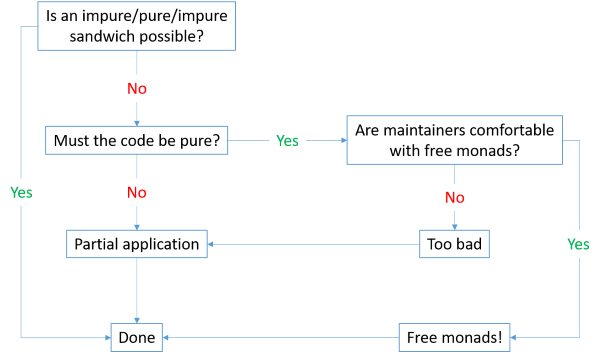

<!-- .slide: data-background="#003d73" -->
## Functors, Applicatives, Monads

 <!-- .element style="width: 200px; position: fixed; bottom: 50px; left: 50px" -->

----

### Agenda

* Monads
* Computation Expressions
* Functors
* Applicatives
* CE continued

---

## We still have a problem

```fsharp
let monadicAdd (a: int option)
               (b: int option)
               (c: int option) =
    a |> Option.bind (fun a' ->
        b |> Option.bind (fun b' ->
            c |> Option.bind (fun c' ->
                Some (a' + b' + c')
    )))
```

----

### Monads

* Design pattern which can combine code fragments
* Apply a function that returns a wrapped value
    * to a wrapped value
* Monad functions

```fsharp
val return': a -> m a
// Also `bind` or `liftM`
val (>>=): (a -> m b) -> m a -> m b
```

----

### True use of monads


note:

From: https://medium.com/descript-software/monads-are-useful-part-1-c407e342e117

Function composition

----

#### Examples

Known stuff :)

```fsharp
let bind f = function
    | Some v -> f v
    | None   -> None

bind (fun v -> Some (v+1)) (Some 4)
```

----

#### Monadic laws

```fsharp
let f a = Some (a+1)
let g a = Some (a*10)
let return' a = Some a
// Left identity
bind f (Some 1) = f 1
// Right identity
bind return' (Some 1) = Some 1
// Assosiative
bind f (bind g (Some 2))
    = bind (fun x -> bind f (g x)) (Some 2)
```

----

#### When to look for monads

* You have a function that performs some side-effect
    * a function taking 'plain' input like `int`, `string` or `Person` and
    * returning `option`, `Promise`, `Result` etc.

---

### Variations


----

### Free monad



Note:
Free monads uses an AST to represent a computation and at the same time keep the computation AST decoupled from the way it is interpreted.

----

### Also

* Comonads
    * Can be seens as a reduction from a computation back down to values
* Additive monads
    * Monad with binary operators 'mplus' and 'mzero'
    * E.g. List with '[]' and '::'

---

### Computation expressions

* Existing computation expressions
    * `async {}`
    * `actor {}`
* Creating your own computation expression is possible

```
builder-expr { cexper }
```

----

#### Keywords in CE

```fsharp
expr { let! ... }
expr { do! ... }
expr { yield ... }
expr { yield! ... }
expr { return ... }
expr { return! ... }
expr { match! ... }
````

----

#### CE is a class types

```fsharp
type OptionBuilder() =
    member _.Return(x) =
        Some x
// Staticly somewhere
let option = OptionBuilder()

let x () =
    option {
        return 2
    }
```

----

#### Class types

```fsharp
type OptionBuilder() =
    ...
    member _.Bind(x, f) =
        Option.bind f x // Monadic bind

// Staticly somewhere
let option = OptionBuilder()

let x (intOption: int option)=
    option {
        let! x = intOption
        return x+1
    }
```

Note: 
```fsharp
type OptionBuilder() =
    member _.Return(x) =
        Some x
    member _.Bind(x, f) =
        Option.bind f x // Monadic bind
```

----

### Why creating a option CE

```fsharp
let monadicAdd (a: int option)
               (b: int option)
               (c: int option) =
    a |> Option.bind (fun a' ->
        b |> Option.bind (fun b' ->
            c |> Option.bind (fun c' ->
                Some (a' + b' + c')
    )))
```

----

### Why creating a option CE 2

```fsharp
let addThreeOptions (a: int option)
                    (b: int option)
                    (c: int option) =
    option {
        let! a' = a
        let! b' = b
        let! c' = c
        return a' + b' + c'        
    }
```


----

#### Returning directly from CE

```fsharp
type OptionBuilder() =
    ...
    member _.ReturnFrom(x) = x

let add (a: int option) =
    option {
        return! a
    }
```

Note:

```fsharp
type OptionBuilder() =
    member _.Return(x) =
        Some x
    member _.ReturnFrom(x) = x
    member _.Bind(x, f) =
        Option.bind f x

let option = OptionBuilder()
```

---

### Functors

* A mapping in an elevated worlds between 'types'
    * using 'normal' functions
* They are structure preseving
    * e.g. `List<string> -> List<int>`

note: 

From category theory
    * mapping between categories


----

#### Functor laws - Identity

* applying `identity` function should leave functor unchanged

```fsharp
List.map id [1;2;3;4;5]
// val it : int list = [1; 2; 3; 4; 5]
```

----

#### Functor laws - composition

* given two functions `f` and `g` you get the same result by
    * mapping over `f` and then `g` should yield same result as
    * mapping over `f >> g`

```fsharp
let compTrue value =
     let a = value |> map f |> map g
     let b = value |> map (f >> g)
     a = b
```


----

#### Functor laws - composition

```fsharp
let times2 b = 2 * b
[1;2;3;4] |> List.map (times2 >> string)
// val it : string list = ["2"; "4"; "6"; "8"]
[1;2;3;4] |> List.map times2 |> List.map string
```

----

### Using functors

* Look for a functor whenever you have a type with a generic type argument

---

### Applicatives

* Mapping of objects in an elevated world
    * using elevated functions with same type

And two functions

```fsharp
val pure: a -> f a
val (<*>): f (a -> b) -> f a -> f b  // Also called lift
// E.g
val pureList: a -> a list
val applyToList: (a -> b) list -> a list -> b list
```

Note:
`<*>` is also called `liftA2` and sometimes `apply` :)

----

#### Examples

```fsharp
module List =
    let apply fs l = 
        fs |> List.collect (fun f ->
                l |> List.map f)
// val apply : fs:('a -> 'b) list -> l:'a list -> 'b list
let odds = [1;3;5;7;9]
let evens = [2;4;6;8;0]
let all = 
    (List.apply
        (List.apply [fun odd even -> (odd, even)] odds) evens)
```

Note:

```fsharp
module Option =
    let apply = function
        | (Some f, Some x) -> Some <| f x
        | _                -> None
```


----

#### Applicative laws

```fsharp
// Identity:
pure id <*> v = v
// Composition:
u <*> v <*> w = u <*> (v <*> w)
// Homomorphism:
pure f <*> v = pure (f v)
// Interchange:
u <*> pure y = pure (fun a -> a y) <*> u
```

Note:

```fsharp
List.map string [1;2;3;4] = apply [string] [1;2;3;4]
// Interchange in F#

apply [add1] [1]= apply [fun a -> a 1] [add1]
```

----

#### Using applicatives

* When having a function taking multiple arguments
    * but having the arguments wrapped in something like `Result`


----

#### Applicative and Functors

Every `applicative` is a `functor`, since `map` can be defined by using `pure` and `<*>`

```fsharp
//map f x = pure f <*> x
map f x = apply (pure f)
```

---

### Changing our examples to applicatives

```fsharp
module Option =
    let apply fOpt xOpt = 
        match (fOpt, xOpt) with
        | (Some f, Some x) -> Some <| f x
        | _                -> None
    let (<*>) = Option.apply

let applicativeAdd (a: int option)
                   (b: int option)
                   (c: int option) =
    let add3 x y z = x + y + z
    (Some add3)
        <*> a
        <*> b
        <*> c
````

----

#### Parallel computations

```fsharp
type OptionBuilder() =
    ...
    member _.MergeSources (x,y) =
        Option.zip x y
    member _.BindReturn (x,f) =
        Option.map f x
let option = OptionBuilder()
let addThreeOptions a b c =
    option {
        let! a' = a
        and! b' = b
        and! c' = c
        return a' + b' + c'        
    }
```

Note: 
```fsharp
module Option =
    let apply fOpt xOpt = 
        match (fOpt, xOpt) with
        | (Some f, Some x) -> Some <| f x
        | _                -> None
    let (<*>) = apply
    let zip a b =
        let toTuple x y = (x, y)
        Some toTuple <*> a <*> b

type OptionBuilder() =
    member _.Return(x) =
        Some x
    member _.ReturnFrom(x) = x
    member _.Bind(x, f) =
        Option.bind f x
    member _.MergeSources(x,y) =
        Option.zip x y
    member _.BindReturn(x,f) =
        Option.map f x
```


---

### References

* [Computation expressions](https://docs.microsoft.com/en-us/dotnet/fsharp/language-reference/computation-expressions)
* [Computation expression explained](https://www.youtube.com/watch?v=pC4ZIeOmgB0)