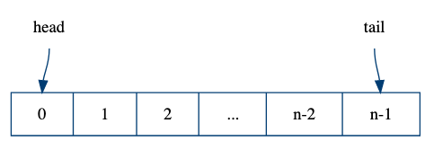

----

### Performance

```fsharp
type A = {X: int; Y: int}
// vs
[<Struct>]
type B = {X: int; Y: int}
```

* Type `B` is 16 bytes smaller, not having `8B` Object header + `8B` vTabel
* `B` is passed as values, therefore not always faster

----

### Padding

```fsharp
type A = {X: int; Y: int}
type B = {X: int; Y: int; Y: int}
```

* Here `B` is padded with 4 bytes extra, from the .NET Allocator


----

### Union types


----

### Immutable data structures

Records, unions, Lists etc etc.

* Fewer movings parts
* Thread-safe by default
* % Not nessesary performance optimal.
    * Change to use mutable datastructures within a module/function to gain performance.

----

### Other things to consider

* Hardware, L1, L2, caches
* OS pointer sizes 32/64b
* Inlining functions

F# can be very [performant](https://www.youtube.com/@FastFSharp) - used by stock companies because of this and its safety. But it requires work and knowledge about .Net Il, Hardware and F# of course.

---

### Amortized bounds

* An extension to the Big-O notation from DOA
* Used to analysis average run time
    * Usually used when some operations are fast and other are slow

* C# List is an example, its worst case bounds
    * insert: `$ O(n) $` -- **why?**
    * lookup: `$ O(1) $`
    * delete: `$ O(1) $`

----

### C# List analysis over time

* `$ \rightarrow $` `n` insertions are `$ O(n^2) $` worst case
* You can make the amortized analysis that shows <!-- .element: class="fragment"  data-fragment-index="1" -->
    * `n` insertions are `$ O(2n) $` <!-- .element: class="fragment"  data-fragment-index="1" -->
    * So amortized bounds are `$ O(1) $` for all operations <!-- .element: class="fragment"  data-fragment-index="1" -->
* See references for detailed analysis<!-- .element: class="fragment"  data-fragment-index="1" -->


---

## Queue

 <!-- .element style="width:800px;" -->

----

### Definition and operation

```fsharp [5-10]
module Queue

type Queue<'a> = 'a list * 'a list

val empty:   Queue<'a>
val isEmpty: Queue<'a> -> bool

val cons:    'a -> Queue<'a> -> Queue<'a>
val head:    Queue<'a> -> 'a
val tail:    Queue<'a> -> Queue<'a>
```

* Could be done with a single list <!-- .element: class="fragment" -->

----

### Operation implementations

```fsharp [2,7|3,8|4,9]
let rec head = function
    | ([], []) -> raise (ArgumentException "Empty")
    | ([], r)  -> head (List.rev r, [])
    | (l, _)   -> List.head l 
    
let rec tail = function
    | ([], []) -> raise (ArgumentException "Empty")
    | ([], r)  -> tail (List.rev r, [])
    | (l, r)   -> (List.tail l, r)
```

----


### Using lazy evaluation

* To optimize our queue [https://en.wikipedia.org/wiki/Chris_Okasaki](C. Okasaki) proposes to use lazy lists.
    * Almost like `seq`` in F#

```fsharp
module LazyQueue

type LazyQueue<'a> = seq<'a> * seq<'a>

val empty:   LazyQueue<'a>
val isEmpty: LazyQueue<'a> -> bool

val cons:    'a -> LazyQueue<'a> -> LazyQueue<'a>
val head:    LazyQueue<'a> -> 'a
val tail:    LazyQueue<'a> -> LazyQueue<'a>
```
<!-- .element: class="fragment" -->

----

### Lazy queue impl (1/2)

So here we utilises that `Seq` is lazy

```fsharp
let l' = Seq.append l r
```

This do not evalute `r` before its needed

----

### Lazy queue impl (2/2)

```fsharp
let l` = Seq.append l (Seq.rev r)
```

1. since append is lazy, we need to do `Seq.rev` incrementally. 
2. so do one step of `Seq.rev` for each step of append   
3. we then need the invariant `Seq.length r <= Seq.length l`

Note:
Seq.rev - will reverse the list in one go

```fsharp
// https://github.com/fsharp/fsharp/blob/577d06b9ec7192a6adafefd09ade0ed10b13897d/src/fsharp/FSharp.Core/seq.fs#L1424
let rev source =
    checkNonNull "source" source
    mkDelayedSeq (fun () ->
        let array = source |> toArray
        Array.Reverse array
        array :> seq<_>)
```

----

### Incremental rotation

```fsharp
let rec rot (l, r, a) = match Seq.length l
    | 0 -> (Seq.head r) :: a    
    | 1 -> (Seq.head l) :: (rot
                (Seq.tail l, Seq.tail r, Seq.head r :: a))
```

\* Not battle tested code

\*\* Not optimized code

----

### Bounds

* Amortized bounds for all operations are still `$ O(1) $`
* Worst case `$ O(log n) $`

----

### Amortization

* Not useful in `realtime` systems
    * why?

----

### Deque idea



