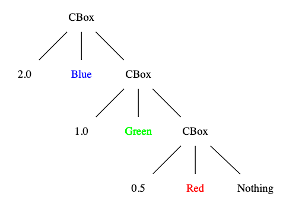
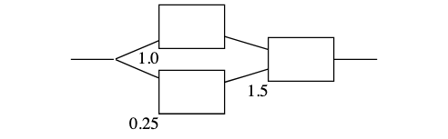
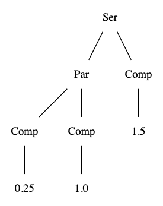

<!-- .slide: data-background="#003d73" -->
## Finite trees

 <!-- .element style="width: 200px; position: fixed; bottom: 50px; left: 50px" -->

<!--  
codespell:ignore Ser, Thi
 -->

----

### Agenda

* Finite trees
* Examples
    * Chinese boxes
    * Electronic Circuits
* Catamorphism

---

## Finite trees

* Recursive data types
* Avoid infinitely recursive data types
* Found everywhere in the 'real world'
    * JSON
    * File system
    * Parsers / Compilers


---

## Chinese boxes

or Matryoshka  dolls

 <!-- .element style="width: 400px;" -->

----

### Definition

Colored Boxes (CBox)

1. Nothing is a CBox
2. A CBox contains a number, color and a CBox
3. Contains nothing else

----

### Three example

Tree with 3 nodes



----

### Implementation

```fsharp
type Colour = Red | Green | Blue | Yellow | Purple
type CBox =
    | Nothing
    | Cube of float * Colour * CBox

let tree =
   Cube(2.0, Blue, 
        Cube(1.0, Green, 
            Cube(0.5, Red, Nothing)))
```

----

### Working with CBox

```fsharp
let rec size = function
    | Nothing -> 0
    | Cube(v, c, box) -> 1 + size box
```

----

### Alternative representation

As a `list` or without `Nothing`

```fsharp
type CBox1 = (float*Colour) list
type CBox2 =
    | Single of float*Colour
    | Multiple of float*Colour*CBox2
```

Note:
CBox1 is the same as CBox - if you take Cons/Nil into account

CBox2 is more specific, but inserting into CBox2 is more cumbersome

---

## Traversing a tree


----

### Example

```fsharp
type ListTree<'a> = Node of 'a * (ListTree<'a> list)

let tree = Node(1, [
                    Node(2, [
                        Node(5, [])
                    ])
                    Node(3, [])
                    Node(4, [
                        Node(6, [])
                        Node(7, [])
                    ])
                ])
```


----

### Depth first traversel / In order

```fsharp
let rec depthFirst (Node(x, ts)) =
    x :: (List.collect depthFirst ts)

depthFirst tree
// val it : int list = [1; 2; 5; 3; 4; 6; 7]
```

----


### Breath first traversel

```fsharp
let breathFirst tree =
    let rec breathFirstList = function
        | []                    -> []
        | (Node(x, ts)) :: rest -> 
            x :: breathFirstList (rest @ ts)
    breathFirstList [tree]

breathFirst tree
// val it : int list = [1; 2; 3; 4; 5; 6; 7]
```

----

### Post Order travesel

```fsharp
let rec postOrder (Node(x, ts)) =
    (List.collect postOrder ts) @ [x]

postOrder tree
val it : int list = [5; 2; 3; 6; 7; 4; 1]
```

----

### In order traversel

* Properly make most sense on binary trees

```fsharp
type BinTree<'a> =
    | Leaf
    | Node of BinTree<'a> * 'a * BinTree<'a>

let rec inOrder = function
    | Leaf -> []
    | Node(l, x, r) -> (inOrder l) @ [x] @ (inOrder r)
```

---

## Electronic circuits

 <!-- .element style="position:relative; float:left" -->
 <!-- .element style="position:relative; float:right; margin-right:100px" -->

----

### Types

```fsharp
type Circuit<'a> =
    | Comp of 'a
    | Ser  of Circuit<'a>*Circuit<'a>
    | Par  of Circuit<'a>*Circuit<'a>
```

----

### General traversel

```fsharp [2|3-5|6-8]
let rec circuitRec fComp fSer fPar = function
    | Comp x      -> fComp x
    | Ser(c1, c2) -> 
        fSer (circuitRec fComp fSer fPar c1)
             (circuitRec fComp fSer fPar c2)
    | Par(c1, c2) ->
        fPar (circuitRec fComp fSer fPar c1)
             (circuitRec fComp fSer fPar c2)
// val circuitRec :
//  fComp:('a -> 'b) ->
//  fSer: ('b -> 'b -> 'b) ->
//  fPar: ('b -> 'b -> 'b) ->
//        tree:Circuit<'a> -> 'b
```

----

### General traversel (refactored)

```fsharp
let rec circuitRec fComp fSer fPar tree = 
    let recursive = circuitRec fComp fSer fPar
    match tree with
    | Comp x       -> fComp x
    | Ser (s1, s2) -> fSer (recursive s1, recursive s2)
    | Par (p1, p2) -> fPar (recursive p1, recursive p2)
//val circuitRec :
//  fComp:('a -> 'b) ->
//  fSer: ('b * 'b -> 'b) ->
//  fPar: ('b * 'b -> 'b) ->
//        tree:Circuit<'a> -> 'b
```

Note: 

Should give associations to Gang of Four visitor pattern

----

### Usage of `circuitRec`

```fsharp
let resistance tree = 
    let fComp r = r
    let fSer (s1, s2)= s1 + s2
    let fPar (c1,c2) = 1.0/(1.0/c1 + 1.0/c2)
    circuitRec fComp fSer fPar tree
```

---

## Catamorphism

* From Greek and means Down+Shape
* Used to collapse a recursive structure to a new value
    * think Fold/FoldBack from List
* All functions on recursive datastructure can be defined by this technique 

----

### Recap

```fsharp
let rec circuitRec fComp fSer fPar tree = 
    let recursive = circuitRec fComp fSer fPar
    match tree with
    | Comp x       -> fComp x
    | Ser (s1, s2) -> fSer (recursive s1, recursive s2)
    | Par (p1, p2) -> fPar (recursive p1, recursive p2)
//val circuitRec :
//  fComp:('a -> 'b) ->
//  fSer: ('b * 'b -> 'b) ->
//  fPar: ('b * 'b -> 'b) ->
//        tree:Circuit<'a> -> 'b
```

Notice the common return type `'b`

Note: 

```fsharp
List.fold folder state list = ???
//  folder: ('state -> 't -> 'state) ->
//  state: 'state ->
//  list: 't list ->
//       -> 'state
```

----

### Why

So why should you use catamorphisms in practice

* Reuse
* Encapsulation
* Flexibility
* Mapping


----

### Reuse

* Recursive datastructure can be quite complex
    * Only have recursive logic in one place
    * Separate the 'how' and 'what'
        * FP in a nutshell
        * Sounds like SRP

note:

Separations of concern


----

### Encapsulation

* if a clients uses circuit and do not pattern match, we can
    * rename cases
    * add cases
    * e.g.

```fsharp
type Circuit<'a> =
    | Comp of 'a
    | Ser  of Circuit<'a>*Circuit<'a>
    | Par  of Circuit<'a>*Circuit<'a>
    | Thi  of Circuit<'a>*Circuit<'a>*Circuit<'a>
```

----

### Hide case for user

```fsharp
let rec circuitRec fComp fSer fPar tree = 
    let recursive = circuitRec fComp fSer fPar
    match tree with
    | Comp x           -> fComp x
    | Ser (s1, s2)     -> fSer (recursive s1, recursive s2)
    | Par (p1, p2)     -> fPar (recursive p1, recursive p2)
    | Thi (t1, t2, t3) -> 
        fPar (t1,
              fPar (recursive t2, recursive t3))
```

* `circuitRec` looks the same - but handle the new case
* Sometimes it's useful to avoid existing functionality to change because datastructure below changes
* You can also use [Active Patterns](https://docs.microsoft.com/en-us/dotnet/fsharp/language-reference/active-patterns) to hide data

----

### Flexibility

* Functions are more flexible than pattern matching
    * composition
    * partial application

```fsharp
let handledComp fComp tree =
    let fSer (s1, s2)= s1 + s2
    let fPar (c1,c2) = 1.0/(1.0/c1 + 1.0/c2)

    circuitRec fComp fSer fPar tree
// val handledComp :
//   fComp:('a -> float) -> tree:Circuit<'a> -> float
```

----

### Mapping

So remember that catamorphisms collapses a recursive data structure to a new value.

* Can be a primitive value as `float`
* Can be a new recursive data structure
     * In this case - easier if shape are similar

```fsharp
type CircuitDescription =
    | Comps of string
    | Ser  of CircuitDescription*CircuitDescription
    | Par  of CircuitDescription*CircuitDescription
```

----

### Example

```fsharp [2-3|4-6|7-9]
let convert tree = 
    let fComp c       =
        Comps (sprintf "Comp %O" c)
    let fSer (s1, s2) =
        Ser (Comps (sprintf "S1: %O" s1),
             Comps(sprintf "S2: %O" s2))
    let fPar (p1, p2) =
        Par (Comps(sprintf "P1: %O" p1),
             Comps(sprintf "P2: %O" p1))

    circuitRec fComp fSer fPar tree
// val convert : tree:Circuit<'a> -> CircuitDescription
```


----

### Deep Copy

Could also be used to make a clone of the original value

```fsharp
let deepCopy tree =
    let fComp = Comp
    let fSer = Ser
    let fPar = Par
    circuitRec fComp fSer fPar tree
```

Note:

```
let fComp = Comp
// is shorthand for
let fComp comp = Comp comp
```

---

### Creating a Catamorphism

1. Create a function to handle each case in the data structure
2. For non-recursive cases pass the function all the data associated with this type
3. For recursive data
    * First call the catamorphism recursively on the nested value
    * Then pass that function, the result from the recursive call


----

### Catamorphisms follow up

Another example is filesystem

```fsharp
type FileSystemItem =
    | File of File
    | Directory of Directory
and File = { name: string; fileSize: int }
and Directory = {
    name: string
    dirSize: int
    subitems: FileSystemItem list
}
```


----

### Mutually exclusive data types

```fsharp
type Product =
    | Bought of BoughtProduct
    | Made of MadeProduct
and BoughtProduct = {
    name : string
    weight : int
    vendor : string option }
and MadeProduct = {
    name : string
    weight : int
    components:Component list }
and Component = {
    qty : int
    product : Product }
```

----

### Stack safety

* Look out for stack safety
    * -> create tail-recursive functions

---

## References

[Catamorphism examples](https://fsharpforfunandprofit.com/posts/recursive-types-and-folds-1b/#product)

[Recursive datastructures article series](https://fsharpforfunandprofit.com/posts/recursive-types-and-folds/)