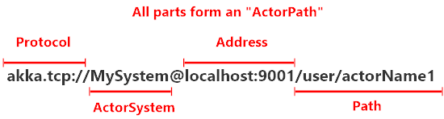

<!-- .slide: data-background="#003d73" -->
## Actor intro

 <!-- .element style="width: 200px; position: fixed; bottom: 50px; left: 50px" -->

----

### Agenda

* What is Akka.Net
  * Actor / Actorsystem
  * Messages
* IActorRef
* Actor Hierarchies + Supervision
* ActorSelection
* Actor lifecycle

---

### What is Akka.Net

* An actor framework - (ported from Scala Akka)
    * Actor model is from SmallTalk - OO done right :)
    * inspiration from Erlang
* Consists of
    * actors
    * messages

----

#### Actor

* Actors are lightweight
    * 2.5-3 mio. actors per GB ram
* Can send and receive messages
    * process one message at a time
    * synchronized
* Exists within an actor system

----

#### Actor system

Creating an actor system

```fsharp
open Akka.FSharp

let myActorSystem = System.create "MyActorSystem"
         (Configuration.load ())
```

All actors live within an actor system.

Note: This is a heavy object, so only create one per application

----


----

#### Actor

Creating an actor

```fsharp
open Akka.FSharp

// for the message-processor kind of actor
spawn myActorSystem "name" (actorOf (fn : 'M -> unit))

// for the message-sender kind of actor
spawn myActorSystem "name" (actorOf2 
                        (fn : Actor<'M> -> 'M -> unit))
```

Note: `spawn` `actofOf` and `actorOf2` is functions from `Akka.FSharp`

----

#### Communications

* Actors can send messages to each other
* Messages are immutable and strongly typed
* Operators
    * Tell (`<!`)
        * sends an async message to the `actor` referenced - under the hood
    * Ask (`<?`)
        * sends an async message and wait for response

```fsharp
actor <! "This is a message"
```

note:
`<!` - tell operator

----

<!-- .slide: data-background="#dcedc1" -->

#### Creating an Akka.Net application

1. Create an Console application
2. Install the following packages from Nuget
    * Akka
    * Akka.FSharp
3. In `Program.fs` open the following modules
    * `open Akka.FSharp`
    * `open Akka.Actor`


----

<!-- .slide: data-background="#dcedc1" -->

#### Continuing

4. In you main function create an actor system
```fsharp
[<EntryPoint>]
let main argv =
    let actorSystem = System.create "ActorSystem"
                         (Configuration.load())
    0
```

----

<!-- .slide: data-background="#dcedc1" -->

#### Creating our first actor

5. Create `Actors.fs` and move it up before `Program.fs` and add the following code

```fsharp
open Akka.Actor
open Akka.FSharp

let helloActor msg =
    match msg with
    | "hello" -> printfn "Hello back at you"
    | _       -> printfn "say again"

```

This is of the type `'M -> unit`

----

<!-- .slide: data-background="#dcedc1" -->

#### Cont.

6. Below the creation of the actor system, create an actor instance

```fsharp
    let actor = spawn actorSystem "HelloActor"
                             (actorOf helloActor)
    actor <! "something"
    actor <! "hello"
    actorSystem.WhenTerminated.Wait()
```

----

<!-- .slide: data-background="#dcedc1" -->

7. Run the application.


----

### Other ways of creating actors

Creating an: `Actor<'M> -> 'M -> unit`: 

```fsharp
// Defining actor
let test2Actor (mailbox: Actor<Message>) message = 
    failWith "Handle message here"

// Creating actor
// assume we have an existing actor system, "myActorSystem"
let test2Actor = spawn myActorSystem "test2Actor"
                             (actorOf2 Actors.test2Actor)
```

----

### Manually creating an actor

```fsharp
let firstActor (mailbox:Actor<_>) =
  let rec loop() = actor {
      let! message = mailbox.Receive()
      // handle an incoming message
      return! loop()
  }
  loop()

// assume we have an existing actor system, "myActorSystem"
let myFirstActor = spawn myActorSystem "myFirstActor"
                                             firstActor
```

----

### Creation of actors summary

1. `actorOf`&nbsp;&nbsp;&nbsp;&nbsp;&nbsp;&nbsp;&nbsp;&nbsp;&nbsp;&nbsp;&nbsp;&nbsp;&nbsp;&nbsp;&nbsp;&nbsp;&nbsp;&nbsp;&nbsp;&nbsp;&nbsp;&nbsp;&nbsp;&nbsp;&nbsp;&nbsp;&nbsp;&nbsp;&nbsp;&nbsp;&nbsp;&nbsp;&nbsp;&nbsp;&nbsp;&nbsp;&nbsp;&nbsp;&nbsp;&nbsp;&nbsp;&nbsp;&nbsp;&nbsp;&nbsp;&nbsp;&nbsp;&nbsp;
```fsharp
'M -> unit
```
2. `actorOf2`
```fsharp
Actor<'M> -> 'M -> unit
```
3. manually
```fsharp
actor {
    ...
}
```

---

### Messages

* F# types: `tuples`, `records` and `discriminated unions` can be used as messages.
* Messages are send with the `tell` command we saw above `<!`
* How to handle messages is optional
    * normally pattern matching is used

```fsharp
match msg with
| :? string as cmd -> // do something with cmd
| :> InputResult as ir -> // do something with ir
```

----

#### Unknown messages

* If an actor receives an unknown messages it should be ignored and possibly logged
* If we change the actor from above

```fsharp
let helloActor (mailbox:Actor<_>) msg =
    match msg with
    | "hello" -> printfn "Hello back at you"
    | _       -> mailbox.Unhandled msg
```

Note: There exists an actor type `ReceiveActor` which `handles` unknown messages automatically

----

#### Messages in F#

* Its a good idea to use a set of predefiend messages for each Actor.
    * e.g.
```fsharp
// Messages.fs
type ErrorType =
| Null
| Validation
// Discriminated union to determine whether or not the
// user input was valid.
type InputResult =
| InputSuccess of string
| InputError of reason: string * errorType: ErrorType
```

----

<!-- .slide: data-background="#dcedc1" -->

#### Create Message protocol

In `Messages.fs` create the following type

```fsharp
type Hello =
    | Hello of string
```

and change helloActor in `Actors.fs`

```fsharp
let helloActor (msg: Hello) =
    match msg with
    | Hello _ -> printfn "Hello back at you"
```

----

<!-- .slide: data-background="#dcedc1" -->

#### Sending messages

In `main.fs`

```fsharp
    actor <! "something"
    actor <! Hello "hello"
```

And run the program - notice than first messages is handled by the actor system

---

### `IActorRef`

* Reference/handle to another actor
* Used to send message through the `ActorSystem`
    * we never talk directly to an actor
    ```fsharp
    let actor = actorOf2 helloActor
    ```
* `ActorSystem` helps communications between actors
    * wraps messages in an envelope with metadata
    * allow location transparency
        * actor can lives on another machine

----

#### Getting an `IActorRef`

1. Create an actor
```fsharp
let myFirstActor = spawn myActorSystem "myFirstActor"
                             (actorOf firstActor)
```
2. Get `parent`, `siblings` or `children`, etc. from context 
3. Look up the actor via the `ActorPath` - we will see this later

----

#### `IActorRef` types

* Different kinds exists
* Access to different `IActorRef` through the actor context
     * Parent, Children, Sender

```fsharp
// Parent
mailbox.Context.Parent
// Sender
mailbox.Context.Sender // or mailbox.Sender
// Children
let child = spawn mailbox.Context "myChildActor" (actorOf childActor)
// or
mailbox.Child // GetChildren
```

----

<!-- .slide: data-background="#dcedc1" -->

#### Adding new messages

In `Messages.fs` add the following type

```fsharp
type SenderMessages =
    | Start
    | Continue
```

----

<!-- .slide: data-background="#dcedc1" -->

#### Refactoring our hello actor

Change the `helloActor` in `Actors.fs`

```fsharp
let helloActor (mailbox: Actor<_>) msg =
    match msg with
    | Hello txt ->
        printfn "Hello there %s" txt
        mailbox.Sender () <! Continue
```

Notice we use the context to access the `Sender` actor ref

----

<!-- .slide: data-background="#dcedc1" -->

#### Adding the new input actor

In `Actors.fs` add the following function

```fsharp
let senderActor hello (mailbox: Actor<_>) _ =
    let txt = Console.ReadLine()
    if (txt = "Exit") then
        mailbox.Context.System.Terminate() |> ignore
    else 
        hello <! (Hello txt)
```

----

<!-- .slide: data-background="#dcedc1" -->

#### Changing `Program.fs`

1. We have changed the way we are creating `helloActor` since it is sending messages
2. `senderActor` is a function "`ICanTell -> Actor<'M> -> 'M -> unit`" which is partially applied with the `hello` IActorRef
3. `actorSystem.WhenTerminated.Wait ()` just wait for the actor system to terminate.
```fsharp [1-2|3-4|6|8]
let hello = spawn actorSystem "HelloActor"
                             (actorOf2 helloActor)
let sender = spawn actorSystem "SenderActor"
                             (actorOf2 (senderActor hello))
sender <! Start // send first message to input actor
actorSystem.WhenTerminated.Wait ()
```

---

### Why Actor Hierarchies

 <!-- .element style="height: 300px" -->

* To atomize work, turn large data quantities into manageble chunks
* To make system reliable and ressilient

----

#### Atomize work

* Breaks data down into smaller and smaller pieces
    * let actors lower in the hierarchy work on these
* 'Leaf' actors can then be very specialized
* E.g. break data down recursively until it is easy to handle

----

#### Real world example

* Twitter (now X) (uses/used JVM Akka)
    * breaks down the stream of all tweets down into smaller streams - for each user.

----

#### Hierarchies for resilience

* Different levels og risk and specialization
* Like an army
    * actors close to the root is doing strategy or
        * supervision
    * actors closer to the leafs is handling riskier tasks
* If error occur in a child actor, it can be e.g restarted without effecting the rest of the sytem.

----

### Supervision

* Every actor we create has a supervisor
* Allows for an actor system to isolate and recover from failures
* Errors are contained in parts of the hierarchy
    * other actors is not effected


----

#### In practics

* Every actor has a parent
    * some has a child(ren)
* Parents supervise the child(ren)

----

#### Akka Actor hierarchy


----

#### Guardians

* `/` - root guardian actor. 
    * Supervises `/user/` and `/system`
* `/system` - system guardian
    * Responsible for closing down system
    * Utility functions like logging etc.
* `/user` - Guardian actor / root actor
    * Parent to our actors

Note:

`/` is the only actor which don't have another actor


----

#### User actors

* `/a1` and `/a2` are essential actors like the ones we have made

```fsharp
let sender = spawn actorSystem "a1"
                (actorOf2 (senderActor hello))
```

* Actors created with the `actorSystem` is children of `/user`
* Creating child actors e.g. `/b1`

```fsharp
// From inside the /a2 actor
let b1 = spawn mailbox.context "b1" basicActor
```

----

#### Actor path

* Every actor has an actor path
* Actor path can be used to send messages to an actor



// TODO: Move down after supervision

----

#### Supervision

* Actor only supervise children
* Supervision 'starts' when something goes wrong e.g. an exception in a child actor
    * Errors is wrapped in a `Failure` message and send to parent.
* Parent actor handle message based on
    * 1. how the child failed
    * 2. what directive is executed - based on `SupervisionStrategy`

----

#### Example

1. `c1` experience an error and throws an exception
2. `c1` suspends operations
3. The system sends a `Failure` message to `c1`'s parent `b1`
4. `b1` issues a directive to `c1` telling it what should happen
5. System continue to work

----

#### Supervision directives


* **Restart** the child (default): this is the common case
* **Stop** the child: this permanently terminates the child actor
* **Escalate** the error (and stop itself)
    * this is the parent saying "I don't know what to do! I'm gonna stop everything and ask MY parent!"
* **Resume** processing (ignores the error)
    * you generally won't use this. Ignore it for now


----

#### Supervision strategies

* **One-For-One** strategy (default)
    * only failing actor is affected - not siblings
* **All-For-One**
    * failing actor and all siblings are effected.

----

### Supervsion strategy example

```fsharp
let aref =
    spawnOpt system "my-actor" (actorOf2 myActor)
       [ SpawnOption.SupervisorStrategy (Strategy.OneForOne (
                (fun error ->
            match error with
                // maybe non-critical, ignore & keep going
            | :? ArithmeticException -> Directive.Resume
                // no idea what to do
            | :? InsanelyBadException -> Directive.Escalate
                // can't recover, stop failing child
            | :? NotSupportedException -> Directive.Stop
                // otherwise restart failing child
            | _ -> Directive.Restart                        
            ), 10, TimeSpan.FromSeconds(60.)))]
```

Note:

Here the actor handles errors if they no more than 10 errors happens within a 60 second window


---

<!-- .slide: data-background="#dcedc1" -->

### Lets see this in action

We extends out system so we can write to a file instead of the console.

1. First we introduce a number of message types for our hello actor in `Messages.fs`
```fsharp
type WriterMessages =
    | InputSuccess of string
    | InputError of string
    | Command of string
```

----

<!-- .slide: data-background="#dcedc1" -->

2. And change our `helloActor` to a writer actor in `Actors.fs`
```fsharp
let writerActor (_: Actor<WriterMessages>) msg =
    let print color (txt:string) =
        Console.ForegroundColor <- color
        Console.WriteLine(txt)
        Console.ResetColor()

    match msg with
    | InputSuccess txt -> print ConsoleColor.Green txt
    | InputError txt   -> print ConsoleColor.Red txt
    | Command txt      -> print ConsoleColor.White txt
```

This can now handle 3 types of messages and write these to the console

----

<!-- .slide: data-background="#dcedc1" -->

3. The responsibility of our sender actor is now to send text from console to the correct actor

```fsharp
// In Actors.fs
let senderActor writer coordinator 
                    (mailbox: Actor<SenderMessages>) msg =
    match msg with
    | Start            -> 
        writer <! WriterMessages.Command
                             "Write filepath to write to: "
        readLine (fun path -> coordinator <! Path path)
    | Continue         -> 
        readLine (fun path -> coordinator <! Path path)
    | Write (p, actor) ->
        writer <! WriterMessages.Command
                     (sprintf "Start writing text to %s" p)
        readLine (fun line -> actor <! Text line)
```

Missing code is in the attached notes

Note:

```fsharp
// Messages.fs 
type SenderMessages =
    | Start
    | Continue
    | Write of string*IActorRef

// Actors.fs in senderActor
    let readLine send =
        let line = Console.ReadLine()
        if (line = "Exit") then
            mailbox.Context.System.Terminate() |> ignore
        else
            send line 

```

----

<!-- .slide: data-background="#dcedc1" -->

4. We then introduce a `fileCoordinatorActor` in `Actors.fs`

```fsharp
let fileCoordinatorActor writer 
                  (mailbox: Actor<CoordinatorMessages>) msg =
    match msg with
    | Path path ->
        if (File.Exists path) then
            writer <! InputSuccess
                     (sprintf "Starting writing to %s" path)
            let actor = spawn mailbox.Context "WriterActor"
                    (actorOf2 (fileWriterActor path writer))
            mailbox.Sender () <!
                         SenderMessages.Write (path, actor)
        else
            writer <! InputError "File not found"
            mailbox.Sender () <! SenderMessages.Continue
```

Note:

```fsharp
// Messages.fs
type CoordinatorMessages =
    | Path of string

```

----

<!-- .slide: data-background="#dcedc1" -->

5. And finally we introduce the `fileWriterActor` which actually is responsible for writing to the file.

```fsharp
// In Actors.fs
let fileWriterActor path writer
                (mailbox: Actor<FileWriterMessage>) msg =
    let fileStream = new FileStream(path,
                        FileMode.Append, FileAccess.Write)
    match msg with
    | Text txt ->
        let bytes = Encoding.ASCII.GetBytes(txt + "\n")
        fileStream.Write(bytes, 0, bytes.Length)
        fileStream.Flush()
        writer <! WriterMessages.InputSuccess
                             "Successfully written text"
        let m = SenderMessages.Write (path, mailbox.Self)
        mailbox.Sender () <! m
             
```

Note:

```fsharp
// Messages.fs
type FileWriterMessage =
    | Text of string
```

----

<!-- .slide: data-background="#dcedc1" -->

6. Lastly we change `Program.fs` so we start the new actor with a strategy

```fsharp
let strategy () = Strategy.OneForOne(( fun error ->
    match error with
    | :? ArithmeticException -> Directive.Resume
    | :? NotSupportedException -> Directive.Stop
    | _ -> Directive.Restart), 10,
            TimeSpan.FromSeconds(30.))
let actorSystem = System.create "MyActorSystem"
                                 (Configuration.load())
let writer = spawn actorSystem "WriterActor"
                                 (actorOf2 writerActor)
let coordinator = spawnOpt actorSystem "FileCoordinator"
                (actorOf2 (fileCoordinatorActor writer))
                [SpawnOption.SupervisorStrategy(strategy())]
// rest is unchanged (more or less)
```

---

### References

* [https://petabridge.com/](https://petabridge.com/)