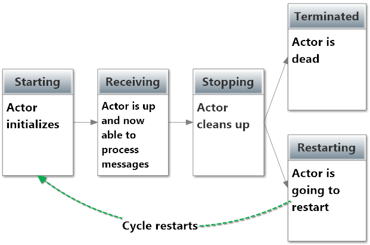
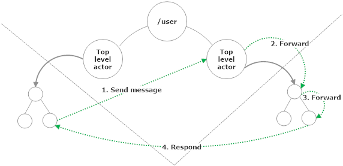
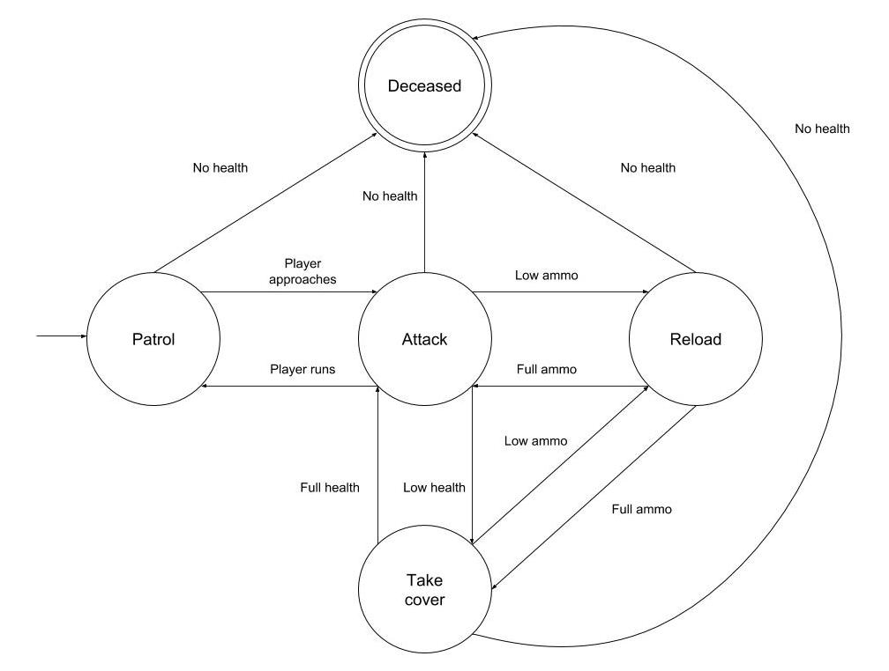

<!-- .slide: data-background="#003d73" -->
## Akka.Net continued

 <!-- .element style="width: 200px; position: fixed; bottom: 50px; left: 50px" -->

----

### Agenda

* Actor lifecycle<br/><!-- .element: class="fragment" -->
* Actor selection<br/><!-- .element: class="fragment" -->
* Good design practices<br/><!-- .element: class="fragment" -->
* State machines<br/><!-- .element: class="fragment" -->
* Router actors<br/><!-- .element: class="fragment" -->


---


### Actor lifecycle

Actor have 5 stage life cycle

`Starting`, `Receiving`, `Stopping`, `Terminated` and `Restarting`

 <!--- .element style="height: 300px" --->


----

#### Lifecycle stages

* <!-- .element: class="fragment" --><span style="font-weight: bold">Starting</span>: Actor is waking up<br/>
* <!-- .element: class="fragment" --><span style="font-weight: bold">Receiving</span>: Actor is accepting messages<br/>
* <!-- .element: class="fragment" --><span style="font-weight: bold">Stopping</span>: Actor is cleaning up its state, or saving state if restarting<br/>
* <!-- .element: class="fragment" --><span style="font-weight: bold">Terminated</span>: Actor is dead<br/>
* <!-- .element: class="fragment" --><span style="font-weight: bold">Restarting</span>: Actor is about to restart<br/>

----

#### Lifecycle hooks

* <!-- .element: class="fragment" --><span style="font-weight: bold">PreStart</span>: Run before receiving - used to initialize
* <!-- .element: class="fragment" --><span style="font-weight: bold">PreRestart</span>: used to cleanup before restart
* <!-- .element: class="fragment" --><span style="font-weight: bold">PostStop</span>: Called when actor has stopped recieving. Cleanup - called as part of <code>PreRestart</code>
* <!-- .element: class="fragment" --><span style="font-weight: bold">PostRestart</span>: Called after <code>PreRestart</code> and before <code>PreStart</code>. Additional reporting/diagnosis


----

### classes in F#

```fsharp [1-2, 7-8]
type PlaybackActor() =    
    inherit UntypedActor()

    override __.OnReceive message =
        // TODO

    override __.PreStart() =
        // do something, like logging for example
```

----

#### Only for `PreStart` and/or `PostStop`

```fsharp [2-3|4-5]
let sampleActor (mailbox:Actor<_>) =
    // this section works like pre-start
    printf "pre-start"  
    // this registers a function to be called on PostStop
    mailbox.Defer (fun () -> printf "post-stop")
    let rec loop () =
        actor {
            let! msg = mailbox.Receive ()
            // TODO handle msg
            return! loop ()
        }
    loop ()

let aref = spawn system "actor" (sampleActor)
```


---

### ActorSelection

* Every actor has an actor path<br/><!-- .element: class="fragment" -->
* Actor path instead of IActorRef<br/><!-- .element: class="fragment" -->


<!-- .element: class="fragment" -->

----

#### ActorSelection details

* ActorSelection<br/><!-- .element: class="fragment" -->
    * The process of looking up an actor
    * The object returned from that lookup
* ActorSelection don't give you a 1:1 relationship<br/><!-- .element: class="fragment" -->
* ActorSelection give you a handle to all actors behind that path<br/><!-- .element: class="fragment" -->
    * e.g. wildcards are supported


----

#### Creating an actor path

```fsharp [1|3-5|6-9|]
let selection = select "path/to/actor" mailbox.Context.System

// e.g.
let myFooActor = spawn actorSystem "barActor"
                                         (actorOf fooActor)
// in an actor
let selection' = select "akka://user/barActor"
                                     mailbox.Context.System
selection' <! someMessage
```

----

#### Why 

* Location transparency<br/><!-- .element: class="fragment" -->
* Loose coupling<br/><!-- .element: class="fragment" -->
* Dynamic behavior<br/><!-- .element: class="fragment" -->
* Adaptive system design<br/><!-- .element: class="fragment" -->

----

#### Location transparency

* Means that we don't care where the actor is running
    * could be in the same process _or_
    * on a different computer

----

#### Loose coupling

* Don't need to store and/or pass around IActorRef<br/><!-- .element: class="fragment" -->
* Weaker coupling between actors/components<br/><!-- .element: class="fragment" -->

----

#### Dynamic behavior

* In a dynamic system where actors are created/removed<br/><!-- .element: class="fragment" -->
    * you can send messages to known addresses
* Don't need to be hardcoded addresses, messages can represent actorPath<br/><!-- .element: class="fragment" -->

----

#### Adaptive system design

* Help when building actor system<br/><!-- .element: class="fragment" -->
* You can introduce new actors without going back and changing the existing system<br/><!-- .element: class="fragment" -->


----

#### When to use

1. Talking to top level actors<!-- .element: class="fragment" data-fragment-index="1" -->
     * E.g you have an `AuthenticateActor` which name is `/user/AuthenticateActor`

```fsharp
select "akka://MyActorSystem/user/AuthenticateActor"
                     mailbox.Context.System <! username
```
<!-- .element: class="fragment" data-fragment-index="1" -->

2. Send to multiple actors<br/><!-- .element: class="fragment" -->
3. When processing a message and 'Sender' is not enough<br/><!-- .element: class="fragment" -->
4. Handoff work to a pool of worker actors<br/><!-- .element: class="fragment" -->

----

#### Take care when passing `ActorPaths` around

Because:
* ActorSelection can be relative

---

### Good design

* Never rely on one hierarchy design<br/><!-- .element: class="fragment" -->
* Always communicate via top-level actors<br/><!-- .element: class="fragment" -->
* Delegate risky operations to leafs<br/><!-- .element: class="fragment" -->

----

### Knowledge

* Make it possible to change implementation details (DIP, LSP)<br/><!-- .element: class="fragment" -->
* Use top-level actors as interfaces<br/><!-- .element: class="fragment" -->

<br/><!-- .element: class="fragment" -->


----

### Supervisor

* Plan supervisor actors where custom failure handing is needed
  * e.g. restarting a group of workers differently
  * child actors require same failure handling


----

### Contact



* Always send messages through top-level actors<br/><!-- .element: class="fragment" -->
  * by `IActorRef` or `ActorSelection`
* Makes extension possible (OCP)<br/><!-- .element: class="fragment" -->
* Return is possible with IActorRef.Forward<br/><!-- .element: class="fragment" -->

---

### State machines

 <!-- .element style="height: 600px" -->


----

### FSM

* FSM from SW4SWD and implemented by GoF State Pattern<br/><!-- .element: class="fragment" data-fragment-index="1" -->
* Many state machines have some sort of time perspective<br/><!-- .element: class="fragment" data-fragment-index="2" -->
    * change state* after some time
    * stay in a state for some time

\* called become in C# and Scala<!-- .element: style="font-size: 20px" class="fragment" data-fragment-index="2" -->

----

#### Akka.Net switchable state

In the actor model, an actor can be in one of a number of different states

```fsharp [2,7,10,13|2-6]
let actor (mailbox: Actor<_>) =
    let rec authenticating () =
      actor {
        let! message = mailbox.Receive ()
        return! authenticated ()
      }
    and unauthenticated () =
      actor {// Handle messages if user is unauthenticated
      }
    and authenticated () =
      actor {// Handle messages if user is authenticated
      }
    authenticating ()
```

----

#### Different states

* In the above example our actor can handle messages base on 3 states<br/><!-- .element: class="fragment" -->
    * `authenticating`, `unauthenticated` and `authenticated`
* This enables reusablitity, and different work with little code<br/><!-- .element: class="fragment" -->
* Safe because actors only handle one messages at a time.<br/><!-- .element: class="fragment" -->

----

#### Handling messages in a state

Let us imagine a chat example:

```fsharp [1-13|7|14-25|6|26-36 ]
let rec authenticating () =
  actor {
    let! message = mailbox.Receive ()

    match message with
    | AuthenticationSuccess -> return! authenticated ()
    | AuthenticationFailure -> return! unauthenticated ()
    | IncomingMessage (roomId, msg) when roomId = chatroomId
          -> ()
    | OutgoingMessage (roomId, msg) when roomId = chatroomId
          -> ()
    return! authenticating ()
  }
  and unauthenticated () =
    actor {
      let! message = mailbox.Receive ()

      match message with
      | RetryAuthentication -> return! authenticating ()
      | IncomingMessage (roomId, msg) when roomId = chatroomId
                  -> ()
      | OutgoingMessage (roomId, msg) when roomId = chatroomId
                  -> ()
      return! unauthenticated ()
    }
  and authenticated () =
    actor {
      let! message = mailbox.Receive ()

      match message with
      | IncomingMessage (roomId, msg) when roomId = chatroomId
                    -> ()
      | OutgoingMessage (roomId, msg) when roomId = chatroomId
                    -> ()
      return! authenticated ()
    }
```

note:

```fsharp
let actor (mailbox: Actor<_>) =
  // let mutable previousMsg = []
  let state previousMsg =
    actor {
      let! msg = mailbox.Receive ()
      // handle msg
      
      state (msg :: previousMsg)
    }

  state []
```

----

#### Unhandled messages

* <!-- .element: class="fragment" -->Actors has a <code>Stash</code> which acts like stack structure<br/>
    * Calling `mailbox.Stash ()` puts current message onto stack
* <!-- .element: class="fragment" --><code>mailbox.Unstash ()</code> puts the top message at the front of the inbox<br/>
* <!-- .element: class="fragment" --><code>mailbox.UnstashAll ()</code> unstashes all messages.<br/>
    * Preserves FIFO order


----

#### Using stash in our example

```fsharp[9-12|5,7]
let rec authenticating () =
  actor {
    let! message = mailbox.Receive ()
    match message with
    | AuthenticationSuccess -> mailbox.UnstashAll ()
                       return! authenticated ()
    | AuthenticationFailure -> mailbox.UnstashAll ()
                      return! unauthenticated ()
    | IncomingMessage (roomId, msg) when roomId = chatroomId
                      -> mailbox.Stash () |> ignore
    | OutgoingMessage (roomId, msg) when roomId = chatroomId
                      -> mailbox.Stash () |> ignore
    return! authenticating ()
  }
```

----

#### Stashed messages

* Keep states<br/><!-- .element: class="fragment" -->
* In case of restart<br/><!-- .element: class="fragment" -->
    * Stash is lost with actor state
    * Unstash all before restart will save messages in mailbox

```fsharp [2]
let disposableActor (mailbox:Actor<_>) =
    mailbox.Defer (fun () -> mailbox.UnstashAll ())
    let rec loop () =
        actor {
            let! msg = mailbox.Receive()
            return! loop ()
        }
    loop()
```
<!-- .element: class="fragment" -->

---

### Router

* Special actor types (Pool or Group)<br/><!-- .element: class="fragment" -->
* Can handle multiple messages at a time (Whuut!)<br/><!-- .element: class="fragment" -->
* Router actors can only forward messages (puh)<br/><!-- .element: class="fragment" -->
* Routers can be configured programaticly or using conf files<br/><!-- .element: class="fragment" -->

----

#### Pool Router

* Owns (supervise) their routee children<br/><!-- .element: class="fragment" -->
* Makes it possible to control pool size<br/><!-- .element: class="fragment" -->

----

#### Routing strategies

* <!-- .element: class="fragment" -->Broadcast - Forward to all routees<br/>
* <!-- .element: class="fragment" -->Random - Forward to a random routee<br/>
* <!-- .element: class="fragment" -->ConsistentHash - Forward to a specific routee based on message<br/>

----

#### Supervision

* <!-- .element: class="fragment" -->Router are actors so we can used <code>SupervisorStrategy</code><br/>
* <!-- .element: class="fragment" -->Default is 'always escalate'

----

#### Starting a Router actor

```fsharp
let worker = spawn mailbox.Context "worker"
                (workerActor)
                [ SpawnOption.Router(RoundRobinPool(10)) ]
```

Note: 

In HOCON (conf files)

Pool actor
```
akka.actor.deployment {
  /workers {
    router = round-robin-pool
    nr-of-instances = 5
  }
}
```

Group Actor

```
akka.actor.deployment {
  /workers {
    router = round-robin-group
    routees.paths = ["/user/workers/w1", "/user/workers/w2", "/user/workers/w3"]
  }
}

```

----

#### Load balancing

Try to evenly distribute work

* <!-- .element: class="fragment" --><code>RoundRobin</code> - just forward each message to a new routee<br/>
* <!-- .element: class="fragment" --><code>TailChooping</code> - forward to one random routee, after some delay send to a new until answer is recieved.<br/>
* <!-- .element: class="fragment" --><code>ScatterGatherFirstCompleted</code> - forward to all routees and return first answer. If no answer within a given timeframe, reply to sender.<br/>

----

#### Load balancing 2 (Pool only)

* <!-- .element: class="fragment" --><code>Resizable</code> - Forward to routee with fewest messages in mailbox
    1. Idle routee
    2. Routee with empty mailbox
    3. Routee with fewest messages
    4. Remote routee
* <!-- .element: class="fragment" --><code>ResizableRouter</code> - 'Auto scaling', tries to detect pressure on routee and expand/contract pool size

----

#### Messages

```fsharp
// Override Strategy for this message
router <! Broadcast("Shields failing, Captain!")

// For debug
router <! GetRoutees()

// For group router only this stops.
router <! PoisonPill.Instance
```

----

#### Group Router

* <!-- .element: class="fragment" -->Do not supervise the <code>routee</code>
    * ActorRefs are handed to the Group Router

```fsharp [10-11]
// Create some routee actors
let c1 = spawn mailbox.Context "coordinator1" (coordinatorA)
let c2 = spawn mailbox.Context "coordinator2" (coordinatorA)
let c3 = spawn mailbox.Context "coordinator3" (coordinatorA)

//create a broadcast router who will ask all of the
// coordinators if they are available for work
let coordinatorPaths = 
        [| string c1.Path; string c2.Path; string c3.Path |]
let coordinator = mailbox.Context.ActorOf(
    Props.Empty.WithRouter(BroadcastGroup(coordinatorPaths)))
```
<!-- .element: class="fragment" -->

----

#### When to use

* Use Pool actor unless
    1. Router should be able to send via `ActorSelection`
    2. You router cannot (for some reason) be responsible for routees
    3. You need to be able to send to different types of actors

---

### References

* [https://petabridge.com/](https://petabridge.com/)