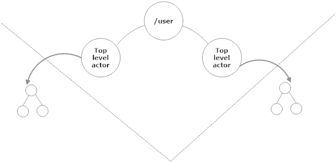

<!-- .slide: data-background="#003d73" -->
## Akka.Net continued

 <!-- .element style="width: 200px; position: fixed; bottom: 50px; left: 50px" -->

----

### Agenda

* Actor lifecycle
* ActorSelection
* State machines
* Router


---

TODO: insert 

#### Actor path

* Every actor has an actor path
* Actor path can be used to send messages to an actor


---


---

### Actor lifecycle

Actor have 5 stage life cycle

`Starting`, `Recieving`, `Stopping`, `Terminated` and `Restarting`

 <!--- .element style="height: 300px" --->


----

#### Lifecycle stages

* `Starting`: Actor is waking up
* `Recieving`: Actor is accepting messages
* `Stopping`: Actor is cleaning up its state, or saving state if restarting
* `Terminated`: Actor is dead
* `Restarting`: Actor is about to restart

----

#### Lifecycle hooks

* `PreStart`: Run before receiving - used to initialize
* `PreRestart`: used to cleanup before restart
* `PostStop`: Called when actor has stopped recieving. Cleanup - called as part of `PreRestart`
* `PostRestart`: Called after `PreRestart` and before `PreStart`. Additional reporting/diagnosis


----

#### How to do you do this in F#

Method 1)

```fsharp
let preStart = Some(fun () ->
        Console.WriteLine "preStart Called"
        |> ignore)
let mySampleActor = spawnOvrd system "actor"
             (actorOf sampleActor) <|
                {defOvrd with PreStart = preStart}
```

----

#### Only for `PreStart` and/or `PostStop`

Method 2)

```fsharp
let sampleActor (mailbox:Actor<_>) =
    // this section works like pre-start
    printf "pre-start"  
    // this registers a function to be called on PostStop
    mailbox.Defer (fun () -> printf "post-stop")
    let rec loop () =
        actor {
            let! msg = mailbox.Receive ()
            // do some work
            return! loop ()
        }
    loop ()

let aref = spawn system "actor" (sampleActor)
```

Note: 

This syntax is called a computation expresion - we will briefly touch on this in week 13/14 - otherwise the HR chapter 12.

---

### ActorSelection

* Used to send messages to actor(s) to which you don't have an `IActorRef`
* Done by actor path


----

#### ActorSelection details

* ActorSelection
    * The processs of looking up an actor
    * The object returned from that lookup
* ActorSelection don't give you a 1:1 relationship
* ActorSelection give you a handle to all actors behind that path
    * e.g. wildcards are supported

----

#### Why 

* Location transparency
* Loose coupling
* Dynamic behavior
* Adaptive system design

----

#### Location transparancy

* Means that we don't care where the actor is running
    * could be in the same process _or_
    * on a different computer

----

#### Loose coupling

* Don't need to store and/or pass around `IActorRef`
* Less coupling between actors/components

----

#### Dynamic behavior

* In a dynamic system where actors are created/removed
    * you can send messages to known addresses
* Don't need to be hardcoded adresses, messages can represent actorPath

----

#### Adaptive system design

* Help when buidling actor system
* You can introduce new actors/sections without going back and changing the existing system


----

#### When to use

1. Talking to top level actors
     * E.g you have an `AuthenticateActor` which name is `/user/AuthenticateActor`

```fsharp
select "akka://MyActorSystem/user/AuthenticateActor"
                     mailbox.Context.System <! username
```

2. Handoff work to a pool of worker actors
3. When processing a message and `Sender` is not enough
4. Send to multiple actors

----

#### Don't send `ActorPaths` around

Because:
* ActorSelection can be relative

----

#### Creating an actor path

```fsharp
let selection = select "path/to/actor" mailbox.Context.System

// e.g.
let myFooActor = spawn actorSystem "barActor"
                                         (actorOf fooActor)
// in an actor
let selection' = select "akka://user/barActor"
                                     mailbox.Context.System
selection' <! someMessage
```

---

### Good design

* Never rely on one hierachy design from another
* Always communicate via top-level actors
* Delete risky operations to leafs

----

### Knowledge

* Make it possible to change implementation details (DIP, LSP)
* Top-level actors are interfaces




----

### Contact


* Always send messages through top-level actors
  * by `IActorRef` or `ActorSelection`
* Make extension possible (OCP)
* Return is possible with `IActorRef.Forward`

---

### State machines

 <!-- .element style="height: 600px" -->


----

### FSM

* We all know FSM from SW4SWD and GoF State Pattern
* Many state machines have some sort of time perspective
    * change state after some time
    * stay in a state for some time

\* called `become` in C# and Scala<!-- .element: style="font-size: 20px" -->

----

#### Akka.Net switchable state

In the actor model, an actor can be in one of a number of different states

```fsharp
let actor (mailbox: Actor<_>) =
    let rec authenticating () =
      actor {
        let! message = mailbox.Recieve ()
        match message with
        |AuthenticationSuccess -> return! authenticated ()
      }
    and unauthenticated () =
      actor {// Handle messages if user is unauthenticated
      }
    and authenticated () =
      actor {// Handle messages if user is authenticated
      }
    authenticating ()
```

----

#### Different states

* In the above example our actor can handle messages base on 3 states
    * `autenticating`, `unauthenticated` and `authenticated`
* This enables reusablitity, and different work with little code
* Safe because we only handle one messages at a time.

----

#### Handling messages in a state

Let us imagine a chat example:

```fsharp
let rec authenticating () =
  actor {
    let! message = mailbox.Receive ()

    match message with
    | AuthenticationSuccess -> return! authenticated ()
    | AuthenticationFailure -> return! unauthenticated ()
    | IncomingMessage (roomId, msg) when roomId = chatroomId
          -> ()
    | OutgoingMessage (roomId, msg) when roomId = chatroomId
          -> ()
    return! authenticating ()
  }
  and unauthenticated () =
    actor {
      let! message = mailbox.Receive ()

      match message with
      | RetryAuthentication -> return! authenticating ()
      | IncomingMessage (roomId, msg) when roomId = chatroomId
                  -> ()
      | OutgoingMessage (roomId, msg) when roomId = chatroomId
                  -> ()
      return! unauthenticated ()
    }
  and authenticated () =
    actor {
      let! message = mailbox.Receive ()

      match message with
      | IncomingMessage (roomId, msg) when roomId = chatroomId
                    -> ()
      | OutgoingMessage (roomId, msg) when roomId = chatroomId
                    -> ()
      return! authenticated ()
    }
```

note:

```fsharp
let actor (mailbox: Actor<_>) =
  // let mutable previousMsg = []
  let state previousMsg =
    actor {
      let! msg = mailbox.Receive ()
      // handle msg
      
      state (msg :: previousMsg)
    }

  state []
```

----

#### Unhandled messages

* Actors has a `Stash` which acts like stack structure
    * Calling `mailbox.Stash ()` puts current message onto stack
* `mailbox.Unstash ()` puts the top message at the front of the inbox
* `mailbox.UnstashAll ()` unstashed all messages.
    * Preserves FIFO order


----

#### Unstash in our example

```fsharp
let rec authenticating () =
  actor {
    let! message = mailbox.Receive ()
    match message with
    | AuthenticationSuccess -> mailbox.UnstashAll ()
                       return! authenticated ()
    | AuthenticationFailure -> mailbox.UnstashAll ()
                      return! unauthenticated ()
    | IncomingMessage (roomId, msg) when roomId = chatroomId
                      -> mailbox.Stash () |> ignore
    | OutgoingMessage (roomId, msg) when roomId = chatroomId
                      -> mailbox.Stash () |> ignore
    return! authenticating ()
  }
```

----

#### Stashed messages

* Keep states
* In case of restart
    * Stash is lost with actor state
    * Unstash all before restart can save messages in mailbox

```fsharp
let preRestart = Some(fun (basefn: exn * obj -> unit) 
                        -> mailbox.UnstashAll () |> ignore)
let mySampleActor = spawnOvrd system "actor"
                    (actorOf sampleActor)
                <| { defOvrd with PreRestart = preRestart }
```

---

### Router

* Special actor types (Pool or Group)
* Can handle multiple messages at a time (Whuut!)
* Router actors can only forward messages (puh)
* Routers can be configured programaticly or using conf files

----

#### Pool Router

* Owns (supervise) their routee children
* Makes it possible to control pool size

----

#### Routing strategies

* `Broadcast` - Forward to all routees
* `Random` - Forward to a random routee
* `ConsistentHash` - Forward to a specific routee based on message

----

#### Supervision

* Router are actors so we can used `SupervisorStrategy`
* Default is 'always escalate'

----

#### Starting a Router actor

```fsharp
let worker = spawn mailbox.Context "worker"
                (workerActor)
                [ SpawnOption.Router(RoundRobinPool(10)) ]
```

Note: 

In HOCON (conf files)

Pool actor
```
akka.actor.deployment {
  /workers {
    router = round-robin-pool
    nr-of-instances = 5
  }
}
```

Group Actor

```
akka.actor.deployment {
  /workers {
    router = round-robin-group
    routees.paths = ["/user/workers/w1", "/user/workers/w2", "/user/workers/w3"]
  }
}

```

----

#### Load balancing

Try to evenly distribute work

* `RoundRobin` - just forward each message to a new routee
* `TailChooping` - forward to one random routee, after some delay send to a new until answer is recieved.
* `ScatterGatherFirstCompleted` - forward to all routees and return first answer. If no answer within a given timeframe, reply to sender.

----

#### Load balacing 2 (Pool only)

* `Resizable` - Forward to routee with fewest messages in mailbox
    1. Idle routee
    2. Routee with empty mailbox
    3. Routee with fewest messages
    4. Remote routee
* `ResizableRouter` - 'Auto scaling', tries to detect pressure on routee and expand/contract pool size

----

#### Messages

```fsharp
// Override Strategy for this message
router <! Broadcast("Shields failing, Captain!")

// For debug
router <! GetRoutees()

// For group router only this stops.
router <! PoisonPill.Instance
```

----

#### Group Router

* Do not supervise the `routee`
    * ActorRefs are handed to the Group Router

```fsharp
// Create some routee actors
let c1 = spawn mailbox.Context "coordinator1" (coordinatorA)
let c2 = spawn mailbox.Context "coordinator2" (coordinatorA)
let c3 = spawn mailbox.Context "coordinator3" (coordinatorA)

//create a broadcast router who will ask all of the
// coordinators if they are available for work
let coordinatorPaths = 
        [| string c1.Path; string c2.Path; string c3.Path |]
let coordinator = mailbox.Context.ActorOf(
    Props.Empty.WithRouter(BroadcastGroup(coordinatorPaths)))
```

----

#### When to use

* Use Pool actor unless
    1. Router should be able to send via `ActorSelection`
    2. You router cannot (for some reason) be responsible for routees
    3. You need to be able to send to different actors

---

### References

* [https://petabridge.com/](https://petabridge.com/)