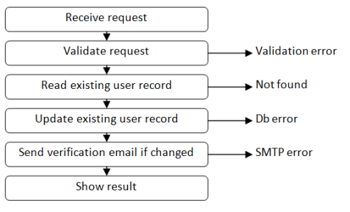

<!-- .slide: data-background="#003d73" -->
## Functional error handling 

 <!-- .element style="width: 200px; position: fixed; bottom: 50px; left: 50px" -->

----

### Agenda

* Problem
* Result / Either monad
* Composition
* Convertion
* Exceptions && Parallel validation

---

### Problem

* A 'normal' program consists of
  1. Validation
  2. Reading data from db/api
  3. Complete functions in buisiness logic
  4. Updatting data in db
  5. Accessing network
  6. Showing results

----

#### No thinking about errors

```fsharp
let useCase (json:string) =
  let person = validatePerson json
  let ssn = db.readSSN person
  let bornIn = api.findMunicipality ssn
  let newData = createNewPerson bornIn
  db.updateMunicipality newData
```

All functions are on the form

```fsharp
'input -> 'output
```

Note:

```fsharp
type person = {ssn: string; bornIn: string option}
let validatePerson (json: string) =
  {ssn = "1234"; bornIn = None}

let createNewPerson bornIn =
  {ssn = "1234"; bornIn = Some bornIn}

module db =
  let readSSN person = person.ssn
  let updateMunicipality person = "Success"

module api =
  let findMunicipality ssn =
    "Aarhus"
```

----

#### More F#'ish

```fsharp
let useCase =
  validatePerson 
  >> db.readSSN
  >> api.findMunicipality
  >> createNewPerson 
  >> db.updateMunicipality
```


----

<!-- .slide: data-background-image="./img/error.jpg" -->


----

#### But what about the actual errors



----

#### Errors

* Some of these functions can fail in different ways
  * IOError
  * DBError
  * ValidationError
  * Verification error
  * Authentication error

How do we compose code that can result in errors with our FP functions?

```fsharp
type ReturnType = Person | ValidationError 
// E.g
let validatePerson (json: string): ReturnType =

```

----

#### Solution

We need a way to compose functions into a single use-case function like:


----

#### Changing our code to handle errors

```fsharp
let useCase (json:string) =
  let person = validatePerson json
  if person != null then
    let ssn = db.readSSN person
    if (ssn != null) then
      let bornIn = api.findMunicipality ssn
      if string.IsNullOrEmpty bornIn then
        let newData = createNewPerson bornIn
        db.updateMunicipality newData
      else "Municipality not found"
    else "Person not found"
  else
    "Validation error"
```


----

#### Fake F# 

```fsharp
let dostuffwithPerson person =
  let ssnOpt = db.readSSN person
  match ssnOpt with
  | Some ssn ->
    let bornIn = api.findMunicipality ssn
    match bordnInOpt with
    | Some bornIn ->
      let newData = createNewPerson person bornIn
      let result = db.updateMunicipality newData
      "Sucess"
    | None -> "Municipality not found"
  | None -> "Person not found"

let useCase json: Return =
  let person = validatePerson json
  match person with
  | Some p -> doStuffWithPerson person
  | None -> "Validation error"


```


Note: Could have choosen to return `Result` from our functions instead of Options - same problem

----

#### Return Types

Introduciong types for all errors cases

```fsharp
type Return =
  | Success
  | DBError
  | IOError
  | VerificationError
  /// ...
```

----

#### Analysis of solution

Drawbacks:
* Hard to match on
* Will consist of all error types in our application
* or many **return** types, we need to navigate in. 


---

#### Simplification

```fsharp
type NoValueResult = Success | Error
// or
type Result<'TSuccess, 'TError> =
  | Success of 'TSuccess
  | Error of 'TError 
```

----

### F# built in Result

```fsharp
type Result<'T,'TError> =
    | Ok of ResultValue:'T
    | Error of ErrorValue:'TError
```

----

#### Extending this to our general case

```fsharp
type Success = Sucesss
type Errors =
  | DBError
  | IOError
  | VerificationError
  /// ...

// single error
let ourUseCase (): Result<Success, Errors> =
    failwith ""
// multiple errors
let ourUseCase2 (): Result<Success, Errors list> =
    failwith ""
```


----

#### Return and Bind

```fsharp
// Return
type Bricks = {desc: string; numBricks: int}
let ok = Ok {desc = "A Castle"; numBricks = 2133}
let error = Error "Lego crashed"

// Bind
let result: Result<int, string> =
   Result.bind (fun (lego: Bricks) -> Ok lego.numBricks) ok
// Result.bind ('T -> Result<'U, 'TError>) 
//        -> Result<'T, 'TError>
//        -> Result<'U, 'TError>
```

note:

```fsharp
let a: Result<string, 'a> = Ok "asdf"
match a with
| Ok value -> value + "ASdf"
| Error error -> throw error

if Result.IsOk a then
  Result.getOk a
else 
  Result.getError a
```

----

#### Monad to the Rescue

<iframe src="https://giphy.com/embed/l0Hlxvd5L0Qrn4JP2" width="480" height="270" frameBorder="0" class="giphy-embed" allowFullScreen></iframe><p><a href="https://giphy.com/gifs/southparkgifs-l0Hlxvd5L0Qrn4JP2">via GIPHY</a></p>

----

* return - wraps a data type in monadic type
* bind - transform the encapsulated value by a function `'A -> M<'B>` 

```fsharp
val return: 'A -> M<'A>
val bind: ('A -> M<'B>) -> M<'A> -> M<'B>
```

Note: 

This is not all there are to Monads :)

There are some monadic laws also.

----

### Example

```fsharp
type person = {email: string; name: string}
let validatePerson input =
  if validEmail (fst input) then
    Error "Email not valid"
  elif validName (snd input) then
    Error "Name not valid"
  else
    Ok {email = fst input; name = snd input }
```

note:

```fsharp
let validEmail (str: string) =
  not (str.Contains("@"))
let validName (str: string) =
  not (str.Contains(" "))
```

---

### Composition <!-- .element style="color:white" -->

<!-- .slide: data-background-image="./img/compose.jpg" -->

----

#### 

```fsharp
type person = {email: string; name: string}
let validatePerson input: Result<Person, string> =
  if validEmail (fst input) then
    Error "Email not valid"
  elif validName (snd input) then
    Error "Name not valid"
  else
    Ok {email = fst input; name = snd input }

let readSSN (person: Person): Result<Person, string> = 
  failwith ""
```

So how to compose these functions?

----

#### Input -> Output

* We have a bunch a functions on the form
  * `'Input -> Result<'Output, 'Error>`
* all taking a single input and returning Result/Option consisting of:
  * a result or
  * an error

----

#### Composing in general

* Functions like: <br/>`f1: 'A -> 'B` and `f2: 'B -> 'C`<br/> can be composed
  * `f1 >> f2`
* Or <br/>`f3: ('A*'B) -> ('C*'D)` and </br>`f4: ('C*'D) -> ('E*'F)`
  * `f3 >> f4`
* So ordinary functions or function `'Input -> 'Result` is easy to compose

----

#### Creating an adapter

To compose functions liked `'A -> Result<'B, 'E>` we need an adapter

`bind` to the rescue

```fsharp
let bind func =
  fun input ->
    match input with
    | Ok value -> func value
    | Error e  -> Error e

let converted = bind validatePerson
// val: converted: Result<'A, 'E> -> Result<'B, 'E>
```


Note:

This takes a function as input, a function that with a single input and retuning a Result (`'A -> Result<'B, 'E>`)

And a value of the type `'Result<'A, 'E>`

Then it either return
* If input is an error, just output the error.
* If there is a value, then apply the given function

----

#### Altertive implementation

```fsharp
let bind2 func input =
  match input with
      | Ok value -> func value
      | Error e  -> Error e

let bind3 func = function
  | Ok value -> func value
  | Error e  -> Error e
```

**Note**: Both functions doing excatly the same as the above one. 


----

#### Using std. composition

```fsharp
let combinedValidation =
  let validated2' = bind validated2 
  let validated3' = bind validated3

  validated1 >> validated2' >> validated3'
```

Note:

```fsharp
  let bind func =
    fun input ->
      match input with
      | Ok value -> func value
      | Error e  -> Error e

  let validated1 str =
    if (str = "ok") then
      Ok str
    else
      Error "Error 1"
    
  let validated2 (str:string) =
    if (str.ToUpper() = "OK") then
      Ok (str.ToUpper())
    else
      Error "Error 2"

  let validated3 (str: string) =
    if (str.Contains("O")) then
      Ok "Contains 'o'"
    else
      Error "Error 3"
  // I know this does not make so much sense.
```

----

#### The same with `>>=` operator

```fsharp
let (>>=) twoTrackInput switchFunction = 
    bind switchFunction twoTrackInput

let validate x =
  x
  |>  validated1
  >>= validated2
  >>= validated3
```

Data vs function oriented method - but same result.

Note:

```fsharp
let (>>=) twoTrackInput switchFunction = 
    bind switchFunction twoTrackInput
```

----

### Convertion

Alternative to the above method, we can convert 

```fsharp
val a: 'A -> Result<'B, 'D>
val b: 'B -> Result<'C, 'D>

// into

val aAndB: 'A -> Result<'C, 'D>
```

----

### `SwitchComposition`

```fsharp
let (>=>) aFun bFun x =
 match aFun x with
 | Ok y    -> bFun y
 | Error e -> Error e

// Usage
let combinedValidation =
  validated1
  >=> validated2
  >=> validated3
```

Note:

`>=>` implemented with bind

```fsharp
let (>=>) aFun bFun =
  aFun >> (bind bFun)
```

----

#### Comparision

* **`Bind`** - Converts a 'switch function' into what [the blog](http://www.fsharpforfunandprofit.com) calls a 'two-track function'
  * Used when combining single function
* **`SwitchComposition`** - Converts two 'switch functions' into a single new 'switch function'
  * Chaining a number of functions together

----

#### Other tools 

* `map` for non-monadic types
* parallel monadic functions
* domain events / logging etc.

---

#### Composing with simple functions 

```fsharp
let cannotFail input = input

// Convert 'A -> 'A into 'A -> Result<'A, 'TError>

let switch f input =
  f input |> Ok
```

----

#### Functions with side effects

* E.g.
  * Save output
  * Log

```fsharp
let log msg: unit = printfn "-- %O" msg

let tee f x =
  f x
  x

let combinedValidation =
  validated1
  >=> validated2
  >=> validated3
  >=> switch (tee log)
```

----

### Exceptions

Our code can throw exceptions and we should be able to handle than in our flow

```fsharp
let doStuff input = invalidArg "input" "always wrong"

let tryCatch f input =
  try
    f input |> Ok
  with
    | ex -> Error ex.Message

let combinedValidation =
  validated1
  >=> validated2
  >=> validated3
  >=> tryCatch (tee doStuff)
```

Note:

```fsharp
let doStuff (input: string) = 
  if input.ToUpper() = "OK"
  then (printfn "fine")
  else invalidArg "input" "was all wrong"
```

----

### Parallel validation

Lets think fold :) combining pairwise

```fsharp
let plus combineOks combineErrors switch1 switch2 x = 
    match (switch1 x),(switch2 x) with
    | Ok s1, Ok s2       -> Ok (combineOks s1 s2)
    | Error f1, Ok _     -> Error f1
    | Ok _ , Error f2    -> Error f2
    | Error f1, Error f2 -> Error (combineErrors f1 f2)
```


---

### References

* Some images from: [https://fsharpforfunandprofit.com/](https://fsharpforfunandprofit.com/)
